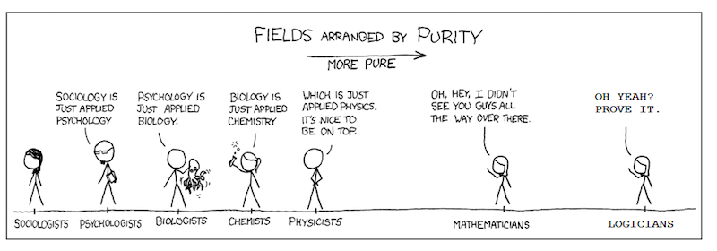

# (PART) Introduction {-}


# **It's about time!**

> "All science is either physics or stamp collecting."
>
> --- Ernest Rutherford (1872-1937)


Before we can begin our introduction to the wonderful world of Complex Adaptive Systems and Complex Networks, we briefly discuss the perspective on scientific inquiry that is used throughout this book. This will not only allow us to highlight some differences between the **Complex Systems Approach (CSA)** we propose for the scientific study of human nature and the classical perspective we will call the **Machine Metaphor Approach (MMA)**.


# **A Quick Guide to Scientific Rigour**


The [**scientific method**](https://en.wikipedia.org/wiki/Scientific_method) consists of all philosophical, theoretical and empirical tools, procedures and methods that can be used to systematically evaluate the veracity of explanatory claims about the structure of reality. The repeated application of the scientific method to study scientific questions promises to generate **valid** inferences and **reliable** facts about a certain explanatory domain.

The validity of scientific inferences is of course always conditional on the perceived veracity of the body of scientific knowledge from which the inferences were derived. Less tangible, but not less important for the perceived veracity of scientific knowledge are concepts such as  *intellectual honesty* en *scientific integrity* of scientists laying explanatory claim on some observable phenomena. Simply applying the scientific method to any problem in science doe not fully grasp all the characteristic that constitute a solid body of scientific knowledge. We will use the term [**rigorous science**](http://mbio.asm.org/content/7/6/e01902-16.full) [@Casadevall2016] to denote the ideal set of conditions to allow the scientific method to separate claims that are likely to be false, from claims that are likely to be true (given the current scientific record).


```{r rigorous, echo=FALSE, fig.cap="Rigorous Science according to @Casadevall2016."}
knitr::include_graphics("images/F1_large.jpg")
```

When a claim is based on **Scientific Rigor**, we refer to the fact there has been:

1. **Experimental Redundancy** - The claim has been examined by all methodological and analytical tools that are available and are appropriate given the context. Rigorous Science does not rely on one type of experimental design or one type of statistical analysis.
2. **Recognition of Error** - Without failure there can be no progress, therefore we should carefully study failures and not just report success stories. Any sources of error should be carefully studied and reported to the scientific community.
3. **Sound Probability & Statistics** - Use of the most recent and appropriate statistical theories, models and analytical techniques. Statistical models become more realistic and often the models that were taught in undergraduate statistics courses have long been replaced and should not be used any more.
4. **Efforts to Avoid Logical Traps** - When generating theories, defining constructs and laws, make sure logical inconsistencies are avoided. When making inferences, avoid the common logical traps such as *The Effect = Structure Fallacy* in null hypothesis significance testing: If a predicted effect is observed (i.e. a statistically significant test result leads to a rejection of the null hypothesis), it is not valid to infer that the existence of the assumed cause was evidenced.
5. **Intellectual Honesty** - Rigorous science is ethical, has integrity and thrives on critical reflection on scientific practice. The right mindset is *"Prove yourself wrong!"*, not *"Prove yourself right!"*


```{r xkcd1a, echo=FALSE, fig.cap="[xkcd](http://xkcd.com/435/) on the 'purity' of scientific disciplines."}

```

----


## **Formalism, Ontology and Epistemology**

> A difficulty of much psychological theorizing is vagueness in the terms employed. In this work, the above ideas have been studied in mathematical form throughout, the definitions and proofs being given corresponding precision.
>
> ---W. R. Ashby (1945, p. 13)


## **Phenomena, theories, facts and laws**


### Properties of theories


## **Appraising and amending theories**


### Strong Inference


```{r stronInf, echo=FALSE}
df<-rbind.data.frame(
  r1 = "Devising alternative hypotheses",
  r2 = "Devising a crucial experiment (or several of them), with alternative possible outcomes, each of which will, as nearly as possible, exclude one or more of the hypotheses",
r3 = "Carrying out the experiment so as to get a clean result",
r4 = "Recycling the procedure, making subhypotheses or sequential hypotheses to refine the possibilities that remain",
r5 = "and so on.")
colnames(df) <- c("Strong inference consists of applying the following steps to every problem in science, formally and explicitly and regularly:")
rownames(df) <- c("1.","2.","3.","1'","...")

knitr::kable(df, 
             booktabs = TRUE,
             row.names = TRUE,
             format = getOutFormat,
             escape = ifelse(all(getOutFormat%in%c("html","docx")),TRUE,FALSE),
             caption = "Strong Inference according to @platt1964strong ") %>%
  kable_styling(latex_options = c("striped", "scale_down"),
                bootstrap_options = c("striped","responsive", "condensed"),
                font_size = 10)  

```


## **Measurement and Psychometrics**

> "It is the theory that decides what we may observe"
>
> 


Welke bewerkingen, beschrijvende statistieken, toetsende analyses en onderzoeksvragen je mag loslaten op gegevens van een bepaald meetniveau is weergegeven in Tabel \@ref(tab:meetniv).^[De analyse technieken hoef je niet te kennen.] 

```{r meetniv, echo=FALSE, message=FALSE, warning=FALSE, results='asis'}
#dft <-read.csv("~/Library/Mobile Documents/com~apple~CloudDocs/GitHub/Cursusboek IWO/1718/docs/meetniveaus.csv")
dft <- t(data.frame(A= c("Determineren van (on)gelijkheid","Determineren van 'meer' of 'minder'","Determineren van de gelijkheid van intervallen of verschillen","Determineren van de gelijkheid van ratios"),
                        B= c("$ =\\ \\neq $","$\\leq\\ \\geq $", "$ + \\ - $", "$ \\times\\ \\div $"),
                        C = c("Groeperen; Classificeren; Indiceren", "Sorteren; Vergelijken; Niveau bepalen", "Relatieve vergelijkingsbasis (meetlat): Relatief verschil of gelijkenis; relatief nulpunt", "Absolute vergelijkingsbasis (meetschaal): Verhoudingen van magnitudes / hoeveelheden; absoluut nulpunt"),
                        D = c("Modus; Frequentie", "Mediaan; Percentielen", "Rekenkundig gemiddelde; Standaarddeviatie", "Geometrisch gemiddelde; Variatiecoëfficiën [note]"),
                        E = c("Nominale associatie (Contingentie coefficient, Phi, Kramer's V, Lambda, $\\chi^2$)", "Directionele nominale associatie (Kendall's tau a-c, Gamma, Somer's D)", "Rangorde correlatie en Product-Moment correlatie (Spearman en Pearson correlatie)", "Kansverdelingen en informatie theorie (K-L divergence, Average Mutual Information)")))
colnames(dft) <- c("Nominaal","Ordinaal","Interval","Ratio")
rownames(dft) <- c("Basale empirische methoden","Wiskundige operatoren","Analyse","Centrale tendentie","Samenhang")


kbt <- knitr::kable(dft, 
      row.names = TRUE, 
      booktabs = TRUE, 
      format = getOutFormat, 
      escape = ifelse(all(getOutFormat%in%c("html","docx")),TRUE,FALSE),
      caption = "Kenmerken van toevalsvariabelen gemeten op de meetniveaus van Stevens (1962)")

if(all(getOutFormat%in%c("html","docx"))){
  kable_styling(kable_input = kbt,
                bootstrap_options = c("striped","condensed","responsive"),
                font_size = 10) %>%
  add_footnote(c("https://nl.wikipedia.org/wiki/Variatiecoëfficiënt"), notation = "number") %>%
  column_spec(1, bold = TRUE)

  } else {
    
  kable_styling(kable_input = kbt,
                latex_options = c("striped", "scale_down"),
                font_size = 10,
                full_width = FALSE) %>%
  add_footnote(c("https://nl.wikipedia.org/wiki/Variatiecoëfficiënt"), notation = "number") %>%
  column_spec(1, bold = TRUE, width = "10em") %>% 
  row_spec(1,bold=TRUE) %>%
  column_spec(2:5, width = "20em")
}
```


# *Study Materials* {-}

```{block2, fact_hypo, type='rmdimportant'}
**Clear explanation of the difference betweern phenomenon, hypothesis, theory en law**  

[](https://youtu.be/lqk3TKuGNBA)

```


```{block2, onto, type='rmdimportant'}
<span style="font-size:80%;"><b>Ontologie.</b></span>

[](https://youtu.be/FN2zwqE_Qo0)

```


```{block2, epis, type='rmdimportant'}
<span style="font-size:80%;"><b>Epistemologie</b></span>

[](https://youtu.be/jRxoHtGa4NM)

```


# **Introduction to Complexity Science**

Psychological systems are biological systems which are physical systems that are alive. Therefore, any theory that lays explanatory claim to phenomena of the mind, ultimately must be a theory about how a physical system is able to accumulate non-random order into its internal structure that appears to codetermine its behaviour. Less formally stated, a science that studies the behaviour of physical systems that are alive, that appear to have a memory which makes their behaviour adaptive, future oriented, intelligent, should in principle be grounded in physical and biological principles and laws. That may be a bridge too far for now, but such theories should at least not contradict highly corroborated theories of physics that describe the behaviour of the constituent components of living systems. 

The best way to describe the differences between the *Machine Metaphor Approach (MMA)* and the *Complex Systems Approach (CSA)* to study human behaviour is to examine what theories generated using the each approach  

The Complex Systems Approach to Behavioural Science is mainly concerned with understanding  be described as  science 


Such behavior is often called 'adaptive' to indicate that the same external states could elicit different behavioral responses depending on the temporal order in which they occur (e.g. reward before vs. after an electric shock; cf. [@Gibson1966a], [@Walker1972a]). One important requirement for dependence of system behavior on the temporal order of event occurrences, is that the physical composition of the system must permit specification of its internal structure by the particular facts pertaining to the events (see e.g. [@Turvey1999a], [@Freeman2001a], [@Friston2013a]). If the after-effects of an interaction of the system with its environment are reflected by systematic changes to the internal structure of a system (e.g., evidenced as correlations between internal and external states such as 'neural correlates'), the system can be characterized as a memory system. Specification of the physical structure of a system through after-effects of interactions ('experienced' events), is the only conceivable way to permit the coordination of behavior in the present (the Now) by the past (cf. [@Turvey1979a]).

The Complex Systems Approach to Behavioural Science is mainly concerned with understanding  be described as  science 

The conception of particular facts as discrete internalized states dates back at least to 1904 when Richard Semon defined the `engram' as the unique physiological trace left in the central nervous system by each stimulus and thing that an organism had experienced or learned ~\citep*[see][]{Bruce2001a, McConnell1965a}. Related to the concept of the engram is the `associative chain theory'~\citep*[][]{Lashley1951a} or `path theory' of the central nervous system:


> "I refer to `path theory', which states, roughly, that the functions of the central nervous system are controlled by chains of neurons laid down as a path so as to conduct the impulse to its appropriate end-organ: that the paths are strictly constant, thus accounting for the fact that the reflexes and reactions are largely constant: that learning consists of the opening up of new paths and that memory consists of the retraversing of some old path by another impulse.""
>
> --- @Ashby1931a [p. 148]


Both the engram and path theory turned out to be elusive theoretical constructs. After a lifetime spent searching for the engram, Lashley announced his failure to detect it ~\citep*[][see Table~\ref{Tab:01}]{Lashley1950a} and with respect to the emergence of order in sequences of behavior out of chains of associations: 


> "I believe, that such interpretations of temporal organization are untenable and that there are, behind the overtly expressed sequences, a multiplicity of integrative processes which can only be inferred from the final results of their activity.""
>
> --- @Lashley1951a [p. 115]


Gibson's quoted vision of the brain as a self-tuning resonator was based on Lashley's criticism of the brain as a storehouse (see Table~\ref{Tab:01}). The storehouse and path metaphors are apparently too compelling, especially in the behavioral-, cognitive-, and neurosciences (BCN science) the brain is commonly referred to as a storage medium ~\citep*[][is a critical evaluation]{Wolpaw2002a} and overt behavior as the result of executing a program ~\citep*[][is a critical evaluation]{Noble2008a}. The internal, or mental representation is a modern version of the engram and plays a crucial role in modern theorizing about intelligent behavior. Remarkably, despite its importance as a theoretical entity, a formal definition is missing. In terms of a physical system, internal representation refers to: ``\textit{an identifiable physical state within a system that stands in for another (internal or external) state and that as such plays a causal role in (or is used by) the system generating its behavior}''~\citep*[][p. 6]{Haselager2003a}. From a realist perspective, any theory about mental phenomena that makes use of internal representations and imprinted `paths' or `traces' to explain adaptive behavior, will have to explain how the system was specified to represent (aspects of) an interaction event. In BCN science, this is generally neglected and many accounts of the physical realization of adaptive behavior must be characterized as `feigned physicalism'. Ashby already noted in 1931, that the path theory ``\textit{[...] has never been clearly stated but tends to lie in the background, emerging to explain some convenient fact yet not being questioned when facts appear which it is powerless to explain.}~\citep*[][p.148]{Ashby1931a}.

The goal of this article is to introduce a number of physical principles and explanatory tools that allow the development of a formalism
\footnote{To be clear, a sketch of a formalism implies positing candidate conjectures to be raised as postulates. It refers to providing novel perspectives on old questions or the re-framing of existing claims in order to enable the unification or formal similarity of competing theories. The (to be developed) formalism itself is not a theory. It is a definition of a domain in reality from which different theories can depart and compete for scientific credibility in explaining the phenomena included by the postulates of the formalism.} for complex adaptive behavior based a conception of computation that respects the physical medium of implementation~\citep*[][]{Maclennan2011a}. 
A formalism for Radical Embodied Computation (REC++)
\footnote{ The addition of ++ in REC++ not only allows easy discrimination from REC, but also refers to the popular computer programming language C++ in which ++ is an increment operator. The operation of incremental counting will be considered an important property of the biophysical realization of computation.} 
should describe order generation inside brains nested in bodies that can explain phenomena of the mind departing from principles of Information Realism ~\citep*[][]{Floridi2003a}. REC++ can be described as an attempt to merge Radical Embodied Cognition ~\citep*[REC; cf.][]{Chemero2009a} and Physical Intelligence~\citep*[PI; cf.][]{Turvey2012a} with Natural Computation ~\citep*[NC; see][]{Wolfram2002a,Pfeifer2007a,Polani2007a,Maclennan2012a}. Potential issues with this objective are he explicit rejection of the use of information-theoretic constructs by REC in which: ``\textit{[
] perception, cognition, and action as necessarily embodied phenomenon, using explanatory tools that do not posit mental representations}''  ~\citep*[][p. 29]{Chemero2009a} and the requirement by PI of information to become more than a measure of uncertainty ~\citep*[meaningful, specific, usable, scaled, see][]{Turvey2012a}. These and related issues will be discussed throughout the text.

First, I will follow Ashby’s lead and test the explanatory boundaries of Radical Neuronal Reductionism (RNR) that is commonly used as a causal ontology for adaptive behavior in BCN science ~\citep*[][]{Majorek2012a}. 


## **What is a Complex Dynamical System?**

A system is an entity that can be described as a composition of components, according to one or more organizing principles. The organizing prniciples can take many different forms, but essentially they decide the three important features of systems that have to do with the relationship between parts and wholes: 

* What are the relevant scales of observation of the system
* What are the relevant phenomena that may be observed at the different scales 
* Can interactions with the internal and external environment occur, and if so, do interactions have any effects on the structure and/or behaviour of the system


### Open vs. Closed

A closed system cannot exchange any energy, matter or information with the external environment.

### Simple vs. Complex


### Ergodic vs. Non-ergodic


### Equilibrium vs. Far-from-equilibrium


### Order vs. Disorder

> "order is essentially the arrival of redundancy in a system, a reduction of possibilities"
>
> --- Von Förster (2003) 

The arrival of redundancy is an excellent description of what is meant by *nonrandom* behaviour. If the behaviour of a system is redundant, this means it is predictable to some extent and this just refers to the fact that behaviour covaries systematically (is correlated) with the behaviour of other parts of the system, or with changes in the external environment. The presence of redundancies indeed implies a reduction of possible states the system has available to generate its behaviour, the states a system can be in are in some way dependent on the temporal evolution of parts of the internal or external environment, they can no longer be occupied independently. This phenomenon id often described as a *constraint on the degrees of freedom* a system has available to generate its behaviour. The appearance of order always implies that states that were previously part of the behaviourial repertoire, are no longer accessible by the system.

The opposite of order, *disorder*, or randomness, must then refer to the absolute absence of any redundancies, making reliable prediction of system behaviour impossible, or, equilly reliable to what may be expected by chance. The amount of disorder in a system can be quantified, a measure known as the Entropy of a system.


### Order vs. Deterministic Chaos


## **A Causal Ontology of Interactions**


## ** **


