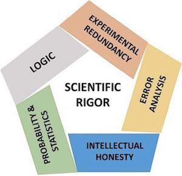
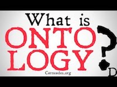

# (PART) Introduction {-}

<!-- # HOW TO CITE -->
<!-- # -->
<!-- # Citations go inside square brackets and are separated by semicolons. Each citation must have a key, composed of ‘@’ + the citation identifier from the database, and may optionally have a prefix, a locator, and a suffix. Here are some examples: -->

<!-- # Blah blah [see @doe99, pp. 33-35; also @smith04, ch. 1]. -->
<!-- # Blah blah [@doe99, pp. 33-35, 38-39 and *passim*]. -->
<!-- # Blah blah [@smith04; @doe99]. -->

<!-- # A minus sign (-) before the @ will suppress mention of the author in the citation. This can be useful when the author is already mentioned in the text: -->

<!-- # Smith says blah [-@smith04]. -->

<!-- # You can also write an in-text citation, as follows: -->

<!-- # @smith04 says blah. -->
<!-- # @smith04 [p. 33] says blah. -->

# **A Quick Guide to Scientific Rigour**

> "Meanwhile our eager-beaver researcher, undismayed by logic-of-science considerations and relying blissfully on the “exactitude” of modern statistical hypothesis-testing, has produced a long publication list and been promoted to a full professorship. In terms of his contribution to the enduring body of psychological knowledge, he has done hardly anything. His true position is that of a potent-but-sterile intellectual rake, who leaves in his merry path a long train of ravished maidens but no viable scientific offspring"
>
> ---Paul Meehl ([1967,p. 114](http://meehl.umn.edu/sites/g/files/pua1696/f/074theorytestingparadox.pdf))     

Before we can begin our introduction to the wonderful world of Complex Adaptive Systems and Complex Networks, we briefly discuss the philosophy of science and perspective on the goal of scientific inquiry that is used throughout this book. This will allow us to highlight some differences between the **Complex Systems Approach (CSA)** we propose for the scientific study of human nature and the classical and often implicit perspective used in most disciplines of the social and life sciences, we will call the **Machine Metaphor Approach (MMA)**.

Use of the scientific method [**scientific method**](https://en.wikipedia.org/wiki/Scientific_method) is what seperates scientific from non-scientific claims about the structure of reality. It consists of all philosophical, theoretical and empirical tools, procedures and methods that can be used to systematically evaluate the veracity of such explanatory claims. The repeated application of the scientific method to study scientific questions promises to generate **valid** (accurate) inferences and **reliable** (precise) facts about a certain explanatory domain, but it is important to note it does not guarantee that any kind of absolute 'truth' will be discovered. The veracity of scientific inferences is always conditional on the quality of the body of scientific knowledge from which the inferences were deduced, induced or abducted. For example, when a *crisis of confidence* about the trustworthiness of the facts in the scientific record of some subdisciplines of psychological science was suggested [@pashler2012a], the immediate consequence was that the veracity of all claims by psychological science was called into question.   

### Rigorous Open Science {-}

Less tangible, but not less important for the perceived veracity of scientific knowledge are concepts such as *intellectual honesty* and *scientific integrity* of the scientists laying explanatory claims on some domain in reality. Merely checking whether the scientific method has been applied does not fully grasp all the prerequisites for generating a solid body of knowledge. We will use the term **rigorous open science** to denote the ideal set of conditions that should be in place to allow us to distinguish scientific claims that are likely to be false, from claims that are likely to be true, given the perceived *verisimilitude* (thruth-likeness) of the knowledge accumulated in the scientific record. 


```{r rigorous, echo=FALSE, fig.cap="Rigorous Science according to @casadevall2016a."}

```

When a claim is based on [**Scientific Rigour**](http://mbio.asm.org/content/7/6/e01902-16.full) [@casadevall2016a], we mean it was posited based on the following set of principles:

1. **Experimental Redundancy** - The claim has been examined by all methodological and analytical tools that are available and are appropriate given the context. Rigorous Science does not rely on one type of experimental design or one type of statistical analysis.
2. **Recognition of Error** - Without failure there can be no progress, therefore we should carefully study failures and not just report success stories. Any sources of error should be carefully studied and reported to the scientific community.
3. **Sound Probability & Statistics** - Use of the most recent and appropriate statistical theories, models and analytical techniques. Statistical modelling techniques become more realistic over time and often the models that were taught in undergraduate statistics courses have long been replaced and should not be used any more.
4. **Efforts to Avoid Logical Traps** - When generating theories and defining constructs and laws, make sure logical inconsistencies are avoided. When making inferences, avoid the common logical traps such as *The Effect = Structure Fallacy* in null hypothesis significance testing (NHST).
5. **Intellectual Honesty** - Rigorous science is ethical, has integrity and thrives on critical reflection on scientific practice. The right mindset is *"Prove yourself wrong!"*, not *"Prove yourself right!"*

We add to the list that science must be open and transparent. This may seem like an obvious statement to a fresh student of human behaviour, but concepts that make up an essential part of the scientific debate in 2017, such as *open science*, *open data*, *reproducibility*, *Questionable Research Practices (QRPs)*, *Hypothesizing After the Results are Known (HARKing)* and *preregistration*, were practically unknown 5 years ago.


### Theoretical Tunnelvision {-}

> "It is the theory that decides what we may observe"
>
> ---Einstein (as quoted by Heisenberg) 

Many of the initiatives to improve science are focussed on methodology and statistics. This is understandable, because that's where errors are easily made (and discovered) and  allows for relatively simple interventions, such as more stingent control on appropriate use of statistics by journals. However, the goal of generating empirical facts is ultimately because we want to find out which scientific claim about the structure of reality best explains why those empirical facts were oserved. In other words:

The quote attributed to Einstein refers to an important, and grossly underestimated phenomenon one might call the *theoretical tunnelvision*. It is best explained by an example that is commonly encountered in the literature in psychological science and goes something like this:

* A study tries to find independent causes (predictors) of a certain disease-entity, a pathological state or behavioural mode people can 'get stuck in'.
* Typically, a statistical model fitted on a large, representative sample of individuals in which many different predictors were measured will yield associations between predictor and disease-entity that are significant but small (on average $r \approx 0.3$, or $\approx 9\%$ explained variance). 
* Often, if other known (non-clinical) covariates are included in a model, and even more so, if the multivariate nature of the phenomenon is taken seriously, for example by including repeated measurements and/or multiple dependent variables, these predictors will no longer explain any unique variance in the outcome measures.
* Here is an example from a 'predictor' study [@walker2015a] in a representative sample of 331 individuals who suffered from persistent MDD for at least 10 years:

> "Clinical variables in this analysis were not strongly associated with persistence of MDD over the course of 10 years. Comorbid generalized anxiety disorder, baseline depression severity, and taking a prescription for nerves, anxiety, or depression were significantly associated with persistent depression in the unadjusted logistic regression models, but the associations became non-significant when in the multivariate model. These findings are in contrast to the results from several other studies." 

* The study concludes by discussing three factors that play a statistically significant role in the persistance of MDD (text between brackets not in original):
    + "having two or more chronic medical conditions [in 1995-1996] contributes to experiencing depression ten years later [2.89 more likely]. However, only having one chronic medical condition did not increase the odds of being classified as having MDD in 2004–2006."
    + "days of activity limitation in 1995–1996 were significantly associated with a greater risk of depression ten years later [2.19 more likely], independent of the number of chronic medical conditions a person had."
    + "Individuals who were in contact with family less than once a week [in 1995-1996] were more likely to have MDD in 2004–2006 [2.07 more likely]. Likewise, people who were married were less likely to have persistent depression compared to those who have never married [never married 2.42 more likely]"

So what's wrong with these inferences? The study shows some previous assumptions about the relevance of clinical predictors should be reconsidered, and it adds to scientific record some facts about risk factors that might have eluded scientists, clinicians and health professionals. Let's look at the main conclusion of the study, in addition to a plea for more attention for people with two or more chronic medical conditions, @walker2015a end the article with:

> Future research should continue to examine the complex nature of the relationship between chronic medical disorders and comorbid psychiatric conditions. Addressing these conditions and strengthening social support systems could be important strategies for reduce the burden of depression.

* First, if clincal predictors play no role in explaining why some people remain depressed for such long periods of time, why isn't the main conclusion of the study that we must re-appraise the scientific theories laying explanatory claim on the aetiology of MDD, from which the diagnostic tools, medical and psychological interventions to which these patients have been exposed were derived? 

* Second, even though the authors acknowledge --and indeed show-- that the propagation of a pathological state like MDD over many years is a very complex multivariate phenomenon, their suggestion for future research is still based on an implicit assumption about causation that is extremely simple. The idea is clearly that there is a chain of unique (efficient) causes, each contributing independently to the emergence, and persistence in time of the MDD state. The authors basically suggest some causes have tp be added to the causal chain. The metaphor used here is that of a machine of which the sum output of its constituent components is equal to the purpose or function of the machine as a whole. Should a component fail, then it can be repaired or replaced as long as it performs the same function as the defective part, thereby restoring the function of the machine as a whole. This is why the authors suggest that strengthening social support systems could be an intervention to recduce the burden of depression: The absence of a partner or visits by family members were predictors that explained some unique variance in the data on the persistence of MDD. Obviously, restoring this defective social support component should restore or at least fascilitate the escape from the MDD state. Meanwhile, they seem to forget that they convincingly argued that MDD is a very complex phenomenon that cannot be dissected into neat, independent component causes.

* Third, and very much related to the previous remark, the authors mention three important factors in the discussion and conclusion section, however, the results section contains another factor that was omitted, it is in fact the second most important predictor of the persistence of MDD: 

> "Women had 2.48 the odds of remaining depressed compared to men"

Why did they ignore this predictor in the discussion? This is speculation, but could it be that this factor is not mentioned because it would have to be considered a 'deficient' component and suggesting any kind of 'treatment' intended to 'repair' it is of course beyond the realm of sane things to suggest. Nevertheless, it does eem rather important to figure out why this is the case, starting by *not* considering gender a unique causal component in a chain of i*n*dependent predictors might help. Instead, gender can be considered a complex aggregate, or, contextual variable that is associated to the dependent variable through a vast network of *inter*dependent facts, events and states of affair. An obvious factor of importance is that effect studies of medical interventions are mainly conducted on white, male, 20-30 year old, right-handed, subjects with above average SES. Also, it is likely that on average, the stability of mood over longer periods of time is more variable in women than in men due to fluctations of hormone levels, it does not seem unreasonable to suggest this might pose extra challenges to women who seek to escape the strong pull of the MDD state. We could go on and very likely each sensible factor we come up with will have some part in the emergence of the association between gender and risk for persistent MDD. 

The analytical tools selected by the researchers (a generalized linear statistical model) restrict the kinds of associations we might observe in the data. In the the present case all associations will --after transformation-- be linear compositions of independent components.^[Naturally, if one would use mixed models we can account for dependencies in the data, but they will still be limited to linear associations.] One never reads this valid equally valid conclusion: "We conclude that the linear model is inadequate to describe the complexity of this phenomenon." The reason is that the implicit assumptions about causality underlying scientific claims never enter the empirical cycle and therefore escape falsification by the repeated application of the scientific method even though those causality assumptions are also based on a scientific theory about the structure of reality that is in principle falsifiable.

To be a bit more precise about the relationship between what theories assume to be constituent parts of reality and why, we discuss the differences between some important theoretical concepts. 


## **Formalism, Ontology and Epistemology**
> A difficulty of much psychological theorizing is vagueness in the terms employed. In this work, the above ideas have been studied in mathematical form throughout, the definitions and proofs being given corresponding precision.
>
> ---W. R. Ashby in 'The Physical Origin of Adaptation by Trial adn Error' (-@ashby1945a, p. 13)


@[Meehl1990a,Meehl1997a]

## **Phenomena, theories, facts and laws**
> "All science is either physics or stamp collecting."
>
> --- Ernest Rutherford (Physics Nobel Laureate, 1872-1937)


### Properties of theories {-}


## **Appraising and amending theories**


### Strong Inference {-}

*The Effect = Structure Fallacy* refers to the logical error that occurs a predicted effect is observed (i.e. a statistically significant test result leads to a rejection of the null hypothesis), it is not valid to infer the existence of the assumed cause was evidenced. NHST is based on *the falsification principle*, which means the perceived veracity of a scientific claim will increase only if it has resist many rigorous attempts to prove it is wrong. If a scientific claim has a large track-record of resisting falsification 


```{r stronInf, echo=FALSE}
df<-rbind.data.frame(
  r1 = "Devising alternative hypotheses",
  r2 = "Devising a crucial experiment (or several of them), with alternative possible outcomes, each of which will, as nearly as possible, exclude one or more of the hypotheses",
r3 = "Carrying out the experiment so as to get a clean result",
r4 = "Recycling the procedure, making subhypotheses or sequential hypotheses to refine the possibilities that remain",
r5 = "and so on.")
colnames(df) <- c("Strong inference consists of applying the following steps to every problem in science, formally and explicitly and regularly:")
rownames(df) <- c("1.","2.","3.","1'","...")

knitr::kable(df, 
             booktabs = TRUE,
             row.names = TRUE,
             format = getOutFormat,
             escape = ifelse(all(getOutFormat%in%c("html","docx")),TRUE,FALSE),
             caption = "Strong Inference according to @platt1964strong ") %>%
  kable_styling(latex_options = c("striped", "scale_down"),
                bootstrap_options = c("striped","responsive", "condensed"),
                font_size = 10)  

```


## **Measurement and Psychometrics**


```{r meetniv, echo=FALSE, message=FALSE, warning=FALSE, results='asis'}
#dft <-read.csv("~/Library/Mobile Documents/com~apple~CloudDocs/GitHub/Cursusboek IWO/1718/docs/meetniveaus.csv")
dft <- t(data.frame(A= c("Determination of (in)equality","Determination of 'more' or 'less'","Determination of  equality of intervals of differences","Determination of equality of ratios"),
                        B= c("$=\\ \\neq$","$\\leq\\ \\geq$", "$+ \\ -$", "$\\times\\ \\div$"),
                        C = c("Groeperen; Classificeren; Indiceren", "Sorteren; Vergelijken; Niveau bepalen", "Relatieve vergelijkingsbasis (meetlat): Relatief verschil of gelijkenis; relatief nulpunt", "Absolute vergelijkingsbasis (meetschaal): Verhoudingen van magnitudes / hoeveelheden; absoluut nulpunt"),
                        D = c("Modus; Frequentie", "Mediaan; Percentielen", "Rekenkundig gemiddelde; Standaarddeviatie", "Geometrisch gemiddelde; Variatiecoëfficiën [note]"),
                        E = c("Nominale associatie (Contingentie coefficient, Phi, Kramer's V, Lambda, $\\chi^2$)", "Directionele nominale associatie (Kendall's tau a-c, Gamma, Somer's D)", "Rangorde correlatie en Product-Moment correlatie (Spearman en Pearson correlatie)", "Kansverdelingen en informatie theorie (K-L divergence, Average Mutual Information)")))
colnames(dft) <- c("Nominaal","Ordinaal","Interval","Ratio")
rownames(dft) <- c("Basale empirische methoden","Wiskundige operatoren","Analyse","Centrale tendentie","Samenhang")


kbt <- knitr::kable(dft, 
      row.names = TRUE, 
      booktabs = TRUE, 
      format = getOutFormat, 
      escape = ifelse(all(getOutFormat%in%c("html","docx")),TRUE,FALSE),
      caption = "Properties of Random Variables at Stevens' Levels of Measurement (1962)")

if(all(getOutFormat%in%c("html","docx"))){
  kable_styling(kable_input = kbt,
                bootstrap_options = c("striped","condensed","responsive"),
                font_size = 10) %>%
  add_footnote(c("https://nl.wikipedia.org/wiki/Variatiecoëfficiënt"), notation = "number") %>%
  column_spec(1, bold = TRUE)

  } else {
    
  kable_styling(kable_input = kbt,
                latex_options = c("striped", "scale_down"),
                font_size = 10,
                full_width = FALSE) %>%
  add_footnote(c("https://nl.wikipedia.org/wiki/Variatiecoëfficiënt"), notation = "number") %>%
  column_spec(1, bold = TRUE, width = "10em") %>% 
  row_spec(1,bold=TRUE) %>%
  column_spec(2:5, width = "20em")
}
```


## **Scientific Realism in the Post-Truth Era**

> “At this point an enigma presents itself which in all ages has agitated inquiring minds. How can it be that mathematics, being after all a product of human thought which is independent of experience, is so admirably appropriate to the objects of reality? Is human reason, then, without experience, merely by taking thought, able to fathom the properties of real things? 
> 
> In my opinion the answer to this question is briefly this: As far as the laws of mathematics refer to reality, they are not certain; and as far as they are certain, they do not refer to reality.”
> 
> ---Albert Einstein (1921)


- Anti: **Pessimistic meta-induction argument** [@french2003]: "There has been ontological discontinuity across theory-change. By induction we may conclude that it is most likely that the ontology of our currently accepted theories will also be radically revised sooner or later."

- Pro: **'No miracles' argument** [@ainsworth2010]: "some scientific theories enjoy enormous empirical success; if these theories are not even approximately true, their success is miraculous; on the other hand, if these theories are approximately true, their success is not miraculous; we should thus infer that such theories are approximately true."


# *Study Materials* {-}

```{block2, fact_hypo, type='rmdimportant'}
**Clear explanation of the difference betweern phenomenon, hypothesis, theory en law**  

[](https://youtu.be/lqk3TKuGNBA)

```


```{block2, onto, type='rmdimportant'}
<span style="font-size:80%;"><b>Ontologie.</b></span>

[](https://youtu.be/FN2zwqE_Qo0)

```


```{block2, epis, type='rmdimportant'}
<span style="font-size:80%;"><b>Epistemologie</b></span>

[](https://youtu.be/jRxoHtGa4NM)

```


# **Introduction to Complexity Science**

Psychological systems are biological systems which are physical systems that are alive. Therefore, any theory that lays explanatory claim to phenomena of the mind, ultimately must be a theory about how a physical system is able to accumulate non-random order into its internal structure that appears to codetermine its behaviour. Less formally stated, a science that studies the behaviour of physical systems that are alive, that appear to have a memory which makes their behaviour adaptive, future oriented, intelligent, should in principle be grounded in physical and biological principles and laws. That may be a bridge too far for now, but such theories should at least not contradict highly corroborated theories of physics that describe the behaviour of the constituent components of living systems. 

The best way to describe the differences between the *Machine Metaphor Approach (MMA)* and the *Complex Systems Approach (CSA)* to study human behaviour is to examine what theories generated using the each approach  

The Complex Systems Approach to Behavioural Science is mainly concerned with understanding  be described as  science 


## **Psychological Science's Information Infatuation**
Er zijn nog veel meer problemen met de computer metafoor voor menselijke cognitie en gedrag, zoals de enorme 'opslagcapaciteit' die nodig zou zijn om alle mentale representaties van de externe wereld te bewaren, maar ook het probleem 'nadenken' voor ons altijd in termen van 'betekenisvolle informatie' verloopt. Onze interne monoloog lijkt op een stem die betekenisvolle taal spreekt, we denken niet na in abstracte symbolen. De wiskundige theorie van Claude Shannon, die het concept informatie voor het eerst definieerde, gaat helemaal niet over de inhoud van de informatie en ook niet over hoe informatie betekenis kan krijgen door het te decoderen. Het is een theorie over het communiceren van hoeveelheden informatie en heet daarom ook: [A mathematical theory of communication](https://en.wikipedia.org/wiki/A_Mathematical_Theory_of_Communication). Als we de onderstaande passage lezen uit het artikel waarin Shannon zijn theorie poneerde, zou het weleens zo kunnen zijn dat de definitie van informatie en computatie (informatieverwerking) totaal verkeerd zijn begrepen door de sociale wetenschappers:

> "The fundamental problem of communication is that of reproducing at one point either exactly or approximately a message selected at another point. Frequently the messages have *meaning*; that is they refer to or are correlated according to some system with certain physical or *conceptual entities*. These *semantic aspects of communication* are irrelevant to the engineering problem. The significant aspect is that the actual message is one selected from a set of possible messages. The system must be designed to operate for each possible selection, not just the one which will actually be chosen since this is unknown at the time of design."
>
> ---Shannon (1948, p.379) 


## **Radical Embodied Cognition**
De filosoof Andy @clark1991 formuleerde het zogenaamde **007-principe** dat deze uitgangspunten mooi samenvat:

> In general, evolved creatures will neither store nor process information in costly ways when they can use the structure of the environment and their operations upon it as a convenient stand-in for the information-processing operations concerned. That is, *known only as much as you need to know to get the job done*

Het gaat er dus om te proberen gedrag te begrijpen als 'belichaamd' (embodied) en 'gesitueerd' in een omgeving of context (embedded) en niet als het resultaat van centrale informatieverwerkende processor (meestal het brein). In Figuur \@ref(fig:ontocaus) is te zien wat precies wordt bedoeld met het onderscheid tussen interacties en componenten als verklaringen. 

```{r ontocaus, fig.cap="Een overzicht van het verschil tussen interactie en component dominante causale ontologie. De oorzaken van dyslexie zijn dezelfde als de uit Figuur \\@ref(fig:aeto)", echo=FALSE}

```


Such behavior is often called 'adaptive' to indicate that the same external states could elicit different behavioral responses depending on the temporal order in which they occur (e.g. reward before vs. after an electric shock; cf. [@Gibson1966a], [@Walker1972a]). One important requirement for dependence of system behavior on the temporal order of event occurrences, is that the physical composition of the system must permit specification of its internal structure by the particular facts pertaining to the events (see e.g. [@Turvey1999a], [@Freeman2001a], [@Friston2013a]). If the after-effects of an interaction of the system with its environment are reflected by systematic changes to the internal structure of a system (e.g., evidenced as correlations between internal and external states such as 'neural correlates'), the system can be characterized as a memory system. Specification of the physical structure of a system through after-effects of interactions ('experienced' events), is the only conceivable way to permit the coordination of behavior in the present (the Now) by the past (cf. [@Turvey1979a]).

The Complex Systems Approach to Behavioural Science is mainly concerned with understanding  be described as  science 

The conception of particular facts as discrete internalized states dates back at least to 1904 when Richard Semon defined the `engram' as the unique physiological trace left in the central nervous system by each stimulus and thing that an organism had experienced or learned ~\citep*[see][]{Bruce2001a, McConnell1965a}. Related to the concept of the engram is the `associative chain theory'~\citep*[][]{Lashley1951a} or `path theory' of the central nervous system:


> "I refer to `path theory', which states, roughly, that the functions of the central nervous system are controlled by chains of neurons laid down as a path so as to conduct the impulse to its appropriate end-organ: that the paths are strictly constant, thus accounting for the fact that the reflexes and reactions are largely constant: that learning consists of the opening up of new paths and that memory consists of the retraversing of some old path by another impulse.""
>
> --- @Ashby1931a [p. 148]


Both the engram and path theory turned out to be elusive theoretical constructs. After a lifetime spent searching for the engram, Lashley announced his failure to detect it ~\citep*[][see Table~\ref{Tab:01}]{Lashley1950a} and with respect to the emergence of order in sequences of behavior out of chains of associations: 


> "I believe, that such interpretations of temporal organization are untenable and that there are, behind the overtly expressed sequences, a multiplicity of integrative processes which can only be inferred from the final results of their activity.""
>
> --- @Lashley1951a [p. 115]


Gibson's quoted vision of the brain as a self-tuning resonator was based on Lashley's criticism of the brain as a storehouse (see Table~\ref{Tab:01}). The storehouse and path metaphors are apparently too compelling, especially in the behavioral-, cognitive-, and neurosciences (BCN science) the brain is commonly referred to as a storage medium ~\citep*[][is a critical evaluation]{Wolpaw2002a} and overt behavior as the result of executing a program ~\citep*[][is a critical evaluation]{Noble2008a}. The internal, or mental representation is a modern version of the engram and plays a crucial role in modern theorizing about intelligent behavior. Remarkably, despite its importance as a theoretical entity, a formal definition is missing. In terms of a physical system, internal representation refers to: ``\textit{an identifiable physical state within a system that stands in for another (internal or external) state and that as such plays a causal role in (or is used by) the system generating its behavior}''~\citep*[][p. 6]{Haselager2003a}. From a realist perspective, any theory about mental phenomena that makes use of internal representations and imprinted `paths' or `traces' to explain adaptive behavior, will have to explain how the system was specified to represent (aspects of) an interaction event. In BCN science, this is generally neglected and many accounts of the physical realization of adaptive behavior must be characterized as `feigned physicalism'. Ashby already noted in 1931, that the path theory ``\textit{[...] has never been clearly stated but tends to lie in the background, emerging to explain some convenient fact yet not being questioned when facts appear which it is powerless to explain.}~\citep*[][p.148]{Ashby1931a}.

The goal of this article is to introduce a number of physical principles and explanatory tools that allow the development of a formalism
\footnote{To be clear, a sketch of a formalism implies positing candidate conjectures to be raised as postulates. It refers to providing novel perspectives on old questions or the re-framing of existing claims in order to enable the unification or formal similarity of competing theories. The (to be developed) formalism itself is not a theory. It is a definition of a domain in reality from which different theories can depart and compete for scientific credibility in explaining the phenomena included by the postulates of the formalism.} for complex adaptive behavior based a conception of computation that respects the physical medium of implementation~\citep*[][]{Maclennan2011a}. 
A formalism for Radical Embodied Computation (REC++)
\footnote{ The addition of ++ in REC++ not only allows easy discrimination from REC, but also refers to the popular computer programming language C++ in which ++ is an increment operator. The operation of incremental counting will be considered an important property of the biophysical realization of computation.} 
should describe order generation inside brains nested in bodies that can explain phenomena of the mind departing from principles of Information Realism ~\citep*[][]{Floridi2003a}. REC++ can be described as an attempt to merge Radical Embodied Cognition ~\citep*[REC; cf.][]{Chemero2009a} and Physical Intelligence~\citep*[PI; cf.][]{Turvey2012a} with Natural Computation ~\citep*[NC; see][]{Wolfram2002a,Pfeifer2007a,Polani2007a,Maclennan2012a}. Potential issues with this objective are he explicit rejection of the use of information-theoretic constructs by REC in which: ``\textit{[] perception, cognition, and action as necessarily embodied phenomenon, using explanatory tools that do not posit mental representations}''  ~\citep*[][p. 29]{Chemero2009a} and the requirement by PI of information to become more than a measure of uncertainty ~\citep*[meaningful, specific, usable, scaled, see][]{Turvey2012a}. These and related issues will be discussed throughout the text.

First, I will follow Ashby's lead and test the explanatory boundaries of Radical Neuronal Reductionism (RNR) that is commonly used as a causal ontology for adaptive behavior in BCN science ~\citep*[][]{Majorek2012a}. 


## **What is a Complex Dynamical System?**

A system is an entity that can be described as a composition of components, according to one or more organizing principles. The organizing prniciples can take many different forms, but essentially they decide the three important features of systems that have to do with the relationship between parts and wholes: 

* What are the relevant scales of observation of the system
* What are the relevant phenomena that may be observed at the different scales 
* Can interactions with the internal and external environment occur, and if so, do interactions have any effects on the structure and/or behaviour of the system


### Open vs. Closed

A closed system cannot exchange any energy, matter or information with the external environment.

### Simple vs. Complex


### Ergodic vs. Non-ergodic
[@Molenaar2008a,@Molenaar2009a]

### Equilibrium vs. Far-from-equilibrium


### Order vs. Disorder

> "order is essentially the arrival of redundancy in a system, a reduction of possibilities"
>
> --- Von Förster (2003) 

The arrival of redundancy is an excellent description of what is meant by *nonrandom* behaviour. If the behaviour of a system is redundant, this means it is predictable to some extent and this just refers to the fact that behaviour covaries systematically (is correlated) with the behaviour of other parts of the system, or with changes in the external environment. The presence of redundancies indeed implies a reduction of possible states the system has available to generate its behaviour, the states a system can be in are in some way dependent on the temporal evolution of parts of the internal or external environment, they can no longer be occupied independently. This phenomenon id often described as a *constraint on the degrees of freedom* a system has available to generate its behaviour. The appearance of order always implies that states that were previously part of the behaviourial repertoire, are no longer accessible by the system.

The opposite of order, *disorder*, or randomness, must then refer to the absolute absence of any redundancies, making reliable prediction of system behaviour impossible, or, equilly reliable to what may be expected by chance. The amount of disorder in a system can be quantified, a measure known as the Entropy of a system.


### Order vs. Deterministic Chaos


## **A Causal Ontology of Interaction Dynamics**


### Holism and Emergence

>"A physical theory is holistic if and only if it is impossible in principle, for a set of local agents each having access to a single subsystem only, to infer the global properties of a system as assigned in the theory (which can be inferred by global measurements), by using the resource basis available to the agents."


###

## **State Space**


## **Phase Space**


## **The Attractor Ladscape**


**Equilibrium State**
It occurs when a dynamic system has a configuration C with the properties that
a. if started at C and released, it does not move from C, and 
b. if started at any configuration near C, the system changes in time towards C.

