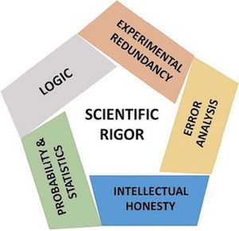

--- 
title: "The Complex Systems Approach to Behavioural Science"
author: "Fred Hasselman & Maarten Wijnants"
date: "2017 - 2018"
site: bookdown::bookdown_site
output: bookdown::gitbook
documentclass: book
bibliography: [refs.bib, packages.bib]
biblio-style: apalike
csl: apa.csl
link-citations: true
description: "The Complex Systems Approach to Behavioural Science. This book is a practical guide to basic theory, models, methods and analyses that can be used to study human physiology, behaviour and cognition from the perspective of Complex Adaptive Systems and Networks."
#url: "https\://darwin.pwo.ru.nl/skunkworks/courseware/1718_IWO/"
#documentclass: krantz
fontsize: "12pt"
monofont: "Source Code Pro"
monofontoptions: "Scale=0.7"
cover-image: images/foundations.png
---


#  *A practical guide* {-}


```{r init, include=FALSE}
require(devtools)
library(knitr)
library(kableExtra)
require(bookdown)
require(bookdownplus)
library(png)
library(jpeg)
library(DiagrammeR)
library(plyr)
library(tidyverse)
library(rio)
library(lattice)
library(htmlTable)
library(htmlwidgets)
library(lubridate)
library(casnet)

knitr::opts_chunk$set(out.width = "99%",fig.align='center',echo=TRUE)
knitr::knit_hooks$set(document = function(x) {gsub("\\usepackage[]{color}", "\\usepackage{xcolor}", x, fixed = TRUE)})
getOutFormat <- knitr::opts_knit$get('rmarkdown.pandoc.to')
```


```{r fig.align='center', echo=FALSE, include=identical(knitr:::pandoc_to(), 'html')}
knitr::include_graphics('images/foundations.png', dpi = NA)
```
*Image from [Grip on Complexity](http://www.nwo.nl/en/about-nwo/media/publications/ew/paper-grip-on-complexity.html)*


# **Course guide** {-}

Complexity research transcends the boundaries between the classical scientific disciplines and is a hot topic in physics, mathematics, biology, economy as well as psychology and the life sciences and is collectively referred to as the Complexity Sciences. This course will discuss techniques that allow for the study of human behaviour from the perspective of the Complexity Sciences, specifically, the study of complex physical systems that are alive and display complex adaptive behaviour such as learning and development.

Contrary to what the term “complex” might suggest, complexity research is often about finding simple models / explanations that are able to simulate a wide range of qualitatively different behavioural phenomena. “Complex” generally refers to the object of study: Complex systems are composed of many constituent parts that interact with one another across many different temporal and spatial scales to generate behaviour at the level of the system as a whole that can appear to be periodic, nonlinear, unstable or extremely persistent. The focus of many research designs and analyses is to quantify the degree of periodicity, nonlinearity, context sensitivity or resistance to perturbation by exploiting the fact that “everything is interacting” in complex systems. 

This requires a mathematical formalism and rules of scientific inference that are very different from the mathematics underlying traditional statistical analyses that assume “everything is NOT interacting” in order to be able to validly infer statistical regularities in a dataset and generalise them to a population. The complex systems approach to behavioural science often overlaps with the idiographical approach of the science of the individual, that is, the goal is not to generalise properties or regularities to universal or statistical laws that hold at the level of infinitely large populations, but to apply general principles and universal laws that govern the adaptive behaviour of all complex systems to study specific facts, about specific systems observed in specific contexts at a specific instant.

The main focus of the course will be hands-on data-analysis and the main analytical tool we will use is R (if you are an expert: It is also possible to use Matlab for most of the assignments, let us know in advance). Practical sessions will follow after a lecture session in which a specific technique will be introduced.

We will cover the following topics:

-	Theoretical background of phase transitions (self-organised criticality) and synchronisation (coupling dynamics) in complex dynamical systems and networks.
-	Simple models of linear and nonlinear dynamical behaviour (Linear & logistic growth, Predator-Prey dynamics, Lorenz system, the chaos game);
-	Analysis of long range dependence in time and trial series (Entropy, Relative roughness, Standardized Dispersion Analysis, Detrended Fluctuation Analysis).
-	Quantification of temporal patterns in time and trial series including dyadic interactions (Phase Space Reconstruction, [Cross] Recurrence Quantification Analysis).
-	Network analyses (Estimating symptom networks, calculating network based complexity measures)


## **Teaching formats** {-}
 
Each meeting starts with a lecture addressing the theoretical and methodological backgrounds of the practical applications that will be used in hands-on assignments during the practical sessions. Several meetings include a part where guest lecturers discuss the use of one or more techniques in their recent research.

### Preparation {-}

To prepare for each lecture students should read the assigned chapters in this book and contribute to the 7 discussion assignments. Participating in the discussion assignments is a required part of this course. At the end of the course we will check whether each student has posted at least one question or answer for each assignment. We will not judge the content of the posts, but in order to pass, we need at least 7 posts, one for each assignment. The answers will be discussed during the subsequent lecture.

### Using Cerego {-}

We have to introduce a lot of new terminology and to help students get acquainted with these terms, they can use [Cerego](https://www.cerego.com). An invitation will be sent to all participants of the course. The list of term is also included as [Appendix A](). 


### Test information {-}
 
Examination will be based on a final assignment and a check of participation in weekly discussions on blackboard (the content of contributions will not be evaluated).
Specifically:

-	To prepare for each lecture students read a contemporary research paper in which a complex systems approach is used to a phenomenon studied in behavioural science. Students are required to formulate questions about each paper, and to initiate a discussion with their fellow-students on Blackboard. Each week at least one post by each student is expected in the discussion forum.
-	A final take-home assignment will be provided at the end of the course. Details will be discussed during the course. In general, the assignment will take about 2 days to complete, the time available to complete the assignment will be 1-2 weeks depending on the schedule.

This course is for students of the Research Master Behavioural Science. Other Research Master students and PhD students interested in following the course ask for permission by emailing to rm@bsi.ru.nl until 3 weeks before the start of the course.

If permission is granted, this will be emailed 2 weeks before the start of the course. Please confirm this mail! PhD students (RU and external) have to subscribe through http://www.ru.nl/socialewetenschappen/onderwijs/overig/aanschuifonderwijs
This course is not available for Bachelor and Master students.

## **Learning objectives** {-}

### Specific {-}

Students who followed this course will be able to:

-	Critically evaluate whether their scientific inquiries can benefit from adopting theories, models, methods and analyses that were developed in the Complexity Sciences to study the structure and behaviour of complex adaptive systems.
-	Understand the differences between using an independent-statistical-component-dominant causal ontology, versus an interdependent-dynamical-interaction-dominant approach to the scientific study of human behaviour.
-	Understand and apply important terms to describe behavioural change and adaptation: Nonlinear dynamics (e.g. hysteresis), attractor state, order parameter, control parameter, state-space, phase-space, phase transition, self-organisation, emergence, synergies as coordinative structures.
-	Simulate linear, nonlinear and coupled growth using simple mathematical models in Excel and R (or Matlab).
-	Fit parameters of simple models of linear and nonlinear growth to real data in SPSS or R (or Matlab).
-	Perform analyses on time and trial series of human performance and physiology that quantify the presence and nature of scaling relations (fractal geometry) in continuous or categorical data in R (or Matlab).
-	Perform analyses on time and trial series of human performance and physiology that quantify the presence and nature of temporal patterns (recurrent trajectories in phase space) in continuous or categorical data data in R (or Matlab).
-	Perform network analyses on datasets that may be considered static or dynamical representations of social networks, or symptom networks (psychopathology) in R.
-	Understand the results from analyses in terms of early warning signals indicating a phase transition might be imminent.
-	Understand the results from analyses in terms of synchronisation and coupling phenomena, e.g. “complexity matching” and “leading/following” behaviour.

### General {-}

At the end of this course, students have reached a level of understanding that will allow them to: 

-	Study relevant scientific literature using a complex systems approach to behavioural science.
-	Getting help with using a complex systems approach in their own scientific inquiries, e.g. by being able to ask relevant questions to experts on a specific topic discussed during the course.
-	Work through tutorials on more advanced topics that were not discussed during the course.
-	Keep up with the continuous influx of new theoretical, methodological and empirical studies on applying the complex systems approach in the behavioural-, cognitive- and neurosciences.


## **Literature** {-}

Main literature: 

-	Hasselman, F., & Wijnants, M. (2018). A Complex Systems Approach to the Behavioural Sciences. A practical guide to basic theory, models, methods and analyses [this book]
-	Rose, T. (2016). The end of average: How we succeed in a world that values sameness. Penguin UK. [also available in Dutch and many other languages]

Selected chapters from these books will be made available to make a personal copy:

-	Friedenberg, J. (2009). Dynamical psychology: Complexity, self-organization and mind. ISCE Publishing.
-	Kaplan, D., & Glass, L. (2012). Understanding nonlinear dynamics. Springer Science & Business Media.

A list of required and optional literature related to the topic discussed in each session will be available on Blackboard.

We als provide links to online materials on specific topics (*Study Materials*) that may provide additional explanation and information about key concepts. These materials are not obligatory, but highly recommended to study at least once.


### Note about the book and assignments

The texts in the chapters of this book are intended as a rough introductory guide to accompany the lectures. An essential part of the course are [the assignments that are available online]()

```{block2, imp, type='rmdimportant'}
 The text inside these blocks provides important information about the course, or the assignments.
```

```{block2, ken, type='rmdkennen'}
 The text inside these blocks provides examples, or, information about a topic you should pay close attentiont to and try to understand.
```

```{block2, note, type='rmdnote'}
 The text inside these blocks provides a note, a comment, or observation.
```

```{block2, imp, type='rmdselfThink'}
 The text inside these blocks contains questions about a topic, or suggests connections between different topics discussed in the book or in the assignments. You should decide for yourself if you need to discuss the information. One way to do this is by opening a discussion thread on the discussion forum on Blackboard.
```


```{block2, imp, type='rmdentertain'}
 The content in these boxes is provided as entertainment :) 
```


## **Schedule** {-}

The dates and locations can be found below. All lectures are on Thursday from `10.45` to `12.30`. The practical sessions take place on Thursday from `13.45` to `15.30`.


## **We use `R`!** {-}

This text was transformed to `HTML`, `PDF` en `ePUB` using `bookdown`[@R-bookdown] in [**RStudio**](https://www.rstudio.com), the graphical user interface of the statistical language [**R**](https://www.r-project.org) [@R-base]. `bookdown` makes use of the `R` version of [markdown](https://en.wikipedia.org/wiki/Markdown) called [Rmarkdown](http://rmarkdown.rstudio.com) [@R-rmarkdown], together with [knitr](http://yihui.name/knitr/) [@R-knitr] and [pandoc](http://pandoc.org). 

We'll use some web applications made in [Shiny](http://shiny.rstudio.com) [@R-shiny] 

Other `R` packages used are: `DT` [@R-DT], `htmlTable` [@R-htmlTable], `plyr` [@R-plyr], `dplyr` [@R-dplyr],`tidyr` [@R-tidyr], `png` [@R-png], `rio` [@R-rio].


<!--chapter:end:index.Rmd-->

# (PART) Introduction {-}

<!-- # HOW TO CITE -->
<!-- # -->
<!-- # Citations go inside square brackets and are separated by semicolons. Each citation must have a key, composed of ‘@’ + the citation identifier from the database, and may optionally have a prefix, a locator, and a suffix. Here are some examples: -->

<!-- # Blah blah [see @doe99, pp. 33-35; also @smith04, ch. 1]. -->
<!-- # Blah blah [@doe99, pp. 33-35, 38-39 and *passim*]. -->
<!-- # Blah blah [@smith04; @doe99]. -->

<!-- # A minus sign (-) before the @ will suppress mention of the author in the citation. This can be useful when the author is already mentioned in the text: -->

<!-- # Smith says blah [-@smith04]. -->

<!-- # You can also write an in-text citation, as follows: -->

<!-- # @smith04 says blah. -->
<!-- # @smith04 [p. 33] says blah. -->

# **A Quick Guide to Scientific Rigour**

> "All science is either physics or stamp collecting."
>
> --- Ernest Rutherford (1872-1937)


Before we can begin our introduction to the wonderful world of Complex Adaptive Systems and Complex Networks, we briefly discuss the philosophy of science and perspective on the goal of scientific inquiry that is used throughout this book. This will allow us to highlight some differences between the **Complex Systems Approach (CSA)** we propose for the scientific study of human nature and the classical, often implicit perspective used in most disciplines of the social and life sciences, we will call the **Machine Metaphor Approach (MMA)**.

Use of the scientific method [**scientific method**](https://en.wikipedia.org/wiki/Scientific_method) is what seperates scientific from non-scientific claims about the structure of reality. It consists of all philosophical, theoretical and empirical tools, procedures and methods that can be used to systematically evaluate the veracity of such explanatory claims. The repeated application of the scientific method to study scientific questions promises to generate **valid** (accurate) inferences and **reliable** (precise) facts about a certain explanatory domain, but it is important to note it does not guarantee that any kind of absolute 'truth' will be discovered. The veracity of scientific inferences is always conditional on the quality of the body of scientific knowledge from which the inferences were deduced, induced or abducted. For example, when a *crisis of confidence* about the trustworthiness of the facts in the scientific record of some subdisciplines of psychological science was suggested [@pashler2012a], the immediate consequence was that the veracity of all claims by psychological science was called into question.   

### Rigorous Science {-}
Less tangible, but not less important for the perceived veracity of scientific knowledge are concepts such as *intellectual honesty* and *scientific integrity* of the scientists laying explanatory claim on some observable phenomena. So the 'mere' application the scientific method to any problem in science does not fully grasp all the characteristics that would lead to a solid body of knowledge. We will use the term [**rigorous science**](http://mbio.asm.org/content/7/6/e01902-16.full) [@casadevall2016a] to denote the ideal set of conditions that should be in place to allow us to distinguish scientific claims that are likely to be false, from claims that are likely to be true, given the perceived veracity of the scientific record.


```{r rigorous, echo=FALSE, fig.cap="Rigorous Science according to @casadevall2016a."}

```

When a claim is based on **Scientific Rigour**, we mean it was posited based on the following:

1. **Experimental Redundancy** - The claim has been examined by all methodological and analytical tools that are available and are appropriate given the context. Rigorous Science does not rely on one type of experimental design or one type of statistical analysis.
2. **Recognition of Error** - Without failure there can be no progress, therefore we should carefully study failures and not just report success stories. Any sources of error should be carefully studied and reported to the scientific community.
3. **Sound Probability & Statistics** - Use of the most recent and appropriate statistical theories, models and analytical techniques. Statistical modelling techniques become more realistic over time and often the models that were taught in undergraduate statistics courses have long been replaced and should not be used any more.
4. **Efforts to Avoid Logical Traps** - When generating theories and defining constructs and laws, make sure logical inconsistencies are avoided. When making inferences, avoid the common logical traps such as *The Effect = Structure Fallacy* in null hypothesis significance testing (NHST).
5. **Intellectual Honesty** - Rigorous science is ethical, has integrity and thrives on critical reflection on scientific practice. The right mindset is *"Prove yourself wrong!"*, not *"Prove yourself right!"*


## **Formalism, Ontology and Epistemology**

> A difficulty of much psychological theorizing is vagueness in the terms employed. In this work, the above ideas have been studied in mathematical form throughout, the definitions and proofs being given corresponding precision.
>
> ---W. R. Ashby in 'The Physical Origin of Adaptation by Trial adn Error' (-@ashby1945a, p. 13)


@[Meehl1990a,Meehl1997a]

## **Phenomena, theories, facts and laws**


### Properties of theories {-}


## **Appraising and amending theories**


### Strong Inference {-}

*The Effect = Structure Fallacy* refers to the logical error that occurs a predicted effect is observed (i.e. a statistically significant test result leads to a rejection of the null hypothesis), it is not valid to infer the existence of the assumed cause was evidenced. NHST is based on *the falsification principle*, which means the perceived veracity of a scientific claim will increase only if it has resist many rigorous attempts to prove it is wrong. If a scientific claim has a large track-record of resisting falsification 


```{r stronInf, echo=FALSE}
df<-rbind.data.frame(
  r1 = "Devising alternative hypotheses",
  r2 = "Devising a crucial experiment (or several of them), with alternative possible outcomes, each of which will, as nearly as possible, exclude one or more of the hypotheses",
r3 = "Carrying out the experiment so as to get a clean result",
r4 = "Recycling the procedure, making subhypotheses or sequential hypotheses to refine the possibilities that remain",
r5 = "and so on.")
colnames(df) <- c("Strong inference consists of applying the following steps to every problem in science, formally and explicitly and regularly:")
rownames(df) <- c("1.","2.","3.","1'","...")

knitr::kable(df, 
             booktabs = TRUE,
             row.names = TRUE,
             format = getOutFormat,
             escape = ifelse(all(getOutFormat%in%c("html","docx")),TRUE,FALSE),
             caption = "Strong Inference according to @platt1964strong ") %>%
  kable_styling(latex_options = c("striped", "scale_down"),
                bootstrap_options = c("striped","responsive", "condensed"),
                font_size = 10)  

```


## **Measurement and Psychometrics**

> "It is the theory that decides what we may observe"
>
> 


```{r meetniv, echo=FALSE, message=FALSE, warning=FALSE, results='asis'}
#dft <-read.csv("~/Library/Mobile Documents/com~apple~CloudDocs/GitHub/Cursusboek IWO/1718/docs/meetniveaus.csv")
dft <- t(data.frame(A= c("Determination of (in)equality","Determination of 'more' or 'less'","Determination of  equality of intervals of differences","Determination of equality of ratios"),
                        B= c("$=\\ \\neq$","$\\leq\\ \\geq$", "$+ \\ -$", "$\\times\\ \\div$"),
                        C = c("Groeperen; Classificeren; Indiceren", "Sorteren; Vergelijken; Niveau bepalen", "Relatieve vergelijkingsbasis (meetlat): Relatief verschil of gelijkenis; relatief nulpunt", "Absolute vergelijkingsbasis (meetschaal): Verhoudingen van magnitudes / hoeveelheden; absoluut nulpunt"),
                        D = c("Modus; Frequentie", "Mediaan; Percentielen", "Rekenkundig gemiddelde; Standaarddeviatie", "Geometrisch gemiddelde; Variatiecoëfficiën [note]"),
                        E = c("Nominale associatie (Contingentie coefficient, Phi, Kramer's V, Lambda, $\\chi^2$)", "Directionele nominale associatie (Kendall's tau a-c, Gamma, Somer's D)", "Rangorde correlatie en Product-Moment correlatie (Spearman en Pearson correlatie)", "Kansverdelingen en informatie theorie (K-L divergence, Average Mutual Information)")))
colnames(dft) <- c("Nominaal","Ordinaal","Interval","Ratio")
rownames(dft) <- c("Basale empirische methoden","Wiskundige operatoren","Analyse","Centrale tendentie","Samenhang")


kbt <- knitr::kable(dft, 
      row.names = TRUE, 
      booktabs = TRUE, 
      format = getOutFormat, 
      escape = ifelse(all(getOutFormat%in%c("html","docx")),TRUE,FALSE),
      caption = "Properties of Random Variables at Stevens' Levels of Measurement (1962)")

if(all(getOutFormat%in%c("html","docx"))){
  kable_styling(kable_input = kbt,
                bootstrap_options = c("striped","condensed","responsive"),
                font_size = 10) %>%
  add_footnote(c("https://nl.wikipedia.org/wiki/Variatiecoëfficiënt"), notation = "number") %>%
  column_spec(1, bold = TRUE)

  } else {
    
  kable_styling(kable_input = kbt,
                latex_options = c("striped", "scale_down"),
                font_size = 10,
                full_width = FALSE) %>%
  add_footnote(c("https://nl.wikipedia.org/wiki/Variatiecoëfficiënt"), notation = "number") %>%
  column_spec(1, bold = TRUE, width = "10em") %>% 
  row_spec(1,bold=TRUE) %>%
  column_spec(2:5, width = "20em")
}
```


# *Study Materials* {-}

```{block2, fact_hypo, type='rmdimportant'}
**Clear explanation of the difference betweern phenomenon, hypothesis, theory en law**  

[](https://youtu.be/lqk3TKuGNBA)

```


```{block2, onto, type='rmdimportant'}
<span style="font-size:80%;"><b>Ontologie.</b></span>

[](https://youtu.be/FN2zwqE_Qo0)

```


```{block2, epis, type='rmdimportant'}
<span style="font-size:80%;"><b>Epistemologie</b></span>

[](https://youtu.be/jRxoHtGa4NM)

```


# **Introduction to Complexity Science**

Psychological systems are biological systems which are physical systems that are alive. Therefore, any theory that lays explanatory claim to phenomena of the mind, ultimately must be a theory about how a physical system is able to accumulate non-random order into its internal structure that appears to codetermine its behaviour. Less formally stated, a science that studies the behaviour of physical systems that are alive, that appear to have a memory which makes their behaviour adaptive, future oriented, intelligent, should in principle be grounded in physical and biological principles and laws. That may be a bridge too far for now, but such theories should at least not contradict highly corroborated theories of physics that describe the behaviour of the constituent components of living systems. 

The best way to describe the differences between the *Machine Metaphor Approach (MMA)* and the *Complex Systems Approach (CSA)* to study human behaviour is to examine what theories generated using the each approach  

The Complex Systems Approach to Behavioural Science is mainly concerned with understanding  be described as  science 


Such behavior is often called 'adaptive' to indicate that the same external states could elicit different behavioral responses depending on the temporal order in which they occur (e.g. reward before vs. after an electric shock; cf. [@Gibson1966a], [@Walker1972a]). One important requirement for dependence of system behavior on the temporal order of event occurrences, is that the physical composition of the system must permit specification of its internal structure by the particular facts pertaining to the events (see e.g. [@Turvey1999a], [@Freeman2001a], [@Friston2013a]). If the after-effects of an interaction of the system with its environment are reflected by systematic changes to the internal structure of a system (e.g., evidenced as correlations between internal and external states such as 'neural correlates'), the system can be characterized as a memory system. Specification of the physical structure of a system through after-effects of interactions ('experienced' events), is the only conceivable way to permit the coordination of behavior in the present (the Now) by the past (cf. [@Turvey1979a]).

The Complex Systems Approach to Behavioural Science is mainly concerned with understanding  be described as  science 

The conception of particular facts as discrete internalized states dates back at least to 1904 when Richard Semon defined the `engram' as the unique physiological trace left in the central nervous system by each stimulus and thing that an organism had experienced or learned ~\citep*[see][]{Bruce2001a, McConnell1965a}. Related to the concept of the engram is the `associative chain theory'~\citep*[][]{Lashley1951a} or `path theory' of the central nervous system:


> "I refer to `path theory', which states, roughly, that the functions of the central nervous system are controlled by chains of neurons laid down as a path so as to conduct the impulse to its appropriate end-organ: that the paths are strictly constant, thus accounting for the fact that the reflexes and reactions are largely constant: that learning consists of the opening up of new paths and that memory consists of the retraversing of some old path by another impulse.""
>
> --- @Ashby1931a [p. 148]


Both the engram and path theory turned out to be elusive theoretical constructs. After a lifetime spent searching for the engram, Lashley announced his failure to detect it ~\citep*[][see Table~\ref{Tab:01}]{Lashley1950a} and with respect to the emergence of order in sequences of behavior out of chains of associations: 


> "I believe, that such interpretations of temporal organization are untenable and that there are, behind the overtly expressed sequences, a multiplicity of integrative processes which can only be inferred from the final results of their activity.""
>
> --- @Lashley1951a [p. 115]


Gibson's quoted vision of the brain as a self-tuning resonator was based on Lashley's criticism of the brain as a storehouse (see Table~\ref{Tab:01}). The storehouse and path metaphors are apparently too compelling, especially in the behavioral-, cognitive-, and neurosciences (BCN science) the brain is commonly referred to as a storage medium ~\citep*[][is a critical evaluation]{Wolpaw2002a} and overt behavior as the result of executing a program ~\citep*[][is a critical evaluation]{Noble2008a}. The internal, or mental representation is a modern version of the engram and plays a crucial role in modern theorizing about intelligent behavior. Remarkably, despite its importance as a theoretical entity, a formal definition is missing. In terms of a physical system, internal representation refers to: ``\textit{an identifiable physical state within a system that stands in for another (internal or external) state and that as such plays a causal role in (or is used by) the system generating its behavior}''~\citep*[][p. 6]{Haselager2003a}. From a realist perspective, any theory about mental phenomena that makes use of internal representations and imprinted `paths' or `traces' to explain adaptive behavior, will have to explain how the system was specified to represent (aspects of) an interaction event. In BCN science, this is generally neglected and many accounts of the physical realization of adaptive behavior must be characterized as `feigned physicalism'. Ashby already noted in 1931, that the path theory ``\textit{[...] has never been clearly stated but tends to lie in the background, emerging to explain some convenient fact yet not being questioned when facts appear which it is powerless to explain.}~\citep*[][p.148]{Ashby1931a}.

The goal of this article is to introduce a number of physical principles and explanatory tools that allow the development of a formalism
\footnote{To be clear, a sketch of a formalism implies positing candidate conjectures to be raised as postulates. It refers to providing novel perspectives on old questions or the re-framing of existing claims in order to enable the unification or formal similarity of competing theories. The (to be developed) formalism itself is not a theory. It is a definition of a domain in reality from which different theories can depart and compete for scientific credibility in explaining the phenomena included by the postulates of the formalism.} for complex adaptive behavior based a conception of computation that respects the physical medium of implementation~\citep*[][]{Maclennan2011a}. 
A formalism for Radical Embodied Computation (REC++)
\footnote{ The addition of ++ in REC++ not only allows easy discrimination from REC, but also refers to the popular computer programming language C++ in which ++ is an increment operator. The operation of incremental counting will be considered an important property of the biophysical realization of computation.} 
should describe order generation inside brains nested in bodies that can explain phenomena of the mind departing from principles of Information Realism ~\citep*[][]{Floridi2003a}. REC++ can be described as an attempt to merge Radical Embodied Cognition ~\citep*[REC; cf.][]{Chemero2009a} and Physical Intelligence~\citep*[PI; cf.][]{Turvey2012a} with Natural Computation ~\citep*[NC; see][]{Wolfram2002a,Pfeifer2007a,Polani2007a,Maclennan2012a}. Potential issues with this objective are he explicit rejection of the use of information-theoretic constructs by REC in which: ``\textit{[] perception, cognition, and action as necessarily embodied phenomenon, using explanatory tools that do not posit mental representations}''  ~\citep*[][p. 29]{Chemero2009a} and the requirement by PI of information to become more than a measure of uncertainty ~\citep*[meaningful, specific, usable, scaled, see][]{Turvey2012a}. These and related issues will be discussed throughout the text.

First, I will follow Ashby's lead and test the explanatory boundaries of Radical Neuronal Reductionism (RNR) that is commonly used as a causal ontology for adaptive behavior in BCN science ~\citep*[][]{Majorek2012a}. 


## **What is a Complex Dynamical System?**

A system is an entity that can be described as a composition of components, according to one or more organizing principles. The organizing prniciples can take many different forms, but essentially they decide the three important features of systems that have to do with the relationship between parts and wholes: 

* What are the relevant scales of observation of the system
* What are the relevant phenomena that may be observed at the different scales 
* Can interactions with the internal and external environment occur, and if so, do interactions have any effects on the structure and/or behaviour of the system


### Open vs. Closed

A closed system cannot exchange any energy, matter or information with the external environment.

### Simple vs. Complex


### Ergodic vs. Non-ergodic
[@Molenaar2008a,@Molenaar2009a]

### Equilibrium vs. Far-from-equilibrium


### Order vs. Disorder

> "order is essentially the arrival of redundancy in a system, a reduction of possibilities"
>
> --- Von Förster (2003) 

The arrival of redundancy is an excellent description of what is meant by *nonrandom* behaviour. If the behaviour of a system is redundant, this means it is predictable to some extent and this just refers to the fact that behaviour covaries systematically (is correlated) with the behaviour of other parts of the system, or with changes in the external environment. The presence of redundancies indeed implies a reduction of possible states the system has available to generate its behaviour, the states a system can be in are in some way dependent on the temporal evolution of parts of the internal or external environment, they can no longer be occupied independently. This phenomenon id often described as a *constraint on the degrees of freedom* a system has available to generate its behaviour. The appearance of order always implies that states that were previously part of the behaviourial repertoire, are no longer accessible by the system.

The opposite of order, *disorder*, or randomness, must then refer to the absolute absence of any redundancies, making reliable prediction of system behaviour impossible, or, equilly reliable to what may be expected by chance. The amount of disorder in a system can be quantified, a measure known as the Entropy of a system.


### Order vs. Deterministic Chaos


## **A Causal Ontology of Interactions**


## **State Space**


## **Phase Space**


## **The Attractor Ladscape**


**Equilibrium State**
It occurs when a dynamic system has a configuration C with the properties that
a. if started at C and released, it does not move from C, and 
b. if started at any configuration near C, the system changes in time towards C.


<!--chapter:end:01-IntroductionCSA.Rmd-->

# (PART) Mathematics of Change {-} 

# **Introduction to the Mathematics of Change** 


## **Stat(ist)ic versus Dynamic Models**

The simplest non-trivial *iterative change process* can be described by the following *difference equation*: 

$$ Y_{t+1} = Y_{t=0} + a*Y_t $$    

The equation describes the way in which the value of $Y$ changes [between two adjacent, **discrete** moments in time](https://en.wikipedia.org/wiki/Discrete_time_and_continuous_time) 
(hence the term [difference equation, or recurrence relation](https://en.wikipedia.org/wiki/Recurrence_relation)). There are two parameters resembling an intercept and a slope:

1. The starting value $Y_0$ at $t=0$, also called the *starting value*, or the *initial conditions*.
2. A rule for incrementing time, here the change in $Y$ takes place over a discrete time step of 1: $t+1$.    
    
The values taken on by variable $Y$ are considered to represent the states  quantifiable observable  leAlternative ways to describe the change of states :

* A dynamical rule describing the propagation of the states of a system observable measured by the values of variable `Y` through discrete time.
* A dynamic law describing the time-evolution of the states of a system observable measured by the variable `Y`.   
    
These descriptions all refer to the change processes that govern system observables (properties of dynamical systems that can be observed through measurement).     

### **It's a line! It's a plane!** 
The formula resembles the equation of a line. There is a constant value $Y_{0}$ which is added to a proportion of the value of $Y$ at time $t$, given by parameter $a$. This is equivalent to the slope of a line. However, in a $(X,Y)$ plane there are two 'spatial' (metric) dimensions representing the values two variables $X$ and $Y$ can take on (see figure).

```{r, echo=FALSE, message=FALSE, warning=FALSE}
set.seed(12346)
y1 = cumsum(rnorm(n=21,mean=5,sd=100))
x1 = -10:10
plot(x1,y1, type="p", lwd=2, xlim=c(-12,12), yaxt="n", xlab="X", ylab="Y", main = "2D Euclidean Space")
abline(h=0,v=0,lty=2)
l1 <- lm(y1~x1)
lines(x1,coef(l1)[1]+x1*coef(l1)[2],type="l",lwd=3)
text(1.5, y1[11], expression(Y[X==0]),col="grey60")
text(11.5, y1[21], expression(Y[X==10]),col="grey60")
text(-11.5, y1[1], expression(Y[X==-10]),col="grey60")
```

The best fitting straight line would be called a statistical model of the linear relationship between the observed values of $X$ and $Y$. It can be obtained by fitting a General Linear Model (GLM) to the data. If $X$ were to represent repeated measurements the multivariate GLM for repeated measures would have to be fitted to the data. This can be very problematic, because statistical models rely on [Ergodic theory](https://en.wikipedia.org/wiki/Ergodic_theory): 

> "... it is the study of the long term average behavior of systems evolving in time."


```{block2, type="rmdkennen"}
In other words: If you throw 1 die 100 times in a row, the average of the 100 numbers is the **time-average** of one of the observables of die-throwing systems. If this system is ergodic, then its **time-average** is expected to be similar to the average of the numbers that turn up if you throw 100 dice all at the same instance of time. The dice layed out on the table represent a spatial sample, a snapshot frozen in time, of the possible states the system can be in. Taking the average would be the **spatial average** this observable of die-throwing systems. This ergodic condiciotn is often implicitly assumed in Behavioural Science when studies claim to study change by taking different samples of individuals (snapshots of system states) and comparing if they are the same. 
```


 need to assume independence of measurements within and between subjects. These assumptions can be translated to certain conditions that must hold for the model to be valid, known as *Compound Symmetry* and *Sphericity*:    

> The compound symmetry assumption requires that the variances (pooled within-group) and covariances (across subjects) of the different repeated measures are homogeneous (identical). This is a sufficient condition for the univariate F test for repeated measures to be valid (i.e., for the reported F values to actually follow the F distribution). However, it is not a necessary condition. The sphericity assumption is a necessary and sufficient condition for the F test to be valid; it states that the within-subject "model" consists of independent (orthogonal) components. The nature of these assumptions, and the effects of violations are usually not well-described in ANOVA textbooks; [^assumptions]   

As you can read in the quoted text above, these conditions must hold in order to be able to identify unique independent components as the sources of variation of $Y$ over time within a subject. This is the a clear example of:


If you choose to use GLM repeated measures to model change over time, you will only be able to infer independent components that are responsible for the time-evolution of $Y$. As is hinted in the last sentence of the quote, the validity of such inferences is not a common topic of discussion statistics textbooks.

### **No! ... It's a time series!**

The important difference between a regular 2-dimensional Euclidean plane and the space in which we model change processes is that the $X$-axis represents the physical dimension **time**. In the case of the Linear Map we have a 1D space with one 'spatial' dimension $Y$ and a time dimension $t$. This  is called time series if $Y$ is sampled as a continuous process, or a trial series if the time between subsequent observations is not relevant, just the fact that there was a temporal order (for example, a series of response latencies to trials in a psychological experiment in the order in which they were presented to the subject).

```{r, echo=FALSE}
plot(0:20,y1, type="b", lwd=2, xlim=c(-2,22), yaxt="n", xlab="Time / Trial series", ylab="Y", main = "1D Euclidean Space")
abline(h=0,v=0,lty=2)
x2 <- (x1+10)
l2 <- lm(y1~x2)
lines(x2,coef(l2)[1]+x2*coef(l2)[2],type="l",lwd=3)
text(-1.2, y1[1], expression(Y[t==0]),col="grey60")
text(21.5, y1[21], expression(Y[t==20]),col="grey60")
```

Time behaves different from a spatial dimension in that it is directional (time cannot be reversed), it cannot take on negative values, and, unless one is dealing with a truly random process, there will be a temporal correlation across one or more values of $Y$ seperated by an amount of time. In the linear difference equation this occurs because each value one step in the future is calculated based on the current value. If the values of $Y$ represent an observable of a dynamical system, the system can be said to have a history, or a memory.

Ergodic systems do *not* have a history or a memory that extends across more than one time step. This is very convenient, because one can calculate the expected value of a system observable given infinite time, by making use of of the laws of probabilities of random events (or random fields). This means: The average of an observable of an Ergodic system measured across infinite time (its entire history, the **time-average**), will be the be the same value as the average of this observable measured at one instance in time, but in an infinite amount of systems of the same kind (the population, the **spatial average**) [^dice]. 

The simple linear difference equation will have a form of *perfect memory* across the smallest time scale (i.e., the increment of 1, $t+1$). This 'memory' just concerns a correlation of 1 between values at adjacent time points (a short range temporal correlation, SRC), because the change from $Y_t$ to $Y_{t+1}$ is exactly equal to $a * Y_t$ at each iteration step. This is the meaning of deterministic, not that each value of $Y$ is the same, but that the value of $Y$ now can be perfectly explained form the value of $Y$ one moment in the past.

Summarising, the most profound difference is not the fact that the equation of linear change is a deterministic model and the GLM is a probabilistic model with parameters fitted from data, this is something we can (and will) do for $a$ as well. The profound difference between the models is the role given to the passage of time: 

* The linear difference equation represents changes in $Y$ as a function of the physical dimension *time* and $Y$ itself.
* The GLM represents changes in $Y$ as a function of a [linear predictor](https://en.wikipedia.org/wiki/Linear_predictor_function) composed of additive components that can be regarded as independent sources of variation that sum up to the observed values of $Y$.

-----
[^assumptions]: [Retreived from www.statsoft.com](https://www.statsoft.com/Textbook/ANOVA-MANOVA#sphericity)
[^einstein]: Einstein as quoted by Heisenberg.
[^ergodic]: See  Dajani &  Dirksin (2008, p. 5, ["A simple introduction to Ergodic Theory"](http://www.staff.science.uu.nl/~kraai101/lecturenotes2009.pdf))

<!--chapter:end:02-MathematicsofChange.Rmd-->

# Methods

We describe our methods in this chapter.

<!--chapter:end:03-BasicTimeSeriesAnalysis.Rmd-->

# Applications

Some _significant_ applications are demonstrated in this chapter.

## Example one

## Example two

<!--chapter:end:04-FluctuationAnalyses-GlobalScaling.Rmd-->

# Final Words

We have finished a nice book.

<!--chapter:end:05-FluctuationAnalyses-LocalScaling.Rmd-->

# Final Words

We have finished a nice book.

<!--chapter:end:06-RecurrenceQuantificationAnalysis.Rmd-->

# Final Words

We have finished a nice book.

<!--chapter:end:07-CrossRecurrenceQuantificationAnalysis.Rmd-->

# Final Words

We have finished a nice book.

<!--chapter:end:08-ComplexNetworks.Rmd-->

# (APPENDIX) APPENDICES {-}

# **List of terms**

### **Adaptive Behaviour** {- #Adap1}

+ System behaviour that appears to be (partially) coordinated by previously 'experienced events'

### **Analytic solution** {- #Anal2}

+ The solution to a difference or differential equation allows one to find any state of the system without the need to iterate the model starting from some initial condition. There are very few (systems of) equations for which analytical solutions exist

### **Attractor** {- #Attr3}

+ The status that a dynamic system eventually "settles down to". An attractor is a set of values in the phase space to which a system migrates over time, or iterations. Attractors can have as many dimensions as the number of variables that influence its system

### **Basin of attraction** {- #Basi4}

+ A region in phase space associated with a given attractor. The basin of attraction of an attractor is the set of all (initial) points that eventually end up in that attractor

### **Behaviour (of a dynamic system)** {- #Beha5}

+ The  temporal evolution of states of a system according to one or more rules (also known as state propagation rules, or, iterative processes). Models of the behaviour of dynamic systems use difference or differential equations to describe the iterative processes hypothesized to underly the temporal evolution

### **Bifurcation** {- #Bifu6}

+ A clearly observable qualitative change in the behavioural mode (attractor state) of a dynamic system associated with continuous change in one or more control parameters  (also known as Phase-, State-, or Order- Transition). The value of a control parameter at which a bifurcation occurs is often non-specific, or trivial

### **Bifurcation diagram** {- #Bifu7}

+ Visual summary of the succession of period-doubling bifurcations produced by gradual changes in the control parameter(s)

### **Catasrophe theory** {- #Cata8}

+ Mathematical resreach program describing how gradual change in some parameters can lead to disprortionally large changes in another parameter, called catastrophes (similair to bifurcations, Phase-, State-, or Order-transitions). 'This kind of behavior has been summarized succinctly in the phrase "the straw that broke the camel's back".' (Gilmore, 1992). 

### **Catastrophe flags** {- #Cata9}

+ Markers indicative for a physical system that is describe by a catastrophe. There are 5 'classical' flags and 3 'diagnostic' flags. Classical: bimodality, sudden jumps, inaccessibility, sensitivity & hyesteresis. Diagnostic: divergence from linear response, critical slowing down and critical  fluctuations. Diagnostic flags can be used as early-warning signals. 

### **Complex Network** {- #Comp10}

+ A network with of many nodes and likely many substructures depending on thet nature and distribution of connections between nodes

### **Complex system** {- #Comp11}

+ Spatially and/or temporally extended nonlinear systems characterized by emergent properties and self-organised behavioural modes at a global, or, macro-level (the system as a whole), that is often different from the characteristic behaviour at a local, or, micro-level (behaviour of the individual parts that constitute the whole)

### **Complexity science** {- #Comp12}

+ Complexity science studies how systems that consist of many components can generate relatively simple and stable (nonrandom) behaviour. Important behavioural phenomena studied in Complexity Science are synchronisation, adaptation and coordination of behaviour across many different temporal and spatial scales, emergent properties and collective behaviour, holism and self-organisation

### **Component dominant dynamics** {- #Comp13}

+ A causal ontology in which observed behaviour is explained by assuming it is the result of a chain of independent efficient causes (components)

### **Control parameter** {- #Cont14}

+ A variable that controls the global behaviour of a dynamic system. For certain values of the parameter, transitions between qualitatively different behavioural modes (orders) can occur.

### **Critical fluctuations** {- #Crit15}

+ An early warning signal for a phase transition that is characterised by an increase in fluctuations (variability) of the behaviour of the system. The increase occurs because the self-organised transition from one state to another relaxes the contraints on the degrees of freedom a system has available to generate its behaviour, allowing states and behavioural modes to appear that were previously inaccesible.

### **Critical slowing down** {- #Crit16}

+ An early warning signal for a phase transition that is characterised by an increase in the duration of relaxation times. If it takes longer for the system to return to the state it was perturbed from, this implies the emergence of a new stable state is imminent

### **Deterministic Chaos** {- #Dete17}

+ Behaviour of a dynamic system that "looks random, but is not" (Lorenz, 1973). The dynamics can be characterised as follows: 1) A-periodic, no point or trajectory in state space will exactly recur; 2) Sensitive dependence in initial conditions; 3) Bounded, not all theoretically possible degrees of freedom are available to the system; 4) The origin of this behaviour is deterministic, not stochastic

### **Difference equation** {- #Diff18}

+ A function specifying the underlying change process in a variable from one discrete point in time to another

### **Differential equation** {- #Diff19}

+ A function specifying the underlying change process of a variable in continuous  time

### **Dimension** {- #Dime20}

+ See embedding dimension, box-counting dimension, correlation dimension, information dimension, dimension of a system

### **Dimensions of a system** {- #Dime21}

+ The set of variables that define a system. Iterative processes operate on the dimensions of a system

### **Dynamic system** {- #Dyna22}

+ A set of equations specifying how certain variables change over time. The equations specify how to determine (compute) the new values as a function of their current values and control parameters. The functions, when explicit, are either difference equations or differential equations. Dynamic systems may be stochastic or deterministic. In a stochastic system, new values come from a probability distribution. In a deterministic system, a single new value is associated with any current value

### **Early warning signals** {- #Earl23}

+ Critical slowing down and critical fluctuations. Early-warning signals indicate instability in the existing state which may result in a qualitative shift towards a new state (phase transition / catastrophe). Early-warning signals are similair to diagnostic catastrophe flags. 

### **Effective Complexity** {- #Effe24}

+ “The effective complexity of an entity is the length of a highly compressed description of its regularities.” (Gell-man & Lloyd, 2004)

### **Embedding Dimension** {- #Embe25}

+ Successive N-tuples of points in a time series are treated as points in N dimensional space. The points are said to reside in embedding dimensions of size N, for N = 1, 2, 3, 4, ... etc.

### **Emergence** {- #Emer26}

+ A complex system can generate emergent behaviour or display emergent properties that are novel and unexpected, that is, they are not predictable from the behaviour and proprties of the components of the system

### **Entropy** {- #Entr27}

+ Relative absence of order/redundancy in a system. The degrees of freedom a system has available for generating its behavior: Possibility

### **Epigenetic landscape (potential lanscape)** {- #Epig28}

+ A hypothetical landscape describing the relative stability of behavioural modes of a system over time

### **Experienced event** {- #Expe29}

+ An interaction of a system with its environment that changed the internal structure/organization of the system such that it can be said to display adaptive behaviour. “Interaction with after-effects”. Random behavior is “Interaction without after-effects”.

### **flow ~** {- #flow30}

+ A differential equation

### **Fractal** {- #Frac31}

+ An irregular shape with self-similarity. It has infinite detail, and cannot be differentiated. "Wherever chaos, turbulence, and disorder are found, fractal geometry is at play" (Briggs and Peat, 1989).

### **Fractal Dimension** {- #Frac32}

+ A measure of a geometric object that can take on fractional values. At first used as a synonym to Hausdorff dimension, fractal dimension is currently used as a more general term for a measure of how fast length, area, or volume increases with decrease in scale. (Peitgen, Jurgens, & Saupe, 1992a).

### **Graph theory** {- #Grap33}

+ Models in which associations between mathematical objects are defined as edges (connections) between vertices (nodes)

### **Hausdorff Dimension** {- #Haus34}

+ A measure of a geometric object that can take on fractional values. (see fractal dimension).

### **Holism (epistemic)** {- #Holi35}

+ "some property of a whole would be holistic if, according to the theory in question, there is no way we can find out about it using only local means, i.e., by using only all possible non-holistic resources available to an agent.” (Seevinck, 2002)

### **Idiographic approach** {- #Idio36}

+ Scientific explanation in which the goal is to generate knowledge about specific facts, events or entities. The goal is not to generalize to universal laws and first principles.

### **Information (quantity)** {- #Info37}

+ A measurable quantity that resolves uncertainty about the state of a system by assigning a value to the uncertainty.

### **Initial condition** {- #Init38}

+ The starting point of a dynamic system, the initial state of a system from which it evolved to the current state.

### **Interaction dominant dynamics** {- #Inte39}

+ A causal ontology in which observed behaviour is explained by assuming it is the result of interactions between processes across many temporal and spatial scales

### **Iteration** {- #Iter40}

+ The repeated application of a function, using its output from one application as its input for the next.

### **Iterative function** {- #Iter41}

+ A function used to calculate the new state of a dynamic system.

### **Iterative system** {- #Iter42}

+ A system in which one or more functions are iterated to define the system.

### **Largest Lyapunov exponent** {- #Larg43}

+ The value of the largest exponent in a spectrum of exponents (the Lyapunov spectrum), coefficients of time, that reflect the rate of departure (divergence) of dynamic orbits of a system. The largest exponent indicates the extent to which the behaviour of a system is sensitive to initial conditions.

### **Limit cycle** {- #Limi44}

+ An attractor that is periodic in time, that is, that cycles periodically through an ordered sequence of states.

### **Limit points** {- #Limi45}

+ Points in phase space. There are three kinds: attractors, repellors, and saddle points. A system moves away from repellors and towards attractors. A saddle point is both an attractor and a repellor, it attracts a system in certain regions, and repels the system to other regions.

### **Linear function of predictors** {- #Line46}

+ A linear equation is of predictors is of the form y=a*x(i)+b, in which variable y varies 'linearly' with other variables x(i). In this equation, 'a' determines the slope of the line and 'b' reflects the y-intercept, the value y obtains when all x(i) equal zero.

### **Linear function of time** {- #Line47}

+ A linear function of time is of the form ŷ(t) = a*y(t) + b, in which variable y varies 'linearly' with time 't', that is, with itself at an earlier moment in time. In this equation 'a' determines the rate with which 'y' will change as time passes, 'b' reflects the initial condition, the value y obtains when t equals zero.

### **map ...** {- #map48}

+ A difference equation

### **Nonlinear dynamics** {- #Nonl49}

+ The study of dynamic systems whose functions specify that change is not a linear function of time.

### **Orbit (trajectory)** {- #Orbi50}

+ A sequence of coordinates (a path) through the phase space of a system.

### **Order** {- #Orde51}

+ “order is essentially the arrival of redundancy in a system, a reduction of possibilities”(Von Förster, 2003). Any form of nonrandom association or dependency that exists between parts of a system, its behaviour over time and/or its environment is a form of order. In scientific explanation of behaviour, the presence of order in non-artificial systems must be explained and should not be (implicitly) assumed.

### **Order Parameter** {- #Orde52}

+ A nominal variable that indexes qualitatively different behavioural modes of a system, for example the phases of matter (gas, liquid, solid, plasma)

### **Period-doubling** {- #Peri53}

+ The change in dynamics in which a N-point attractor is replaced by a 2N-point attractor.

### **Phase portrait** {- #Phas54}

+ The collection of all trajectories from all possible starting points in the phase space of a dynamic system.

### **Phase space** {- #Phas55}

+ An abstract space used to represent the behavior of a system. Its dimensions are the variables of the system. Thus a point in the phase space defines a potential state of the system. The points actually achieved by a system depend on its iterative function and initial condition (starting point).

### **Phase transition** {- #Phas56}

+ A transition between qualitatively different behavioural modes

### **Potential function** {- #Pote57}

+ A function that describes the order paremeter of a system, that is, it describes the relative stability of the potential end-states (attractor states) a system can settle into. The paramaters of the potential function include the control parameter.

### **Power-law scaling** {- #Powe58}

+ A relationship between two variables that is linear on doubly logarithmic coordinates, meaning the law is experessed in increments that represent 'power'

### **Recursive process** {- #Recu59}

+ For our purposes, "recursive" and "iterative" are synonyms. Thus recursive processes are iterative processes, and recursive functions are iterative functions.

### **Relaxation time** {- #Rela60}

+ The time it takes for a system to return to a stable state after it was perturbed enough to leave that state. A characteristic warning signal of an imminent phase transition is an increase relaxation times, also known as critical slowing down.

### **Repellors** {- #Repe61}

+ One type of limit point. A point in phase space that a system moves away from.

### **Return map** {- #Retu62}

+ Plot of time series values vs.a delayed copy of itself. A return plot can be used to get an idea about the functional form of the iterative process, it is a simple variant of delay embedding.

### **Saddle point** {- #Sadd63}

+ A point, usually in three dimensional state space, that both attracts and repels, attracting in one dimension and repelling to another.

### **Scale free network** {- #Scal64}

+ A network in which the distribution of the number of connections of a node and their frequency of occurence follows a power-law in which there are just a few nodes with many connections and many nodes with just a few connections

### **Self-affinity** {- #Self65}

+ An infinite nesting of characteristic structure on all scales. Strict self-affinity refers to a form of which all substructures are affine transformation, which means the different dimensions of the system can be scaled by their own exponent. Statistical self-affinity refers to an approximate equivalence of form at all scales.

### **Self-similarity** {- #Self66}

+ An infinite nesting of characteristic structure on all scales. Strict self-similarity refers to a form of which all substructures can be considered scaling tranformations, larger or smaller copies scaled by a single exponent for all dimensions of the structure. Statistical self-similarity refers to an approximate equivalence of scaled structure.

### **Sensitive dependence on initial conditions** {- #Sens67}

+ A property of chaotic systems. A dynamic system has sensitivity to initial conditions when very small differences in starting values result in very different behavior. If the orbits of nearby starting points diverge, the system has sensitivity to initial conditions.

### **Small world network** {- #Smal68}

+ Many real-world networks have a small average shortest path length, but also a clustering coefficient that is significantly higher than expected by chance. These networks are extremely efficient, each node in a very large network can still be reach in just a few steps (the 'six degrees of seperation` phenomenon).

### **State** {- #Stat69}

+ A coordinate in state space designating the current status of a dynamic system. The elements of the coordinates are values on the dimensions of the system that span the state space.

### **State space** {- #Stat70}

+ A hypothetical space spanned by the dimensions of the system. Each combination of values of variables that represent the dimension is a state of the system, it is a coordinate in state space.

### **State space (phase space)** {- #Stat71}

+ An abstract space used to represent the behaviour of a system. Its dimensions are the variables of the system. Thus a point in the phase space defines a potential state of the system.

### **Strange attractor** {- #Stra72}

+ An attractor state representing chaotic dynamics: a-periodic, bounded, and sensitive dependence on initial conditions

### **System** {- #Syst73}

+ An entity that can be described as a composition of components according to some organising principle. Organising principles describe how parts of the system relate to the whole and.

### **Time series** {- #Time74}

+ A record of observations (data points) of behaviour over time.

### **Trajectory (orbit)** {- #Traj75}

+ A sequence of positions (path) of a system in its phase space. The path from its starting point (initial condition) to and within its attractor.

### **Transient time (transient behaviour)** {- #Tran76}

+ The time it takes for a system to transition from one stable state (behavioural mode, attractor state) into another, during which the system displays transient behaviour

<!--chapter:end:09-Appendices.Rmd-->

`r if (knitr:::is_html_output()) '# References {-}'`

<!--chapter:end:10-references.Rmd-->

