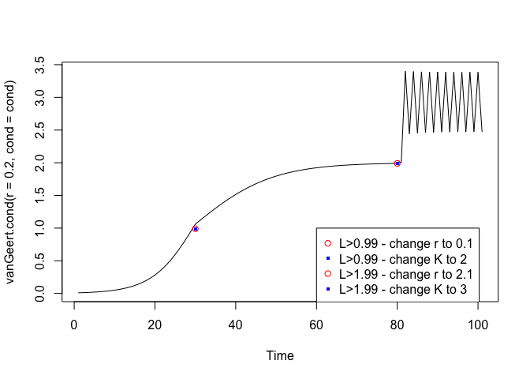
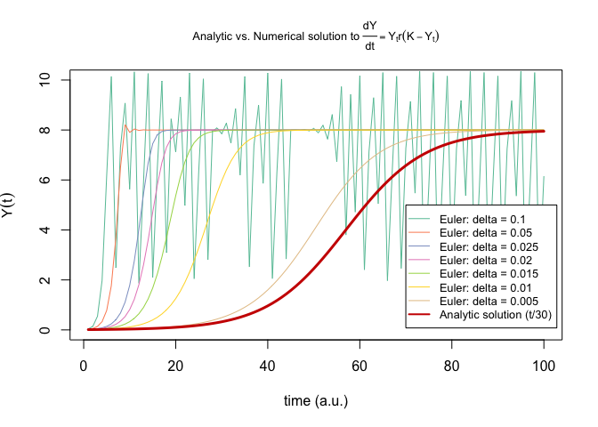

# **Quick Links** {-}

* [Main Assignments Page](https://darwin.pwo.ru.nl/skunkworks/courseware/1718_DCS/assignments/)
* [Assignments Part 1B: Fitting Parameters and Potential Functions](https://darwin.pwo.ru.nl/skunkworks/courseware/1718_DCS/assignments/ASSIGNMENTS_P1B.html)
* [Assignments Part 2: Time Series Analysis: Temporal Correlations and Fractal Scaling](https://darwin.pwo.ru.nl/skunkworks/courseware/1718_DCS/assignments/ASSIGNMENTS_P2.html)
* [Assignments Part 3: Quantifying Recurrences in State Space](https://darwin.pwo.ru.nl/skunkworks/courseware/1718_DCS/assignments/ASSIGNMENTS_P3.html)
* [Assignments Part 4: Complex Networks](https://darwin.pwo.ru.nl/skunkworks/courseware/1718_DCS/assignments/ASSIGNMENTS_P4.html)
  
</br>
</br>

# **Modelling (nonlinear) growth and Deterministic Chaos**

In this assignment you will build two (relatively) simple one-dimensional maps based on the models implemented in a spreadsheet. Just copy the linked Google Sheet to a new on-line Google Sheet, or, save it to your computer and use your favourite spreadsheet software (e.g., Excel, Numbers) to explore the behaviour of the model.    
    
We will start by modelling the *Linear Map* and then proceed to the slightly more complicated *Logistic Map* (aka *Quadratic map*). You can use `R`, `Matlab`, or `Python` to model the dynamical processes, but for now we will assume you use `R`.

</br>

\BeginKnitrBlock{rmdnote}<div class="rmdnote">Check the solutions of the assignments **after** you tried to do them on your own!    
  
Also, have a look at the examples in [Chapter 2](https://darwin.pwo.ru.nl/skunkworks/courseware/1718_DCS/02-MathematicsofChange.html) on different ways to visualize time series in `R`.</div>\EndKnitrBlock{rmdnote}

</br>

## **The Linear Map**

</br>

Equation \@ref(eq:linmap) is the ordinary difference equation (ODE) discussed in [Chapter 2](https://darwin.pwo.ru.nl/skunkworks/courseware/1718_DCS/02-MathematicsofChange.html) and is called the *Linear Map*:
  
\begin{equation}
Y_{i+1} = Y_{i=0} + r*Y_i
(\#eq:linmap)
\end{equation}
  
In these exercises you will *simulate* time series produced by the change process in equation \@ref(eq:linmap) for different parameter settings of the growth-rate parameter $r$ (the *control parameter*) and the initial conditions $Y_0$. *Simulation* is obviously different from a statistical analysis in which parameters are estimated from a data set. The goal of these assignments is to get a feeling for what a dynamical model is, and in what way it is different from a linear statistical regression model like GLM.

</br>

\BeginKnitrBlock{rmdnote}<div class="rmdnote">It is common practice to use $Y_{i}$ for the current state and $Y_{i+1}$ for the next state of a discrete time model (a map, a difference equation). For a continuous time model (a flow, a differential equation), sometimes $Y_{t}$ and $\hat{Y_t}$ are used. More common is the $\delta$, or *'change in'* notation: $\frac{dY}{dt} = Y_0 + r * Y(t)$, which you can pronounce as *'a change in Y over a change in time is a function of ...'*. However, different authors have different preferences and may use other notations.</div>\EndKnitrBlock{rmdnote}
  
</br>

### Growth in a Spreadsheet
  
</br>

\BeginKnitrBlock{rmdimportant}<div class="rmdimportant">If you want to modify the spreadsheets and use them as a template for other assignments, be sure to check the following settings: 
  
* Open a Microsoft Excel worksheet or a [Google sheet](https://www.google.com/docs/about/)
* Check whether the spreadsheet uses a 'decimal-comma' ($0,05$) or 'decimal-point' ($0.05$) notation. 
    + The numbers given in the assignments of this course all use a 'decimal-point' notation.
* Check if the `$` symbol fixes rows and columns when it used in a formula in your preferred spreadsheet program. 
    + This is the default setting in Microsoft Excel and Google Sheets. If you use one of those programs you are all set.</div>\EndKnitrBlock{rmdimportant}

</br>

First study the behaviour of the **Linear map** in a spreadsheet and then try to implement it in `R`.
  
* Open the [GoogleSheet](https://docs.google.com/spreadsheets/d/1EEpUFxEmelJDPDT61jyT_xfntLo_MYBTW0MZuRSC770/edit?usp=sharing) and look at the **Linear map** tab.
* The `r` in cell `A5` is the *control parameter*. It currently has the value $1.08$ in cell`B5`.
* The cell labelled $Y_0$ in `A6` is the *initial value* at $i=0$. It has the value $0.1$ in cell `B6`.   
* The `A` column also contains $Y_i$, the output of the linear map. 
    + Click on `A10`, in the formula bar you can see this refers to the initial value in `B6`. This will be the first input to the iterative process.
    + Click on `A11`, in the formula bar you can see the very simple implementation of the linear map.
    + The value of cell `A11` (i.e. $Y_{i=1}$) will be calculated by multiplying the value of cell `B5` (parameter `r`) with the value of cell `A10` (the previous value, which happens to be: $Y_{i=0}$).
    
</br>

\BeginKnitrBlock{rmdkennen}<div class="rmdkennen">A reminder of what the model represents:     
      
* We are calculating $Y_{i+1}$ (i.e. 'behaviour' in the future, given the current state)
* This value is *completely determined* by $Y_{t=0}$ (i.e., the first 'input') and the value of the control parameter `r` (the growth rate)
* There are no stochastic components involved in generating the temporal evolution of `Y`</div>\EndKnitrBlock{rmdkennen}
  
</br>

### Change the control parameter, label the order parameter  {.tabset .tabset-fade .tabset-pills}

If you make a copy of the Google Sheet you should be able to edit the cells. If this does not work, [download the spreadsheet from GitHub](https://github.com/FredHasselman/The-Complex-Systems-Approach-Book/blob/master/assignments/assignment_data/Iterating1Dmaps/Assignment%20DCS_%20Iterating%201D%20Maps.xlsx)
  
* Change the values in cells `B5` and `B6` and you will see an immediate change in the graph. To study model behaviour, try the following growth parameters:
    + $r =  1.08$
    + $r = -1.08$
    + $r =  1$
    + $r = -1$
    + $r =  0.95$
    + $r = -0.95$

#### Questions {-}
* Are there any *qualitative differences* in the dynamical behaviour of the system that can be attributed parameter values?
* Provide a description for each clearly distinct behaviour displayed by this system (only for the parameter settings you examined). 

#### Answers {-}
* Yes!
    + $r =  1.08$ - Unlimited exponential growth, $Y$ will grow infinitely large
    + $r = -1.08$ - Unstable limit cycle, exponential 2-period oscillation $Y$ will grow infinitely large
    + $r =  1$ - Point attractor, fixed point at $Y = 1$
    + $r = -1$ - Limit cycle, closed period-2 orbit at $Y = [-1,1]$
    + $r =  0.95$ - Exponential decay, $Y$ will approach $0$ in the limit
    + $r = -0.95$ - Point attractor, exponentially decaying 2-period oscillation, $Y$ will approach $0$


\BeginKnitrBlock{rmdkennen}<div class="rmdkennen">The labels assigned to behavioural modes that are clearly qualitatively distinct from one another, are know as the **order parameter**. The **order parameter** will change its value to indicate the system has transitioned to a new behavioural regime. Such changes often occur suddenly with gradual changes in the **control parameter**.     
For example, the four phases that describe matter are an **order parameter** (solid, liquid, gas and plasma). We know water will transition from a liquid state to a gas state if we increase the **control parameter** beyond a certain point (e.g. temperature rises above $100^\circ\text{C}$).

Other names you might encounter that refer to the change of the label of an order parameter:
  
* Phase transition/shift
* Order transition
* Critical transition
* Change of behavioural mode/regime
* Change of attractor state/landscape
* Shift between self-organised/stable states/attractors</div>\EndKnitrBlock{rmdkennen}

</br>

### Dependence on initial conditions? {.tabset .tabset-fade .tabset-pills}
  
* Change the initial value $Y_0$ in cell `B6` to $10$ and compare to $0.1$ (if you want to directly compare different settings, just create a new copy of the sheet)
* Subsequently give the growth parameter in cell `B5` the following values:
    + $r =  1.08$
    + $r = -1.08$
    + $r =  1$
    + $r = -1$
    + $r =  0.95$
    + $r = -0.95$ 
  
#### Questions {-}
* Are there any *qualitative differences* in the dynamical behaviour of the system for each parameter setting, that can be attributed to a difference in initial conditions?
  
#### Answers {-}
* No, there are no differences in the overall dynamics due to changes in initial conditions. Of course, the absolute values change, but the temporal pattern of change is the same.

  
### Using `R` to simulate the Linear Map {.tabset .tabset-fade .tabset-pills}
  
The best (and easiest) way to simulate these simple models in `R` is to create a function, which takes as input arguments the parameters ($Y_0$, $r$) and a variable indicating the length of the time series.

#### Questions {-}

For the Linear Map you could use this template:


```r
# TEMPLATE
# Modify this function
linearMap <- function(Y0 = 0, r = 1, N = 100){
    
    # Initialize Y as vector of Y0, followed by N-1 empty slots (NA).
    Y <- c(Y0, rep(NA,N-1))
    
    # Then, you need create the iteration
    for(i in 1:(N-1)){
        
    Y[i+1] <- # !!Implement the linear or Quadratic map here!!
        
    }
    
    return(Y)
}
```

</br>

* Copy the code to `R` and implement the Linear Map by looking at the formula, or the spreadsheet.
* To test it, you need to initialize the function by selecting the code and running it. 
    + The environment will now contain a function called `linearMap`
* Generate some data by calling the function using $Y0=0.1$, $r=1.08$ and $N=100$ and store the result in a variable. 

#### Answers {-}


```r
# Linear Map
linearMap <- function(Y0 = 0, r = 1, N = 100){
  
  # Initialize Y as vector of Y0, followed by N-1 empty slots (NA).
  Y <- c(Y0, rep(NA,N-1))
  
  # Then, you need create the iteration
  for(i in 1:(N-1)){
    
    Y[i+1] <- r * Y[i] # The linear difference equation
    
    }
  
  return(Y)
}
```

</br>

### Plot the timeseries {.tabset .tabset-fade .tabset-pills}

#### Questions {-}

Creating a time series plot is easy if the function `linearMap` returns the time series as a numeric vector. You could just use:


```r
plot(linearMap(Y0=0.1,r=1.08,N=100), type = "l")
```

#### Answers {-}


```r
plot(linearMap(Y0=0.1,r=1.08,N=100), type = "l")
```

<!-- -->

`R` and `Matlab` have specialized objects to represent time series, and functions and packages for time series analysis. These are especially convenient for plotting time and date information on the X-axis. See the examples on plotting [time series in `R` in Chapter 2](https://darwin.pwo.ru.nl/skunkworks/courseware/1718_DCS/02-MathematicsofChange.html#plotTS).
  
</br>
</br>

## **The Logistic Map** 
  
The Logistic Map takes the following functional form: 
  
\begin{equation}
Y_{i+1} = r*Y_i*(1-Y_i)
(\#eq:logmap)
\end{equation}
  
### Chaos in a spreadsheet 
  
* Open the [GoogleSheet](https://docs.google.com/spreadsheets/d/1EEpUFxEmelJDPDT61jyT_xfntLo_MYBTW0MZuRSC770/edit?usp=sharing) and look at the **Logistic map** tab.
* The set-up is the same as for the linear map, except of course the implemented change process.
* The `A` column contains $Y_i$, the output of the Logistic map. With $r=1.3$ the behaviour looks a lot like an S-curve, a logistic function.
* Check the following:
    + Click on `A10`, in the formula bar you can see this refers to the initial value `B6`.
    + Click on `A11`, in the formula bar you can see the very simple implementation of the Logistic map.
    + The value of cell `A11` ($Y_{i=1}$) is calculated by multiplying the value of cell `B5` (parameter `r`) with the value of cell `A10` (the current value $Y_i$, in this case $Y_{i=0}$). The only difference is we are also multiplying by $(1-Y_i)$.

</br>

\BeginKnitrBlock{rmdselfThink}<div class="rmdselfThink">We established that `r` controls growth, what could be the function of $(1-Y_t)$?</div>\EndKnitrBlock{rmdselfThink}

</br>

### Change the control parameter, label the order parameter {.tabset .tabset-fade .tabset-pills}
  
To study the behaviour of the Logistic Map you can start changing the values in `B5`. 
  
* Try the following settings for $r$:
    + $r = 0.9$
    + $r = 1.9$
    + $r = 2.9$
    + $r = 3.3$
    + $r = 3.52$
    + $r = 3.9$

#### Questions {-}
  
* Are there any *qualitative differences* in the dynamical behaviour of the system that can be attributed parameter values?
* Provide a description for each clearly distinct behaviour (the labels of the order parameter) displayed by this system (only for the parameter settings you examined). 
  
#### Answers {-}

* Yes!
* With $Y_0 = 0.01$:
    + $r = 0.9$ - Point attractor, fixed point at $Y = 0$
    + $r = 1.9$ - Point attractor, fixed point at $Y = 0.4737$
    + $r = 2.9$ - Point attractor, fixed point at $Y = 0.6552$
    + $r = 3.3$ - Limit cycle attractor, closed period 2 orbit at $Y =  [0.8236, 0.4794]$
    + $r = 3.52$ - Limit cycle attractor, closed period 4 orbit at $Y =  [0.5121, 0.8795, 0.3731, 0.8233]$
    + $r = 3.9$ - Strange attractor, a-periodic orbit all values between $\approx0.01$ and $\approx0.99$


  
### The return plot {.tabset .tabset-fade .tabset-pills}
  
#### Questions {-}

* Set $r$ at $4.0$:
    + How would you describe the dynamics of the time series? Periodic? Something else?
    + Check the values, is there any value that is recurring, for example like when $r=3.3$? Perhaps if you increase the length of the simulation?
* Select the values in both columns under $Y(i)$ and $Y(i+1)$, (`A10` to `B309`) and create a scatter-plot (no lines, just points).
    + The points should line up to represent a familiar shape...

</br>

\BeginKnitrBlock{rmdkennen}<div class="rmdkennen">The plot you just produced is a so called **return plot**, in which you have plotted $Y_{i+1}$ against $Y_i$. We shifted the time series by 1 time step, which is why this is also called a **lag 1 plot**.    

Can you explain the pattern you see (a 'parabola') by looking closely at the functional form of the Logistic Map? (hint: another name for this equation is the **Quadratic Map**).

If you change the control parameter to a lower value the return plot will seem to display a shape that is no longer a parabola, but this is not the case, all values produced by by the Logistic Map **must** be a point on a parabola. Some parameter settings just do not produce enought different points for the parabola to show itself in the return plot.</div>\EndKnitrBlock{rmdkennen}

</br>

* What do you expect the return plot of the **Linear Map** will look like? Go ahead and try it!

</br>

\BeginKnitrBlock{rmdselfThink}<div class="rmdselfThink">The return plot is an important tool for getting a 'first impression' of the nature of the dynamic process that generated the observed values:
  
* Try to imagine what the lag 1 plot of a cubic difference equation would look like
* What about the return plot for a timeseries of independent random numbers (white noise)?     
* We are of course not limited to a lag of 1, what happens at lag 2, or lag 10 in the return plots of the Linear and Quadratic Map?</div>\EndKnitrBlock{rmdselfThink}

#### Answers {-}

* Set $r$ at $4.0$:
    + The dynamics are called a-periodic, or quasi-periodic, or, chaotic.
    + None of the values will exactly recur!!
* Select the values in both columns under $Y(i)$ and $Y(i+1)$, (`A10` to `B309`) and create a scatter-plot (no lines, just points).
    + The points form a parabola
    + The return plot for both maps can be seen [here](https://docs.google.com/spreadsheets/d/17PBTvGa1Hu9spqEQGuhpwWXGeY7Nujkm09pxcppKPn4/edit?usp=sharing) 


</br>

### Sensitive dependence on initial conditions?  {.tabset .tabset-fade .tabset-pills}
  
Go to the following [GoogleSheet](https://docs.google.com/spreadsheets/d/1xaZJLYfZzkxg_PXCAa7QT7p4R_JTnUIxzs_Qs1-RAOQ/edit?usp=sharing) and download or copy it.
  
#### Questions {-}
  
* Imagine these are observed time series from two subjects in a response time experiment. These subjects are perfect 'twins':
    + The formula describing their behaviour is exactly the same (it's the Quadratic Map, check it!)
    + The control parameter, controlling the behavioural mode is exactly the same ($r=4$).
    + The only difference is that they have a tiny discrepancy in initial conditions in cell `D6` of $0.01$.
* Not tiny enough? Change it to become even smaller:
    + $0.001$
    + $0.0001$
    + $0.00001$
    + etc.
* What happens as you make the discrepancy smaller and smaller?

</br>


#### Answers {-}

By making the discrepancy smaller the two time series will become more similar.

\BeginKnitrBlock{rmdkennen}<div class="rmdkennen">This sheet displays the extreme sensitivity to changes in initial conditions displayed by the Logistic Map for specific parameter settings. This specific phenomenon is more commonly referred to as **The Butterfly Effect**. It is a characteristic of a very interesting and rather mysterious behaviour displayed by deterministic dynamical equations known as **deterministic chaos**.

However, perhaps even more important to notice here, is the fact that a wide range of qualitatively different behaviourial modes can be understood as originating from one and the same, rather simple, dynamical system. The different behavioural modes were observed for different values of a control parameter, which, in real-world models, often represents an observable (physical) quantity (e.g. temperature, available resources, chemical gradient, etc.) 

The Logistic Map is the simplest nontrivial model that can display deterministic chaos.</div>\EndKnitrBlock{rmdkennen}

</br>

### Use `R` to simulate the Logistic Map {.tabset .tabset-fade .tabset-pills}

The best (and easiest) way to simulate the discrete time models is to create a function which takes as input the parameters ($Y_0$, $r$) and a variable indicating the length of the time series.

#### Questions {-}

To model the Logistic Map, use this template:


```r
# TEMPLATE
# Modify this function
logisticMap <- function(Y0 = 0.01, r = 1, N = 100){
    
    # Initialize Y as vector of Y0, followed by N-1 empty slots (NA).
    Y <- c(Y0, rep(NA,N-1))
    
    # Then, you need create the iteratation
    for(i in 1:(N-1)){
        
    Y[i+1] <- # !!Implement the linear or logistic map here!!
        
    }
    
    return(Y)
}
```

</br>

* Copy the code above and implement the Logistic Map.
* When you are done, you need to initialize the function, select the code and run it. 
    + The environment will now contain a function called `logisticMap`
    + Generate some data by calling the function using $Y0=0.1$, $r=4$ and $N=100$ (or any other values you want to explore) and store the result in a variable. 
    

#### Answers {-}


```r
# Logistic Map
logisticMap <- function(Y0 = 0.01, r = 1, N = 100){
    
    # Initialize Y as vector of Y0, followed by N-1 empty slots (NA).
    Y <- c(Y0, rep(NA,N-1))
    
    # Then, you need create the iteratation
    for(i in 1:(N-1)){
        
    Y[i+1] <- r * Y[i] * (1 - Y[i]) # The quadratic difference equation
       
    }
    
    return(Y)
}
```


### Plot the timeseries {.tabset .tabset-fade .tabset-pills}

#### Questions {-}

Creating a time series plot is easy if the function `linearMap` returns the time series as a numeric vector. You could just use:


```r
plot(logisticMap(Y0=0.01,r=1.9,N=100), type = "l")
```

* Also try to create a graph that demonstrates the sensitive dependence on initial conditions
* Create the lag 1 return plot.
      + Also try to create a lag 2, lag 3 and lag 4 return plot.
      + Can you explain the patterns?


#### Answers {-}


```r
library(plyr)
rs <- c(0.9,1.9,2.9,3.3,3.52,3.9)
op<-par(mfrow=c(2,3))
l_ply(rs,function(r) plot(logisticMap(r=r),ylab = paste("r =",r) ,type = "l"))
```

<!-- -->

```r
par(op)
```

* Also try to create a graph that demonstrates the sensitive dependence on initial conditions
* Create the lag 1 return plot.
      + Also try to create a lag 2, lag 3 and lag 4 return plot (increase N to 500 or 1000).
      + Can you explain the patterns?


```r
lags <- c(1,2,3,4)
N <- 1000
op <- par(mfrow = c(2,2), pty = "s")
l_ply(lags, function(l) {plot(dplyr::lag(logisticMap(r=4,N=N),l), logisticMap(r=4,N=N), pch = ".", xlim = c(0,1), ylim = c(0,1), xlab = "Y(t)", ylab = "Y(t+1)",  main = paste("lag =",l))})
```

<!-- -->

```r
par(op)
```

</br>

----

</br>
</br>

## **A model of cogntitive growth** 

In this assignment you'll build a slightly more sophisticated growth model and study at its properties. The model will be the growth model introduced by [Paul van Geert (1991)](https://eric.ed.gov/?id=EJ494106).

This growth model was used to study growth of language skills in young children, such as vocabulary, and was intended to be to represent 'an ecology of growers' referring to the many motor, perceptual and cognitive skills a child needs to develop in order to become proficient at using a language. It has the following form: 

\begin{equation}
L_{t+1} = L_t * (1 + r - r * \frac{L_t}{K})
(\#eq:vanG)
\end{equation}

</br>

\BeginKnitrBlock{rmdkennen}<div class="rmdkennen">Note the similarities to Equation \@ref(eq:logmap), the (stylized) logistic map. The main difference is that the number $1$ in $(1-Y_i)$ has become a parameter $K$, or, the *carrying capacity* whch indicates how far the function can grow. A more general term used for models of this kind is: *restricted growth model*. </div>\EndKnitrBlock{rmdkennen}

</br>

### The growth model in a spreadsheet {.tabset .tabset-fade .tabset-pills}

The model is [implemented in a spreadsheet](https://docs.google.com/spreadsheets/d/1DAg0u-zMFOIvRSDOZDxqnzyS0HQJg4FIXzJIMvEMwiI/edit?usp=sharing), select the first tab sheet.

* You can start by changing the values for the parameters and the initial values in cells `B5`, `B6` and `B7`. To study its behaviour, be sure to try the following growth parameters:
    + $r = 1.2$
    + $r = 2.2$
    + $r = 2.5$
    + $r = 2.7$
    + $r = 2.9$
    
* For the carrying capacity $K$ (cell `B7`) you can try the following values:
    + $K = 1.5$
    + $K = 0.5$. (Leave $r = 2.9$. Mind the value on the vertical axis!)
    
    
#### Questions {-}

* Changes in the values of $K$ have an effect on the height of the graph. The pattern itself also changes a bit.
    + Can you explain why this is so?
    
* Implement the model in `R`. 
    + You should be able to do this by slightly modifying you model of the Logistic Map, but you need to add a parameter, $K$.
    + Make a lag 1 return plot.
    
#### Answers {-}

* Changes in the values of $K$ have an effect on the height of the graph. The pattern itself also changes a bit.
    + If $K$ is changed, the range of values that can go into the iterative process changes, so the state evolution will also change.
    
* Implement the model in `R`. 
    + You should be able to do this by slightly modifying you model of the Logistic Map.


```r
# Van Geert's cognitive growth model
vanGeert <- function(L0 = 0.01, r = 1.2, K = 2, N = 100){
  # Initialize L as vector of L0, followed by N-1 empty slots (NA).
  L <- c(L0, rep(NA, N-1))
  # Then, you need create the iteratation
  for(i in 1:(N-1)){
    L[i+1] <- L[i] * (1 + r - r * L[i] / K)
  }
  return(L)
}


# Make the plots ----
library(plyr)

op<-par(mfrow=c(2,4))
# Different r
rs <- c(1.2, 2.2, 2.5, 2.7, 2.9)
l_ply(rs, function(r) plot(vanGeert(r=r),ylab = paste("r =",r," | K = 2") ,type = "l"))

# Different Carrying Capacity K
Ks <- c(1.5, 0.5)
l_ply(Ks, function(k) plot(vanGeert(r=2.9,K=k),ylab = paste("r = 2.9 | K =",k) ,type = "l"))

par(op)
```

<!-- -->

    + Make a lag 1 return plot.


```r
lags <- c(1,2,3,4)
N <- 1000
op <- par(mfrow = c(2,2), pty = "s")
l_ply(lags, function(l) {plot(dplyr::lag(vanGeert(r=2.9,N=N),l), vanGeert(r=2.9,N=N), pch = ".", xlim = c(0,3), ylim = c(0,3), xlab = "Y(t)", ylab = "Y(t+1)",  main = paste("lag =",l))})
```

<!-- -->

```r
par(op)
```

</br>
</br>


## **Conditional growth: Jumps and Stages**


### Auto-conditional jumps {.tabset .tabset-fade .tabset-pills}

Suppose we want to model that the growth rate $r$ increases after a certain amount has been learned. In general, this is a very common phenomenon, for instance: When becoming proficient at a skill, growth (in proficiency) is at first slow, but then all of a sudden there can be a jump to the appropriate (and sustained) level of proficiency.

#### Questions {-}

* Take the model of the Logistic Map as a starting point.
* Look at the spreadsheet `Van Geert (Jumps)` 
* Suppose we want our parameter to change when a growth level of $0.2$ is reached. We'll need an `IF` statement which looks something like this: `IF` $L > 0.2$ then use the new parameter value, otherwise use the parameter value we started with. 
    + in Excel this becomes quite complicated using the `IF` function (`ALS` in Dutch). 
    + Implementing the conditional jumps `R` will take on a different (much easier) form.


```r
# TEMPLATE
# Modify this function
vanGeert <- function(L0 = 0, r = 1, K = 2, N = 100){
    
    # Initialize L as vector of Y0, followed by N-1 empty slots (NA).
    L <- c(L0, rep(NA,N-1))
    
    # Then, you need create the iteration
    for(i in 1:(N-1)){
        
    # You need to monitor the value of L and change the growth rate according to a rule
    if(L[i]>=ThresholdValue){
      r <- 
    } 

    L[i+1] <- # Implement the model here!!
        
    }
    
    return(L)
}
```


* Copy the code above and implement the Van Geert's model.
* When you are done, you need to initialize the function, select the code and run it. 
    + The environment will now contain a function called `vanGeert`
    + Generate some data, e.g. with $r$ set to $1, 2, 2.8, 2.9, 3$. 
    + *Extra:* Consider making `ThresholdValue` an argument of the function so you can play around with the values.

#### Answers {-}

Using the template:


```r
vanGeert.jump <- function(L0 = 0.01, r = 0.1, K = 2, ThresholdValue = 0.2, N = 100){
  
  # Create a vector L of length N, which has value L0 at L[1]
  L <- c(L0, rep(NA, N-1))
  
    # Then, you need create the iteratation
    for(i in 1:(N-1)){
      
      # You need to monitor the value of L and change the growth rate according to a rule
      if(L[i]>=ThresholdValue){
        r <- 2
      }
        
    # Van Geert growth model
    L[i+1] <- L[i] * (1 + r - r * L[i] / K)
  }
  return(ts(L))
}

# Plot with the default settings, this time let's use the lattice package
library(lattice)
xyplot(vanGeert.jump(),ylab = "Change r to 2 if L >= 0.2")
```

<!-- -->


The code below defines the function in such a way that we can add more than one conditional statement.


```r
vanGeert.cond <- function(L0 = 0.01, r = 0.1, K = 2, cond = cbind.data.frame(L = 0.2, par = "r", val = 2), N = 100){
    
  # Create a vector L of length N, which has value L0 at L[1]
    L <- c(L0, rep(NA, N-1))
    
    # Iterate N steps of the difference equation with values passed for L0, K and r.
    cnt <- 1
    for(i in seq_along(L)){
      
        # Check if the current value of L is greater than the threshold for the current conditional rule in cond
        if(L[i] > cond$L[cnt]){
          
            # If the threshold is surpassed, change the parameter settings by evaluating: cond$par = cond$val 
            eval(parse(text = paste(cond$par[cnt], "=", cond$val[cnt])))
          
            # Update the counter if there is another conditional rule in cond
            if(cnt < nrow(cond)){cnt <- cnt + 1}
        }
      
        # Van Geert growth model
        L[i+1] <- L[i] * (1 + r - r * L[i] / K)
    }
    return(ts(L))
}


# Plot with the default settings.
library(lattice)
xyplot(vanGeert.cond())
```

<!-- -->

The 'trick' used here is to define the function such that it can take a set of conditional rules and apply them sequentially during the iterations. The conditional rule is passed as a `data.frame`, but one could also use a `list` object. 


```r
(cond <- cbind.data.frame(L = c(0.2, 0.6), par = c("r", "r"), val = c(0.5, 0.1)))
```

```
##     L par val
## 1 0.2   r 0.5
## 2 0.6   r 0.1
```

```r
plot(vanGeert.cond(cond=cond))
points(which(vanGeert.cond(cond=cond)>0.2)[1],0.2,col="red",pch=16)
points(which(vanGeert.cond(cond=cond)>0.6)[1],0.6,col="red",pch=16)
legend(60,1,legend = c("L>0.2 - change r to 0.5","L>0.6 - change r to .1"),col = c("red","red"),pch=16)
```

<!-- -->


</br>


### Auto-conditional stages {.tabset .tabset-fade .tabset-pills}

Another conditional change we might want to explore is that when a certain growth level is reached the carrying capacity $K$ increases, reflecting that new resources have become available to support further growth.

#### Questions {-}

* Build your model in such a way that when $L > 0.99$, $K$ changes to the value 2, keep $r = 0.1$
* Try to also to change the growth rate r after reaching $L > 0.99$ 
* Recreate the model on the tab `Van Geert (3 stages)` in `R`


#### Answers {-}

We'll continue with the more general function.


```r
(cond <- cbind.data.frame(L = 0.99, par = "K", val = 2))
```

```
##      L par val
## 1 0.99   K   2
```

```r
plot(vanGeert.cond(r=0.1,cond=cond))
points(which(vanGeert.cond(cond=cond)>0.99)[1],0.99,col="red",pch=16)
legend(60,1, legend = "L>0.99 - change r to 2", col = "red", pch=16)
```

<!-- -->


Or, combine a change of `r` and a change of `k`

```r
(cond <- cbind.data.frame(L = c(0.99,0.99,1.99,1.99), par = c("r","K","r","K"), val = c(0.1,2,2.1,3)))
```

```
##      L par val
## 1 0.99   r 0.1
## 2 0.99   K 2.0
## 3 1.99   r 2.1
## 4 1.99   K 3.0
```

```r
plot(vanGeert.cond(r=0.2,cond=cond))
points(which(vanGeert.cond(r=0.2,cond=cond)>cond$L[1])[1],cond$L[1],col="red",pch=21)
points(which(vanGeert.cond(r=0.2,cond=cond)>cond$L[2])[1],cond$L[2],col="blue",pch=46,cex=4)
points(which(vanGeert.cond(r=0.2,cond=cond)>cond$L[3])[1],cond$L[3],col="red",pch=21)
points(which(vanGeert.cond(r=0.2,cond=cond)>cond$L[4])[1],cond$L[4],col="blue",pch=46,cex=4)
legend(60,1,legend = paste0("L>",cond$L," - change ",cond$par," to ",cond$val),col = c("red","blue"),pch=c(21,46), pt.cex = c(1,4))
```

<!-- -->

```r
# A fantasy growth process
(cond <- cbind.data.frame(L = c(0.1, 1.99, 1.999, 2.5, 2.9), par = c("r", "K", "r", "r","K"), val = c(0.3, 3, 0.9, 0.1, 1.3)))
```

```
##       L par val
## 1 0.100   r 0.3
## 2 1.990   K 3.0
## 3 1.999   r 0.9
## 4 2.500   r 0.1
## 5 2.900   K 1.3
```

```r
xyplot(vanGeert.cond(cond=cond))
```

<!-- -->


### Growth models in package `casnet`

To model the auto catalytic growth equations we provide a function `growth.ac()`, which is able to simulate all of the processes discussed in the lectures. Using just a few lines of code, each of the 4 difference equations used in the assignments can be simulated. Basically the code block below contains the solutions to the Linear Map, the stylized Logistic Map and the Van Geert model for cognitive growth.


```r
growth_ac <- function(Y0 = 0.01, r = 1, k = 1, N = 100, type = c("driving", "damping", "logistic", "vanGeert")[1]){
    # Create a vector Y of length N, which has value Y0 at Y[1]
    if(N>1){
    Y <- as.numeric(c(Y0, rep(NA,N-2)))
    # Conditional on the value of type ... 
    switch(type, 
           # Iterate N steps of the difference function with values passed for Y0, k and r.
           driving  = sapply(seq_along(Y), function(t) Y[[t+1]] <<- r * Y[t] ),
           damping  = k + sapply(seq_along(Y), function(t) Y[[t+1]] <<- - r * Y[t]^2 / k),
           logistic = sapply(seq_along(Y), function(t) Y[[t+1]] <<- r * Y[t] * ((k - Y[t]) / k)),
           vanGeert = sapply(seq_along(Y), function(t) Y[[t+1]] <<- Y[t] * (1 + r - r * Y[t] / k)) 
    )}
    return(ts(Y))
}

# Call the function with default settings and r = 1.1
Y <- growth_ac(r = 1.1)
plot(Y)
```

<!-- -->

Some notes about this function:

* To select which growth process to simulate, the argument `type` is defined which takes the values `driving` (default), `damping`, `logistic` and `vanGeert`. 
    + The statement `switch(type, ...)` will iterate an equation based on the value of `type`.
* A `time series` object is returned due to the function `ts()`. This is a convenient way to represent time series data, it can also store the sample rate of the signal and start and end times.
    + Most of the basic functions, like `plot()` and `summary()` will recognise a time series object when it is passed as an argument and use settings appropriate for time series data.
* The `sapply()` function iterates $t$ from $1$ to the number of elements in $Y$ (`seq_along(Y)`) and then applies the function.
* The double headed arrow `<<-` is necessary because we want to update vector $Y$, which is defined outside the `sapply()` environment.

</br>
</br>


----

</br>
</br>

# **Multivariate systems**

By multivariate systems we do not simply mean there is more than 1 iterative process (dynamical variable), but that there is a coupling between at least two iterative processes that makes the outcomes of each individual process at each time step (partially) dependent on the previous time step of other processes.

You'll start by expanding on the previous assignments, in which you modelled changes in the parameter values by implementing an `IF ... THEN` rule that evaluated whether some threshold level was reached. In the assignment you'll create a kind of **one-directional coupling**, or **supportive interaction**, which is just a precursor to modelling more interesting interaction dynamics.

 You'll model the so-called Lottka-Volterra equations, representing **competetive interactions** between two iterative processes, also known as **predator-prey dynamics**. You can imagine these equations represent populations of *Foxes* and *Rabbits* in which the population of the  predators (Foxes) depends on the available prey (Rabbits) and vice versa. To do model these equations, you'll need to learn a bit about modelling **flows**: Continuous time differential equations. 


## **One directional coupling**

A more realistic way to model a change of growth parameter `r` using `IF ... THEN` statements, is to make the growth of a variable depend on another process. The proper *dynamical* way to do this would be to define a coupled system of difference or differential equations in which the interaction dynamics completely regulate growth (or decay) of the variables directly, such as the predator-prey system in the next assignment. 

In this assignment we'll keep using at least one 'conditional' rule and try to implement emergent levels by creating **supportive interactions** between separate processes. This is probably the most simple version of *interaction dynamics*, *coupling dynamics*, or *multiplicative interactions* with more then one iterative process. Basically, the processes will still be rather independent from one another and the interaction simply means a 'shock' is delivered to an individual process, after which the system just continuous to evolve on its own. 


### Connected growers {.tabset .tabset-fade .tabset-pills}

For this assignment, we'll use a different way to achieve the levels you created in the previous assignment in which you used `IF ... THEN` statements to achieve changes in dynamics. The conditional rules that change the parameters were 'given', we'll try to be a bit more dynamical... 

Have a look at [this spreadsheet](https://docs.google.com/spreadsheets/d/1cbC58yTg-pOoThMQY0UyzIQ3ZiaTosJlqQFkRHt9LJg/edit?usp=sharing) in which a model is implemented that is discussed in the following chapter by Paul van Geert:

[Van Geert, P. (2003). Dynamic systems approaches and modeling of developmental processes. In J. Valsiner and K. J. Conolly (Eds.), Handbook of developmental Psychology. London: Sage. Pp. 640-672](http://www.paulvangeert.nl/publications_files/Handbook%20Valsiner%20and%20Conolly.pdf).

Relevant text pertaining to this assignment:

* BUILDING YOUR OWN MODELS: A SHORT TUTORIAL (p. 665)
    + The model is discussed in "A Model of Hierarchically Connected Growers"

#### Questions {-}

Try to model this example of supportive interaction in `R`. 

\BeginKnitrBlock{rmdnote}<div class="rmdnote">The spreadsheetmodel tries to mimic Figures 28.6 to 28.8 in van Geert (2003), but only column `A` receives a 'support' boost As noted in the text:
  
"A similar set of equations can be set up, applying to columns B and C respectively."
</div>\EndKnitrBlock{rmdnote}


* You can use the template function below
* You can look in the spreadsheet, or look in the chapter to find the right formula's for `A` and `B`
* Make a plot like in the spreadsheet
    + Note that the function returns a data frame with A, B and C


```r
vanGeert.support <- function(A0 = 0.01, Ar = .5, AK = 1, 
                             B0 = 0.01, Br = .2, BK = 1, 
                             C0 = 0, C1 = 1, Cr = 1, CK = 1, 
                             AtoC = 0.8, BsupportA = .5, N = 100){
  
  # Create a vector A,B,C of length N, which has value A0,B0,C0 at A[1],B[1],C[1]
  A <- c(A0, rep(NA, N-1))
  B <- c(B0, rep(NA, N-1))
  C <- c(C0, rep(NA, N-1))
  
  # Then, you need create the iteration
  for(i in 1:(N-1)){
    
    # You need to monitor the value of L and change the growth rate according to a rule
    if(A[i]<AtoC){
      C[i+1] <- # Value of C0
    } else {
      C[i+1] <- # Value of C1
    }
    
    A[i+1] <- # Implement A with support from B
    B[i+1] <- # Implement B whose growth depends on C
  }
  
  return(data.frame(A=A,B=B,C=C))
}
```


#### Answers {-}

* The template filled in with the correct functions and parameter settings


```r
vanGeert.support <- function(A0 = 0.01, Ar = .5, AK = 1, 
                             B0 = 0.01, Br = .2, BK = 1, 
                             C0 = 0, C1 = 1, Cr = 1, CK = 1, 
                             AtoC = 0.8, BsupportA = .5, N = 100){
  
  # Create a vector A,B,C of length N, which has value A0,B0,C0 at A[1],B[1],C[1]
  A <- c(A0, rep(NA, N-1))
  B <- c(B0, rep(NA, N-1))
  C <- c(C0, rep(NA, N-1))
  
  # Then, you need create the iteration
  for(i in 1:(N-1)){
    
    # You need to monitor the value of L and change the growth rate according to a rule
    if(A[i]<AtoC){
      C[[i+1]] <- C0
    } else {
      C[[i+1]] <- C1
    }
    
    A[i+1] <- A[i] + A[i] * Ar * (1 - A[i] / AK) + A[i] * B[i] * BsupportA # A10 + A10 * $A$5 * (1 - A10 / $A$4) + A10 * B10 * $B$2
    B[i+1] <- B[i] + B[i] * Br * (1 - B[i] / BK) * C[i]                    # B10 + B10 * $B$5 * (1 - B10 / $B$4) * C10
    
  }
  
  return(data.frame(A=A,B=B,C=C))
}
```

* Make a plot like in the spreadsheet
    + Note that the function returns a data frame with A, B and C


```r
Y <- vanGeert.support()

ts.plot(ts(Y$A), ts(Y$B), ts(Y$C),
        gpars = list(xlab = "time (a.u.)",
                     ylab = expression(Y(t)),
                     main = expression(paste("Hierarchical Connected Growers ")),
                     lwd = rep(2,3),
                     lty = c(1:3),
                     col = c("darkred","darkblue","darkgreen")
                     )
        )
legend(50, .8, c("B will support A by adding .5*B",
                 paste0("B starts to grow at time ",which(Y$A > .8)[1]), 
                 paste0("C turns to 1 at time ",which(Y$A > .8)[1])),
       lwd = rep(2,3), lty = c(1:3), col = c("darkred","darkblue","darkgreen"), merge = TRUE)
```

<!-- -->


* This would be the *not-so-dynamical* way to do it:


```r
# Generate 3 timeseries
Y1 <- growth_ac(k = 2, r =.2, type = "vanGeert")
# Y2 and Y3 start at r = 0.001
Y3 <- Y2 <- growth_ac(k = 2, r = 0.001, type = "vanGeert")

# Y2 and Y3 start when k is approached
c1 <- 1.6
c2 <- 2.2

# Here we just swap the new values with the old values
Y2[Y1 > c1] <- growth_ac(r = .3, k = 3, type = "vanGeert", N = sum(Y1 > c1))
Y3[Y2 > c2] <- growth_ac(r = .5, k = 4, type = "vanGeert", N = sum(Y2 > c2))

# Make a nice plot
ts.plot(Y1, Y2, Y3,
        gpars = list(xlab = "time (a.u.)",
                     ylab = expression(Y(t)),
                     main = expression(paste("'Unconnected' Growers ",Y[t+1]==Y[t]*(1 + r - r*Y[t]))),
                     lwd = rep(2,3),
                     lty = c(1:3),
                     col = c("darkred","darkblue","darkgreen")
                     )
        )
legend(1, 3.8, c("Y1(0):  r = .2",
                 paste0("Y2(",which(Y1 > c1)[1],"): r = .3"), 
                 paste0("Y3(",which(Y2 > c2)[1],"): r = .5")),
       lwd = rep(2,3), lty = c(1:3), col = c("darkred","darkblue","darkgreen"), merge = TRUE)
```

<!-- -->


### Other demonstrations of dynamic modeling using spreadsheets

See the website by [Paul Van Geert](http://www.paulvangeert.nl/research.htm), scroll down to see models of:

* Learning and Teaching
* Behaviour Modification
* Connected Growers
* Interaction during Play

</br>


</br>
</br>

## **The predator-prey model**


In this assignment we will look at a 2D coupled dynamical system: **the Predator-Prey model** (aka [Lotka-Volterra equations](https://en.wikipedia.org/wiki/Lotka???Volterra_equations)).      

The dynamical system is given by the following set of first-order differential equations, one represents changes in a population of predators, (e.g., **F**oxes: $f_F(R_t,F_t)$ ), the other represents changes in a population of prey, (e.g., **R**abbits: $f_R(R_t,F_t)$ ).


\begin{align}
\frac{dR}{dt}&=(a-b*F)*R \\
\\
\frac{dF}{dt}&=(c*R-d)*F
(\#eq:lv)
\end{align}


This is not a *difference* equation but a *differential* equation, which means building this system is not as straightforward as was the case in the previous assignments. Simulation requires a numerical method to 'solve' this differential equation for time, which means we need a method to approach, or estimate continuous time in discrete time. Below you will receive a speed course in one of the simplest numerical procedures for integrating differential equations, the [Euler method](https://en.wikipedia.org/wiki/Euler_method).    


### Euler's Method {-}

A general differential equation is given by:

\begin{equation}
\frac{dx}{dt} = f(x)
(\#eq:diff)
\end{equation}

Read it as saying: "_a change in $x$ over a change in time is a function of $x$ itself_". This can be approximated by considering the change to be over some constant, small time step $\Delta$:

\begin{equation}
\frac{(x_{t+1} = x_t)}{\Delta} = f(x_t)
(\#eq:Euler)
\end{equation}

After rearranging the terms a more familiar form reveals itself:

\begin{align}
x_{t+1} &= x_t &= f(x_t) * \Delta \\
x_{t+1} &= f(x_t) * \Delta + x_t
(\#eq:Euler2)
\end{align}

This looks like an ordinary iterative process, $\Delta$ the *time constant* determines the size of time step taken at every successive iteration. For a 2D system with variables **R** and **F** on would write:
    
\begin{align}
R_{t+1} &= f_R(R_t,Ft) * \Delta + R_t \\
F_{t+1} &= f_F(R_t,F_t) * \Delta + F_t
(\#eq:EulerRF)
\end{align}
    
</br>
</br>

### Foxes and Rabbits in R {.tabset .tabset-fade .tabset-pills}

Use `R` to implement [the model in this spreadsheet](https://docs.google.com/spreadsheets/d/1rZDEo8XYNCzhRWrWOli7DDB6f4m87p-hjYv2_KlBLa4/edit?usp=sharing)


#### Questions{-}

* To get the right equations, you'll have to substitute $f_R(R_t,Ft)$ and $f_F(R_t,F_t)$ with the differential equations for Foxes and Rabbits provided above.
* Use the following parameter settings:
    + `N` = `1000`
    + `a` and `d` are `1`
    + `b` and `c` are `2` 
    + Initial values `R0` and `F0` are `0.1`
* Make a plot of the time series for Foxes and Rabbits
* Make a plot of the 2D state space of this system (aka *phase plane*)
    + Examine how the state space changes for different parameter settings

#### Answers {-}


The Euler set-up:
$$
\begin{align}
R_{t+1} &= f_R(R_t,Ft) * \Delta + R_t \\
F_{t+1} &= f_F(R_t,F_t) * \Delta + F_t
\end{align}
$$

With the equations:
$$
\begin{align}
R_{t+1} &=  (a-b*F_t)*R_t * \Delta + R_t \\
\\
F_{t+1} &=  (c*R_t-d)*F_t * \Delta + F_t
\end{align}
$$


```r
library(plyr)

# Parameters
N  <- 1000
a  <- d <- 1
b  <- c <- 2 
R0 <- F0 <- 0.1
R  <- as.numeric(c(R0, rep(NA,N-1)))
F  <- as.numeric(c(F0, rep(NA,N-1)))

# Time constant
delta <- 0.01

# Numerical integration of the logistic differential equation
l_ply(seq_along(R), function(t){
    R[[t+1]] <<- (a - b * F[t]) * R[t] * delta + R[t] 
    F[[t+1]] <<- (c * R[t] - d) * F[t] * delta + F[t] 
    })

# Note different behaviour when ts() is applied
xyplot(cbind(ts(R),ts(F)))
```

<!-- -->

```r
xyplot(R ~ F, pch = 16)
```

<!-- -->


### **Growth functions in continuous time**

The result of applying a method of **numerical integration** such a s Euler's method is called a **numerical solution** of the differential equation. The **analytical solution** is the equation which will give you a value of $Y$ for any point in time, given an initial value $Y_0$. Systems which have an analytical solution can be used to test the accuracy of **numerical solutions**.

The logistic differential equation $\frac{dY}{dt} = r*Y_t*\left(1-\frac{Y_t}{K}\right)$ has an analytic solution given as:

$$
\frac{K * Y_0}{Y_0 + \left(K-Y_0\right) * e^{(-K*r*t)} }
$$
We have the implemented discrete time growth function in `growth_ac()`, but could easily adapt all those functions to make them continuous by using Euler's method. 

Below is a comparison of the analytic solution of the continuous logistic growth function, with the result of using Euler's method to approximate the continuous time function.


```r
library(plyr)
library(RColorBrewer)
# Parameter settings
delta <- .1
N <- 100

# W'ell make time vector to get a smoot analytis solution
TIME <- seq(1,N,by=1)

r <- 3.52 # Remember this setting? This means Chaos in discrete time, in continous time it means extreme growth.

# Carrying capacity and initial condition are chosen se we get a nice plot
K  <-  8
Y0 <- .01

deltas <- c(delta, delta*.5,delta*.25,delta*.2,delta*.15,delta*.1,delta*.05)
cl <- brewer.pal(length(deltas),"Set2")

# Numerical integration of the logistic differential equation as implemented in growth_ac()
Y.euler <- llply(deltas, function(d){
  # Use the values in deltas to get iterate the logistic flow
  Y <- as.numeric(c(Y0, rep(NA,length(TIME)-1)))
  ts(sapply(seq_along(TIME), function(t) Y[[t+1]] <<- ((r * Y[t] * (K - Y[t])) * d) + Y[t] ))
  })

# Analytical solution
# We have to scale TIME a bit, normally we would use 1/TIME
Y.analytic <- ts( K * Y0 / (Y0 + (K - Y0) * exp(-1*(r*K*TIME/250))) )

ts.plot(Y.euler[[1]], Y.euler[[2]] ,Y.euler[[3]], Y.euler[[4]], Y.euler[[5]], Y.euler[[6]], Y.euler[[7]], Y.analytic,
        gpars = list(xlab = "time (a.u.)",
                     ylab = expression(Y(t)),
                     main = expression(paste("Analytic vs. Numerical solution to ",frac(dY,dt)==Y[t]*r*(K-Y[t]))),
                     lwd = c(rep(1,length(deltas)),3),
                     lty = 1,
                     col = c(cl,"red3"),
                     ylim = c(0,10),
                     cex.main = .8
                     )
        )

legend(70, 5, c(paste("Euler: delta =",deltas),"Analytic solution (t/30)"),
       lwd = c(rep(1,length(deltas)),2),
       lty = 1,
       col = c(cl,"red3"),
       merge = TRUE, cex = .8)
```

<!-- -->

\BeginKnitrBlock{rmdnote}<div class="rmdnote">If you want to learn how to put mathematical operators in legends and axes using `expression()`, see the webpage [Mathematical Annotation in R](http://vis.supstat.com/2013/04/mathematical-annotation-in-r/)</div>\EndKnitrBlock{rmdnote}

When `delta` is relatively large, the fluctuations still resemble deterministic chaos, as delta gets closer to 0, this 'smooths out' the fluctuations and the analytic solution is approached. As a consequence, it takes longer and longer to reach `K`. However, 'longer' is of course relative to the unit of time represented on the x-axis, because we're simulating, they are arbitrary units.

----

</br>
</br>


