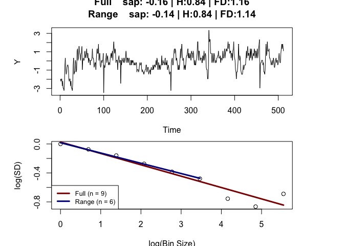
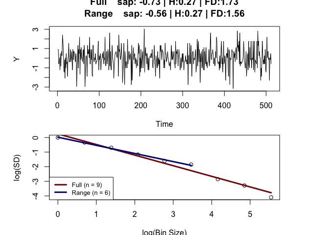

# **Quick Links** {-}

* [Main Assignments Page](https://darwin.pwo.ru.nl/skunkworks/courseware/1718_DCS/assignments/)
* [Assignments Part 1A: Introduction to the mathematics of change](https://darwin.pwo.ru.nl/skunkworks/courseware/1718_DCS/assignments/ASSIGNMENTS_P1A.html)
* [Assignments Part 1B: Fitting Parameters and Potential Functions](https://darwin.pwo.ru.nl/skunkworks/courseware/1718_DCS/assignments/ASSIGNMENTS_P1B.html)
* [Assignments Part 3: Quantifying Recurrences in State Space](https://darwin.pwo.ru.nl/skunkworks/courseware/1718_DCS/assignments/ASSIGNMENTS_P3.html)
* [Assignments Part 4: Complex Networks](https://darwin.pwo.ru.nl/skunkworks/courseware/1718_DCS/assignments/ASSIGNMENTS_P4.html)
  
</br>
</br>

# **Basic Timeseries Analysis** 

In this course we will not discuss the type of linear time series models known as Autoregressive Models (e.g. AR, ARMA, ARiMA, ARfiMA) summarised on [this Wikipedia page on timeseries](https://en.wikipedia.org/wiki/Time_series#Models). We will in fact be discussing a lot of methods in a book the Wiki page refers to for *'Further references on nonlinear time series analysis'*: [**Nonlinear Time Series Analysis** by Kantz & Schreiber](https://www.cambridge.org/core/books/nonlinear-time-series-analysis/519783E4E8A2C3DCD4641E42765309C7). You do not need to buy the book, but it can be a helpful reference if you want to go beyond the formal level (= mathematics) used in this course. Some of the packages we use are based on the acompanying software [**TiSEAN**](https://www.pks.mpg.de/~tisean/Tisean_3.0.1/index.html) which is written in `C` and `Fortran` and can be called from the commandline (Windows / Linux).


## **Correlation functions**  

Correlation functions are intuitive tools for quantifiying the temporal structure in a time series. As you know, correlation can only quantify linear regularities between variables, which is why we discuss them here as `basic` tools for time series analysis. So what are the variables? In the simplest case, the variables between which we calculate a correlation are between a datapoint at time *t* and a data point that is seperated in time by some *lag*, for example, if you would calculate the correlation in a lag-1 return plot, you would have calculated the 1st value of the correlation function (actually, it is 2nd value, the 1st value is the correlation of time series with itself, the lag-0 correlation, which is of course $r = 1$)  

### ACF and PCF {.tabset .tabset-fade .tabset-pills}


You can do the analyses in SPSS or in `R`, but this analysis is very common so you'll find functions called `acf`, `pacf`and `ccf` in many other statistical software packages,


#### Questions (SPSS/R) {-}

* Download the file [`series.sav`](https://github.com/FredHasselman/The-Complex-Systems-Approach-Book/blob/master/assignments/assignment_data/BasicTSA_arma/series.sav) from Github. 

It contains three time series `TS_1`, `TS_2` and `TS_3`. As a first step look at the mean and the standard deviation (`Analyze` >> `Descriptives`).  Suppose these were time series from three subjects in an experiment, what would you conclude based on the means and SD’s?  

* Let’s visualize these data. Go to `Forecasting` >> `Time Series` >> `Sequence Charts`. Check the box One chart per variable and move all the variables to Variables. Are they really the same?  

* Let’s look at the `ACF` and `PCF`
    + Go to `Analyze` >> `Forecasting` >> `Autocorrelations`. 
    + Enter all the variables and make sure both *Autocorrelations* (ACF) and *Partial autocorrelations* (PACF) boxes are checked. Click `Options`, and change the `Maximum Number of Lags` to `30`. 
    + Use the table to characterize the time series:  


|                    SHAPE                | INDICATED MODEL |
|-----------------------------------------|-------------------------------------------------------------------------------------------------|
|       Exponential, decaying to zero     | Autoregressive model. Use the partial autocorrelation plot to identify the order of the autoregressive model|
| Alternating positive and negative, decaying to zero  | Autoregressive model. Use the partial autocorrelation plot to help identify the order.|
| One or more spikes, rest are essentially zero | Moving average model, order identified by where plot becomes zero. |
| Decay, starting after a few lags | Mixed autoregressive and moving average model.|
All zero or close to zero  | Data is essentially random.|
| High values at fixed intervals | Include seasonal autoregressive term. |
| No decay to zero  | Series is not stationary. |


* In the simulation part of this course we have learned a very simple way to explore the dynamics of a system: The return plot. The time series is plotted against itself shifted by 1 step in time. 

* Create return plots (use a Scatterplot) for the three time series. Tip: You can easily create a `t+1` version of the time series by using the LAG function in a `COMPUTE` statement. For instance:

```
COMPUTE TS_1_lag1 = LAG(TS_1)
```
    
* Are your conclusions about the time series based on interpreting these return plots the same as based on the `acf` and `pacf`?
     
     
#### Answers (SPSS) {-}

If you run this syntax in `SPSS` you'll get the correct output.

```
DESCRIPTIVES
  VARIABLES=TS_1 TS_2 TS_3
  /STATISTICS=MEAN STDDEV MIN MAX .

*Sequence Charts .
TSPLOT VARIABLES= TS_1
  /NOLOG
  /FORMAT NOFILL REFERENCE.
TSPLOT VARIABLES= TS_2
  /NOLOG
  /FORMAT NOFILL REFERENCE.
TSPLOT VARIABLES= TS_3
  /NOLOG
  /FORMAT NOFILL REFERENCE.

*ACF and PCF.

ACF
  VARIABLES= TS_1 TS_2 TS_3
  /NOLOG
  /MXAUTO 30
  /SERROR=IND
  /PACF.


*Return plots.

COMPUTE TS_1_lag1 = LAG(TS_1) .
COMPUTE TS_2_lag1 = LAG(TS_2) .
COMPUTE TS_3_lag1 = LAG(TS_3) .
EXECUTE .


IGRAPH /VIEWNAME='Scatterplot' /X1 = VAR(TS_1_lag1) TYPE = SCALE /Y =
  VAR(TS_1) TYPE = SCALE /COORDINATE = VERTICAL  /X1LENGTH=3.0 /YLENGTH=3.0
  /X2LENGTH=3.0 /CHARTLOOK='NONE' /SCATTER COINCIDENT = NONE.
EXE.

IGRAPH /VIEWNAME='Scatterplot' /X1 = VAR(TS_2_lag1) TYPE = SCALE /Y =
  VAR(TS_2) TYPE = SCALE /COORDINATE = VERTICAL  /X1LENGTH=3.0 /YLENGTH=3.0
  /X2LENGTH=3.0 /CHARTLOOK='NONE' /SCATTER COINCIDENT = NONE.
EXE.

IGRAPH /VIEWNAME='Scatterplot' /X1 = VAR(TS_3_lag1) TYPE = SCALE /Y =
  VAR(TS_3) TYPE = SCALE /COORDINATE = VERTICAL  /X1LENGTH=3.0 /YLENGTH=3.0
  /X2LENGTH=3.0 /CHARTLOOK='NONE' /SCATTER COINCIDENT = NONE.
EXE.

```


#### Notes for `R` {-}

If you want to use `R`, just go through the questions and ignore the `SPSS` specific comments. Here are some tips:

**Importing data in `R`**

By downloading:

1. Follow the link, e.g. for [`series.sav`](https://github.com/FredHasselman/The-Complex-Systems-Approach-Book/blob/master/assignments/assignment_data/BasicTSA_arma/series.sav).
2. On the Github page, find a button marked **Download** (or **Raw** for textfiles).
3. Download the file
4. Load it into `R`


```r
library(rio)
series <- import("series.sav", setclass = "tbl_df")
```


By importing from Github:

1. Copy the `url` associated with the **Download**  button on Github (right-clik).
2. The copied path should contain the word 'raw' somewhere in the url.
3. Call `rio::import(url)`

```r
library(rio)
series <- import("https://github.com/FredHasselman/The-Complex-Systems-Approach-Book/raw/master/assignments/assignment_data/BasicTSA_arma/series.sav", setclass = "tbl_df")
```

You can use the functions in the `stats` package: `arima()`, `acf()` and `pacf()` (`Matlab` has functions that go by slightly different names, check the [Matlab Help pages](https://nl.mathworks.com/help/econ/autocorr.html)). 

There are many extensions to these linear models, check the [`CRAN Task View` on `Time Series Analysis`](https://cran.r-project.org/web/views/TimeSeries.html) to learn more (e.g. about package `zoo` and `forecast`).


### Relative Roughness of the Heart {.tabset .tabset-fade .tabset-pills}

> "We can take it to the end of the *line*     
>  Your love is like a shadow on me all of the *time*     
>  I don't know what to do and I'm always in the dark     
>  We're living in a powder keg and giving off *sparks*"     
>
> --- Bonnie Tyler/James R. Steinman, Total Eclipse of the Heart


Download three different time series of heartbeat intervals (HBI) [here](https://github.com/FredHasselman/The-Complex-Systems-Approach-Book/tree/master/assignments/assignment_data/RelativeRoughness). If you use `R` and have package `rio` installed you can run this code and the load the data into a `data.frame` directly from `Github`.


```r
library(rio)
TS1 <- rio::import("https://github.com/FredHasselman/The-Complex-Systems-Approach-Book/raw/master/assignments/assignment_data/RelativeRoughness/TS1.xlsx", col_names=FALSE)
TS2 <- rio::import("https://github.com/FredHasselman/The-Complex-Systems-Approach-Book/raw/master/assignments/assignment_data/RelativeRoughness/TS2.xlsx", col_names=FALSE)
TS3 <- rio::import("https://github.com/FredHasselman/The-Complex-Systems-Approach-Book/raw/master/assignments/assignment_data/RelativeRoughness/TS3.xlsx", col_names=FALSE)
```

The Excel files did not have any column names, so let's create them in the `data.frame`

```r
colnames(TS1) <- "TS1"
colnames(TS2) <- "TS2"
colnames(TS3) <- "TS3"
```


**The recordings**
These HBI’s were constructed from the[] R-R interbeat intervals](https://www.physionet.org/tutorials/hrv/) in electrocardiogram (ECG) recordings, as defined in Figure \@ref(fig:RRf1).

<div class="figure" style="text-align: center">

<p class="caption">(\#fig:RRf1)Definition of Heart Beat Periods.</p>
</div>


 * One HBI series is a sample from a male adult, 62 years old (called *Jimmy*). Approximately two years before the recording, the subject has had a coronary artery bypass, as advised by his physician following a diagnosis of congestive heart failure. *Jimmy* used antiarrhythmic medicines at the time of measurement.

 * Another HBI series is a sample from a healthy male adult, 21 years old (called *Tommy*). This subject never reported any cardiac complaint. Tommy was playing the piano during the recording.

 * A third supposed HBI series is fictitious, and was never recorded from a human subject (let’s call this counterfeit *Dummy*).


#### Questions {-}

The assignment is to scrutinise the data and find out which time series belongs to *Jimmy*, *Tommy*, and *Dummy* respectively. ^[The HBI intervals were truncated (not rounded) to a multiple of 10 ms (e.g., an interval of 0.457s is represented as 0.450s), and to 750 data points each. The means and standard deviations among the HBI series are approximately equidistant, which might complicate your challenge.]

The chances that you are an experienced cardiologist are slim. We therefore suggest you proceed your detective work as follows:

*	Construct a graphical representation of the time series, and inspect their dynamics visually ( plot your time series).
* Write down your first guesses about which time series belongs to which subject. Take your time for this visual inspection (i.e., which one looks more like a line than a plane, which one looks more 'smooth' than 'rough').
*	Next, explore some measures of central tendency and dispersion, etc.
*	Third, compute the Relative Roughness for each time series, use Equation \@ref(eq:RR)

\begin{equation}
RR = 2\left[1−\frac{\gamma_1(x_i)}{Var(x_i)}\right]
(\#eq:RR)
\end{equation}

The numerator in the formula stands for the `lag 1` autocovariance of the HBI time series $x_i$. The denominator stands for the (global) variance of $x_i$. Most statistics packages can calculate these variances, `R` and `Matlab` have built in functions. Alternatively, you can create the formula yourself.

*	Compare your (intuitive) visual inspection with these preliminary dynamic quantifications, and find out where each of the HIB series are positions on the ‘colorful spectrum of noises’ (i.e., line them up with Figure \@ref(fig:RRf3)).

<div class="figure" style="text-align: center">

<p class="caption">(\#fig:RRf3)Coloured Noise versus Relative Roughness</p>
</div>


**What do we know now, that we didn’t knew before?**
Any updates on Jimmy’s, Tommy’s and Dummy’s health? You may start to wonder about the 'meaning' of these dynamics, and not find immediate answers.

Don’t worry; we’ll cover the interpretation over the next two weeks in further depth. Let’s focus the dynamics just a little further for now. It might give you some clues.

* Use the `randperm` function (in `Matlab` or in package  [`pracma`](http://www.inside-r.org/packages/cran/pracma) in `R`) to randomize the temporal ordering of the HBI series. Or try to use the function `sample()`
* Visualize the resulting time series to check whether they were randomized successfully
* Next estimate the Relative Roughness of the randomized series. Did the estimates change compared to your previous outcomes (if so, why)?
* Now suppose you would repeat what you did the previous, but instead of using shuffle you would integrate the fictitious HBI series (i.e., normalize, then use `x=cumsum(x))`. You can look up `cumsum` in `R` or `Matlab`’s Help documentation). Would you get an estimate of Relative Roughness that is approximately comparable with what you got in another HBI series? If so, why?


#### Answers {-}


```r
library(rio)
TS1 <- rio::import("https://github.com/FredHasselman/The-Complex-Systems-Approach-Book/raw/master/assignments/assignment_data/RelativeRoughness/TS1.xlsx", col_names=FALSE)
TS2 <- rio::import("https://github.com/FredHasselman/The-Complex-Systems-Approach-Book/raw/master/assignments/assignment_data/RelativeRoughness/TS2.xlsx", col_names=FALSE)
TS3 <- rio::import("https://github.com/FredHasselman/The-Complex-Systems-Approach-Book/raw/master/assignments/assignment_data/RelativeRoughness/TS3.xlsx", col_names=FALSE)
```

The Excel files did not have any column names, so let's create them in the `data.frame`

```r
colnames(TS1) <- "TS1"
colnames(TS2) <- "TS2"
colnames(TS3) <- "TS3"
```


```r
# Create a function for RR
RR <- function(ts){
# lag.max = n gives autocovariance of lags 0 ... n,
VAR  <- acf(ts, lag.max = 1, type = 'covariance', plot=FALSE)
# RR formula
RelR   <- 2*(1-VAR$acf[2] / VAR$acf[1])
# Add some attributes to the output
attributes(RelR) <- list(localAutoCoVariance = VAR$acf[2], globalAutoCoVariance = VAR$acf[1])
return(RelR)
}

# Look at the results
for(ts in list(TS1,TS2,TS3)){
  relR <- RR(ts[,1])
  cat(paste0(colnames(ts),": RR = ",round(relR,digits=3), " = 2*(1-",
         round(attributes(relR)$localAutoCoVariance, digits = 4),"/",
         round(attributes(relR)$globalAutoCoVariance,digits = 4),")\n"))
  }
```

```
## TS1: RR = 0.485 = 2*(1-0.0016/0.0021)
## TS2: RR = 0.118 = 2*(1-0.0018/0.0019)
## TS3: RR = 2.052 = 2*(1--1e-04/0.002)
```

Use Figure \@ref(fig:RRf3) to lookup which value of $RR$ corresponds to which type of dynamics:

**TS1**: Pink noise
**TS2**: Brownian noise
**TS3**: White noise


**Randomize**

To randomize the data you may use the function `sample` (which is easier than `randperm`)


```r
library(pracma)
# randperm()
TS1Random <- TS1$TS1[randperm(length(TS1$TS1))]

# sample()
TS1Random <- sample(TS1$TS1, length(TS1$TS1))
TS2Random <- sample(TS2$TS2, length(TS2$TS2))
TS3Random <- sample(TS3$TS3, length(TS3$TS3))


plot.ts(TS1Random)
lines(ts(TS1$TS1),col="red3")
```

<!-- -->

If you repeat this for TS2 and TS3 and compute the Relative Roughness of each randomized time series, the outcomes should be around 2, white noise! This makes sense, you destroyed all the correlations in the data by removing the temporal order with which values were observed.


```r
cat("TS1random\n")
```

```
## TS1random
```

```r
cat(RR(TS1Random))
```

```
## 1.956977
```

```r
cat("\nTS2random\n")
```

```
## 
## TS2random
```

```r
cat(RR(TS2Random))
```

```
## 1.888587
```

```r
cat("\nTS3random\n")
```

```
## 
## TS3random
```

```r
cat(RR(TS3Random))
```

```
## 2.036068
```

**Integrate**

Normalize the white noise time series

```r
TS3Norm <- scale(TS3$TS3)
```

Now integrate it, which just means, 'take the cumulative sum'.

```r
TS3Int <- cumsum(TS3Norm)
plot.ts(TS3Int)
lines(ts(TS3Norm),col="red3")
```

<!-- -->

If you compute the Relative Roughness of the integrated time series, the outcome should be close to 0, Brownian noise.

```r
cat("\nTS3Int\n")
```

```
## 
## TS3Int
```

```r
cat(RR(TS3Int))
```

```
## 0.02783704
```


### Sample Entropy  {.tabset .tabset-fade .tabset-pills}

Use the `sample_entropy()` function in package `pracma`.

#### Questions {-}

* Calculate the Sample Entropy of the two sets of three timeseries you now have.
    + Use your favourite function to estimate the sample entropy of the three time series. Use for instance a segment length `edim` of 3 datapoints, and a tolerance range `r` of 1 * the standard deviation of the series. What values do you observe?
    + Can you change the absolute SampEn outcomes by 'playing' with the m parameter? If so, how does the outcome change, and why?
    + Can you change the absolute SampEn outcomes by 'playing' with the r parameter If so, how does the outcome change, and why?
    + Do changes in the relative SampEn outcome change the outcomes for the three time series relative to each other?

*	Extra: Go back to the assignment where you generated simulated time series from the logistic map.


#### Answers {-}

Change some of the parameters.


```r
library(rio)
library(pracma)

# ACF assignment data `series`
cat(paste0("\nseries.TS1 m=3\n",sample_entropy(series$TS_1, edim = 3, r = sd(series$TS_1))))
## 
## series.TS1 m=3
## 0.652582760511648
cat(paste0("\nseries.TS2 m=3\n",sample_entropy(series$TS_2, edim = 3, r = sd(series$TS_2))))
## 
## series.TS2 m=3
## 0.195888185092471
cat(paste0("\nseries.TS3 m=3\n",sample_entropy(series$TS_3, edim = 3, r = sd(series$TS_3))))
## 
## series.TS3 m=3
## 0.528115883767288


# ACF assignment data `series`
cat(paste0("\nseries.TS1 m=6\n",sample_entropy(series$TS_1, edim = 6, r = sd(series$TS_1))))
## 
## series.TS1 m=6
## 0.676004479826967
cat(paste0("\nseries.TS2 m=6\n",sample_entropy(series$TS_2, edim = 6, r = sd(series$TS_2))))
## 
## series.TS2 m=6
## 0.167801266934409
cat(paste0("\nseries.TS3 m=6\n",sample_entropy(series$TS_3, edim = 6, r = sd(series$TS_3))))
## 
## series.TS3 m=6
## 0.527677852462416


# ACF assignment data `series`
cat(paste0("\nseries.TS1 m=6, r=.5\n",sample_entropy(series$TS_1, edim = 3, r = .5*sd(series$TS_1))))
## 
## series.TS1 m=6, r=.5
## 1.26945692316692
cat(paste0("\nseries.TS2 m=6, r=.5\n",sample_entropy(series$TS_2, edim = 3, r = .5*sd(series$TS_2))))
## 
## series.TS2 m=6, r=.5
## 0.641584864066123
cat(paste0("\nseries.TS3 m=6, r=.5\n",sample_entropy(series$TS_3, edim = 3, r = .5*sd(series$TS_3))))
## 
## series.TS3 m=6, r=.5
## 0.5894301000077
```

The change of `m` keeps the relaive order, change of `r` for the same `m` does not.

**Values of other time series**


```r

# RR assignment data `TS1,TS2,TS3`
cat(paste0("\nTS1\n",sample_entropy(TS1$TS1, edim = 3, r = sd(TS1$TS1))))
## 
## TS1
## 0.260297595725622
cat(paste0("TS1Random\n",sample_entropy(TS1Random, edim = 3, r = sd(TS1Random))))
## TS1Random
## 0.632709707882112

cat(paste0("\nTS2\n",sample_entropy(TS2$TS2, edim = 3, r = sd(TS2$TS2))))
## 
## TS2
## 0.0477314028211898
cat(paste0("TS2Random\n",sample_entropy(TS2Random, edim = 3, r = sd(TS2Random))))
## TS2Random
## 0.547466964521145

cat(paste0("\nTS3\n",sample_entropy(TS3$TS3, edim = 3, r = sd(TS3$TS3))))
## 
## TS3
## 0.612955347930071
cat(paste0("TS3Int\n",sample_entropy(TS3Norm, edim = 3, r = sd(TS3Norm))))
## TS3Int
## 0.612955347930071


# Logistic map
library(casnet)
cat("\nLogistic map\nr=2.9\n")
## 
## Logistic map
## r=2.9
y1<-growth_ac(r = 2.9,type="logistic")
sample_entropy(y1, edim = 3, r = sd(y1))
## [1] 0.0002390343
cat("\nLogistic map\nr=4\n")
## 
## Logistic map
## r=4
y2<-growth_ac(r = 4,type="logistic")
sample_entropy(y2, edim = 3, r = sd(y2))
## [1] 0.5293149
```


## **Fluctuation analyses**

Install package `casnet` to use the functions `fd_sda()`, `fd_psd()` and `fd_dfa()`.


```r
# Install casnet if necessary: https://github.com/FredHasselman/casnet
# !!Warning!! Very Beta...
# Auto config of Marwan's commandline rqa works on Windows, MacOS and probably Linux as well
library(devtools)
ifelse("casnet"%in%installed.packages(),library(casnet),devtools::install_github("FredHasselman/casnet"))
```

```
## [1] "devtools"
```

###  Standardised Dispersion Analysis {.tabset .tabset-fade .tabset-pills}


#### Questions {-}

* Common data preparation before running fluctuation analyses:
    + Normalize the time series (using `sd` based on `N`, not `N-1`)
    + Check whether time series length is a power of `2`. If you use `N <- log2(length(y))`, the number you get is `2^N`. You need an integer power for the length in order to create equal bin sizes. You can padd the series with 0s, or make it shorter before analysis.
* Perform `sda` on the 3 HRV timeseries, or any of the other series you already analysed.
* Compare to what you find for `sda` to the other measures (`RR`,`SampEn`, `acf`, `pacf`)


#### Answers {-}


```r
library(rio)
library(pracma)
library(casnet)

# ACF assignment data `series`
cat(paste0("\nseries.TS1 m=3\n",fd_sda(series$TS_1, doPlot = TRUE)))
## 
## 
## fd.sda:	Sample rate was set to 1.
```

<!-- --><!-- -->

```
## 
## series.TS1 m=3
## list(freq.norm = c(1, 0.5, 0.25, 0.125, 0.0625, 0.03125, 0.015625, 0.0078125, 0.00390625, 0.001953125), size = c(1, 2, 4, 8, 16, 32, 64, 128, 256, 512), bulk = c(0.347343522098388, 0.242352579323943, 0.162747757147372, 0.113823109391014, 0.0712297015651491, 0.0401742476122335, 0.0324987872899546, 0.0266879815382271, 0.00976447380987755, 0.0056327159091165)) 
## series.TS1 m=3
## list(sap = -0.6378456980678, H = 0.3621543019322, FD = 1.6378456980678, fitlm1 = list(coefficients = c(-0.928266063595079, -0.6378456980678), residuals = c(-0.129174947915701, -0.0469746629336488, -0.00304582086589436, 0.0815191976529707, 0.0549044618509938, -0.0756582954591304, 0.154439242585116, 0.399570749761868, -0.163770959843594, -0.271808964832979), effects = c(9.2269264111857, -4.01576292746785, 0.0299552105750079, 0.113134361860519, 0.0851337588251874, -0.0468148657182911, 0.181896805092601, 
## 0.425642445035998, -0.139085131802818, -0.248509004025558), rank = 2, fitted.values = c(-0.928266063595077, -1.37038701084306, -1.81250795809105, -2.25462890533904, -2.69674985258702, -3.13887079983501, -3.58099174708299, -4.02311269433098, -4.46523364157897, -4.90735458882695), assign = 0:1, qr = list(qr = c(-3.16227766016838, 0.316227766016838, 0.316227766016838, 0.316227766016838, 0.316227766016838, 0.316227766016838, 0.316227766016838, 0.316227766016838, 0.316227766016838, 0.316227766016838, 
## -9.86365729932036, 6.29582191999199, 0.15621147358221, 0.0461150970695743, -0.0639812794430618, -0.174077655955698, -0.284174032468334, -0.39427040898097, -0.504366785493606, -0.614463162006242), qraux = c(1.31622776601684, 1.26630785009485), pivot = 1:2, tol = 1e-07, rank = 2), df.residual = 8, xlevels = list(), call = stats::lm(formula = log(out$sd) ~ log(out$scale)), terms = log(out$sd) ~ log(out$scale), model = list(`log(out$sd)` = c(-1.05744101151078, -1.41736167377671, -1.81555377895694, -2.17310970768607, 
## -2.64184539073603, -3.21452909529414, -3.42655250449788, -3.62354194456911, -4.62900460142256, -5.17916355365993), `log(out$scale)` = c(0, 0.693147180559945, 1.38629436111989, 2.07944154167984, 2.77258872223978, 3.46573590279973, 4.15888308335967, 4.85203026391962, 5.54517744447956, 6.23832462503951)))) 
## series.TS1 m=3
## list(sap = -0.561179556800627, H = 0.438820443199373, FD = 1.56117955680063, fitlm2 = list(coefficients = c(-1.05981179183364, -0.561179556800627), residuals = c(0.00237078032285817, 0.0314301456411572, 0.0222180680451609, 0.0536421669002746, -0.0261134885654537, -0.209817165539329, -0.0328605471588344, 0.159130040354166), effects = c(6.84830623266132, -2.52087869563296, 0.0193613424982445, 0.0546050390705098, -0.0213310186780671, -0.201215097934791, -0.0204388818371448, 0.175371303393007), rank = 2, 
##     fitted.values = c(-1.05981179183364, -1.44879181941787, -1.83777184700211, -2.22675187458634, -2.61573190217057, -3.00471192975481, -3.39369195733904, -3.78267198492328), assign = 0:1, qr = list(qr = c(-2.82842712474619, 0.353553390593274, 0.353553390593274, 0.353553390593274, 0.353553390593274, 0.353553390593274, 0.353553390593274, 0.353553390593274, -6.86180700427983, 4.4921071430415, 0.0903888096881914, -0.0639145402739005, -0.218217890235992, -0.372521240198084, -0.526824590160176, -0.681127940122268
##     ), qraux = c(1.35355339059327, 1.24469215965028), pivot = 1:2, tol = 1e-07, rank = 2), df.residual = 6, xlevels = list(), call = stats::lm(formula = log(out$sd[bins]) ~ log(out$scale[bins])), terms = log(out$sd[bins]) ~ log(out$scale[bins]), model = list(`log(out$sd[bins])` = c(-1.05744101151078, -1.41736167377671, -1.81555377895694, -2.17310970768607, -2.64184539073603, -3.21452909529414, -3.42655250449788, -3.62354194456911), `log(out$scale[bins])` = c(0, 0.693147180559945, 1.38629436111989, 
##     2.07944154167984, 2.77258872223978, 3.46573590279973, 4.15888308335967, 4.85203026391962)))) 
## series.TS1 m=3
## list(sd = c(0.347343522098388, 0.242352579323943, 0.162747757147372, 0.113823109391014, 0.0712297015651491, 0.0401742476122335, 0.0324987872899546, 0.0266879815382271, 0.00976447380987755, 0.0056327159091165), scale = c(1, 2, 4, 8, 16, 32, 64, 128, 256, 512))
cat(paste0("\nseries.TS2 m=3\n",fd_sda(series$TS_2, doPlot = TRUE)))
## 
## 
## fd.sda:	Sample rate was set to 1.
```

<!-- --><!-- -->

```
## 
## series.TS2 m=3
## list(freq.norm = c(1, 0.5, 0.25, 0.125, 0.0625, 0.03125, 0.015625, 0.0078125, 0.00390625, 0.001953125), size = c(1, 2, 4, 8, 16, 32, 64, 128, 256, 512), bulk = c(0.346394852663953, 0.330780627774339, 0.32351493245868, 0.318901992568449, 0.313671936960789, 0.288007466217949, 0.255694750184013, 0.0177754719770813, 0.0122482803586355, 0.0144881050909264)) 
## series.TS2 m=3
## list(sap = -0.584911757983907, H = 0.415088242016093, FD = 1.58491175798391, fitlm1 = list(coefficients = c(-0.262819040360012, -0.584911757983907), residuals = c(-0.797356921559395, -0.438050903010744, -0.0548310948320931, 0.336237391397863, 0.725131158058544, 1.0451998451602, 1.33162772784804, -0.929107158965292, -0.896111202989073, -0.322738841108048), effects = c(6.60047591109362, -3.68250026717613, 0.167142503621275, 0.536781023244981, 0.904244823299413, 1.20288354379482, 1.46788145987641, -0.814283393543172, 
## -0.802717404173202, -0.250775008898427), rank = 2, fitted.values = c(-0.262819040360013, -0.668248976282918, -1.07367891220582, -1.47910884812873, -1.88453878405164, -2.28996871997454, -2.69539865589745, -3.10082859182035, -3.50625852774326, -3.91168846366617), assign = 0:1, qr = list(qr = c(-3.16227766016838, 0.316227766016838, 0.316227766016838, 0.316227766016838, 0.316227766016838, 0.316227766016838, 0.316227766016838, 0.316227766016838, 0.316227766016838, 0.316227766016838, -9.86365729932036, 
## 6.29582191999199, 0.15621147358221, 0.0461150970695743, -0.0639812794430618, -0.174077655955698, -0.284174032468334, -0.39427040898097, -0.504366785493606, -0.614463162006242), qraux = c(1.31622776601684, 1.26630785009485), pivot = 1:2, tol = 1e-07, rank = 2), df.residual = 8, xlevels = list(), call = stats::lm(formula = log(out$sd) ~ log(out$scale)), terms = log(out$sd) ~ log(out$scale), model = list(`log(out$sd)` = c(-1.06017596191941, -1.10629987929366, -1.12851000703792, -1.14287145673087, -1.15940762599309, 
## -1.24476887481434, -1.36377092804941, -4.02993575078565, -4.40236973073233, -4.23442730477421), `log(out$scale)` = c(0, 0.693147180559945, 1.38629436111989, 2.07944154167984, 2.77258872223978, 3.46573590279973, 4.15888308335967, 4.85203026391962, 5.54517744447956, 6.23832462503951)))) 
## series.TS2 m=3
## list(sap = -0.385422618948269, H = 0.614577381051731, FD = 1.38542261894827, fitlm2 = list(coefficients = c(-0.594426454809963, -0.385422618948269), residuals = c(-0.465749507109444, -0.244718822835676, 0.000225651068091914, 0.253018803023164, 0.503637235408962, 0.685430588235734, 0.833583136648691, -1.56542708443952), effects = c(4.32598753475832, -1.73135969966728, 0.130818007406939, 0.368355121076776, 0.603717515177339, 0.770254829718875, 0.903151339846596, -1.51111491952685), rank = 2, fitted.values = c(-0.594426454809964, 
## -0.861581056457986, -1.12873565810601, -1.39589025975403, -1.66304486140205, -1.93019946305008, -2.1973540646981, -2.46450866634612), assign = 0:1, qr = list(qr = c(-2.82842712474619, 0.353553390593274, 0.353553390593274, 0.353553390593274, 0.353553390593274, 0.353553390593274, 0.353553390593274, 0.353553390593274, -6.86180700427983, 4.4921071430415, 0.0903888096881914, -0.0639145402739005, -0.218217890235992, -0.372521240198084, -0.526824590160176, -0.681127940122268), qraux = c(1.35355339059327, 
## 1.24469215965028), pivot = 1:2, tol = 1e-07, rank = 2), df.residual = 6, xlevels = list(), call = stats::lm(formula = log(out$sd[bins]) ~ log(out$scale[bins])), terms = log(out$sd[bins]) ~ log(out$scale[bins]), model = list(`log(out$sd[bins])` = c(-1.06017596191941, -1.10629987929366, -1.12851000703792, -1.14287145673087, -1.15940762599309, -1.24476887481434, -1.36377092804941, -4.02993575078565), `log(out$scale[bins])` = c(0, 0.693147180559945, 1.38629436111989, 2.07944154167984, 2.77258872223978, 
## 3.46573590279973, 4.15888308335967, 4.85203026391962)))) 
## series.TS2 m=3
## list(sd = c(0.346394852663953, 0.330780627774339, 0.32351493245868, 0.318901992568449, 0.313671936960789, 0.288007466217949, 0.255694750184013, 0.0177754719770813, 0.0122482803586355, 0.0144881050909264), scale = c(1, 2, 4, 8, 16, 32, 64, 128, 256, 512))
cat(paste0("\nseries.TS3 m=3\n",fd_sda(series$TS_3, doPlot = TRUE)))
## 
## 
## fd.sda:	Sample rate was set to 1.
```

<!-- --><!-- -->

```
## 
## series.TS3 m=3
## list(freq.norm = c(1, 0.5, 0.25, 0.125, 0.0625, 0.03125, 0.015625, 0.0078125, 0.00390625, 0.001953125), size = c(1, 2, 4, 8, 16, 32, 64, 128, 256, 512), bulk = c(0.348918310813236, 0.245488050754902, 0.157937411852238, 0.116778332973455, 0.0744884378643151, 0.0450977215294519, 0.0347378082356875, 0.0188151833103713, 0.015049851180179, 0.00478660387539667)) 
## series.TS3 m=3
## list(sap = -0.637593769153148, H = 0.362406230846852, FD = 1.63759376915315, fitlm1 = list(coefficients = c(-0.913024802275192, -0.637593769153148), residuals = c(-0.139892648340062, -0.0495358803219708, -0.0486390028145071, 0.0913860414079535, 0.0836987339065788, 0.023832865269688, 0.204776132192424, 0.0335579540868204, 0.252208213527597, -0.451392408914521), effects = c(9.17624437052312, -4.0141768278847, -0.0130647062506227, 0.125575665600443, 0.116503685727673, 0.0552531447193867, 0.234811739270727, 
## 0.0622088887937287, 0.27947447586311, -0.425510818950404), rank = 2, fitted.values = c(-0.913024802275191, -1.35497112570628, -1.79691744913738, -2.23886377256847, -2.68081009599956, -3.12275641943066, -3.56470274286175, -4.00664906629284, -4.44859538972394, -4.89054171315503), assign = 0:1, qr = list(qr = c(-3.16227766016838, 0.316227766016838, 0.316227766016838, 0.316227766016838, 0.316227766016838, 0.316227766016838, 0.316227766016838, 0.316227766016838, 0.316227766016838, 0.316227766016838, -9.86365729932036, 
## 6.29582191999199, 0.15621147358221, 0.0461150970695743, -0.0639812794430618, -0.174077655955698, -0.284174032468334, -0.39427040898097, -0.504366785493606, -0.614463162006242), qraux = c(1.31622776601684, 1.26630785009485), pivot = 1:2, tol = 1e-07, rank = 2), df.residual = 8, xlevels = list(), call = stats::lm(formula = log(out$sd) ~ log(out$scale)), terms = log(out$sd) ~ log(out$scale), model = list(`log(out$sd)` = c(-1.05291745061525, -1.40450700602826, -1.84555645195189, -2.14747773116052, -2.59711136209299, 
## -3.09892355416097, -3.35992661066933, -3.97309111220602, -4.19638717619634, -5.34193412206955), `log(out$scale)` = c(0, 0.693147180559945, 1.38629436111989, 2.07944154167984, 2.77258872223978, 3.46573590279973, 4.15888308335967, 4.85203026391962, 5.54517744447956, 6.23832462503951)))) 
## series.TS3 m=3
## list(sap = -0.591299702035941, H = 0.408700297964059, FD = 1.59129970203594, fitlm2 = list(coefficients = c(-1.00043688519813, -0.591299702035941), residuals = c(-0.0524805654171201, 0.00578760050202471, -0.0254041240894556, 0.0825323180340602, 0.0427564084337408, -0.0491980623020946, 0.0996566025216964, -0.103650177682852), effects = c(6.88704725974979, -2.65618161519396, -0.0131117652653228, 0.0972415443924475, 0.0598825023263825, -0.0296551008751985, 0.121616431482847, -0.0792734811874469), rank = 2, 
##     fitted.values = c(-1.00043688519813, -1.41029460653028, -1.82015232786243, -2.23001004919458, -2.63986777052673, -3.04972549185887, -3.45958321319102, -3.86944093452317), assign = 0:1, qr = list(qr = c(-2.82842712474619, 0.353553390593274, 0.353553390593274, 0.353553390593274, 0.353553390593274, 0.353553390593274, 0.353553390593274, 0.353553390593274, -6.86180700427983, 4.4921071430415, 0.0903888096881914, -0.0639145402739005, -0.218217890235992, -0.372521240198084, -0.526824590160176, -0.681127940122268
##     ), qraux = c(1.35355339059327, 1.24469215965028), pivot = 1:2, tol = 1e-07, rank = 2), df.residual = 6, xlevels = list(), call = stats::lm(formula = log(out$sd[bins]) ~ log(out$scale[bins])), terms = log(out$sd[bins]) ~ log(out$scale[bins]), model = list(`log(out$sd[bins])` = c(-1.05291745061525, -1.40450700602826, -1.84555645195189, -2.14747773116052, -2.59711136209299, -3.09892355416097, -3.35992661066933, -3.97309111220602), `log(out$scale[bins])` = c(0, 0.693147180559945, 1.38629436111989, 
##     2.07944154167984, 2.77258872223978, 3.46573590279973, 4.15888308335967, 4.85203026391962)))) 
## series.TS3 m=3
## list(sd = c(0.348918310813236, 0.245488050754902, 0.157937411852238, 0.116778332973455, 0.0744884378643151, 0.0450977215294519, 0.0347378082356875, 0.0188151833103713, 0.015049851180179, 0.00478660387539667), scale = c(1, 2, 4, 8, 16, 32, 64, 128, 256, 512))


# ACF assignment data `series`
cat(paste0("\nseries.TS1 m=6\n",fd_sda(series$TS_1,  doPlot = TRUE)))
## 
## 
## fd.sda:	Sample rate was set to 1.
```

<!-- --><!-- -->

```
## 
## series.TS1 m=6
## list(freq.norm = c(1, 0.5, 0.25, 0.125, 0.0625, 0.03125, 0.015625, 0.0078125, 0.00390625, 0.001953125), size = c(1, 2, 4, 8, 16, 32, 64, 128, 256, 512), bulk = c(0.347343522098388, 0.242352579323943, 0.162747757147372, 0.113823109391014, 0.0712297015651491, 0.0401742476122335, 0.0324987872899546, 0.0266879815382271, 0.00976447380987755, 0.0056327159091165)) 
## series.TS1 m=6
## list(sap = -0.6378456980678, H = 0.3621543019322, FD = 1.6378456980678, fitlm1 = list(coefficients = c(-0.928266063595079, -0.6378456980678), residuals = c(-0.129174947915701, -0.0469746629336488, -0.00304582086589436, 0.0815191976529707, 0.0549044618509938, -0.0756582954591304, 0.154439242585116, 0.399570749761868, -0.163770959843594, -0.271808964832979), effects = c(9.2269264111857, -4.01576292746785, 0.0299552105750079, 0.113134361860519, 0.0851337588251874, -0.0468148657182911, 0.181896805092601, 
## 0.425642445035998, -0.139085131802818, -0.248509004025558), rank = 2, fitted.values = c(-0.928266063595077, -1.37038701084306, -1.81250795809105, -2.25462890533904, -2.69674985258702, -3.13887079983501, -3.58099174708299, -4.02311269433098, -4.46523364157897, -4.90735458882695), assign = 0:1, qr = list(qr = c(-3.16227766016838, 0.316227766016838, 0.316227766016838, 0.316227766016838, 0.316227766016838, 0.316227766016838, 0.316227766016838, 0.316227766016838, 0.316227766016838, 0.316227766016838, 
## -9.86365729932036, 6.29582191999199, 0.15621147358221, 0.0461150970695743, -0.0639812794430618, -0.174077655955698, -0.284174032468334, -0.39427040898097, -0.504366785493606, -0.614463162006242), qraux = c(1.31622776601684, 1.26630785009485), pivot = 1:2, tol = 1e-07, rank = 2), df.residual = 8, xlevels = list(), call = stats::lm(formula = log(out$sd) ~ log(out$scale)), terms = log(out$sd) ~ log(out$scale), model = list(`log(out$sd)` = c(-1.05744101151078, -1.41736167377671, -1.81555377895694, -2.17310970768607, 
## -2.64184539073603, -3.21452909529414, -3.42655250449788, -3.62354194456911, -4.62900460142256, -5.17916355365993), `log(out$scale)` = c(0, 0.693147180559945, 1.38629436111989, 2.07944154167984, 2.77258872223978, 3.46573590279973, 4.15888308335967, 4.85203026391962, 5.54517744447956, 6.23832462503951)))) 
## series.TS1 m=6
## list(sap = -0.561179556800627, H = 0.438820443199373, FD = 1.56117955680063, fitlm2 = list(coefficients = c(-1.05981179183364, -0.561179556800627), residuals = c(0.00237078032285817, 0.0314301456411572, 0.0222180680451609, 0.0536421669002746, -0.0261134885654537, -0.209817165539329, -0.0328605471588344, 0.159130040354166), effects = c(6.84830623266132, -2.52087869563296, 0.0193613424982445, 0.0546050390705098, -0.0213310186780671, -0.201215097934791, -0.0204388818371448, 0.175371303393007), rank = 2, 
##     fitted.values = c(-1.05981179183364, -1.44879181941787, -1.83777184700211, -2.22675187458634, -2.61573190217057, -3.00471192975481, -3.39369195733904, -3.78267198492328), assign = 0:1, qr = list(qr = c(-2.82842712474619, 0.353553390593274, 0.353553390593274, 0.353553390593274, 0.353553390593274, 0.353553390593274, 0.353553390593274, 0.353553390593274, -6.86180700427983, 4.4921071430415, 0.0903888096881914, -0.0639145402739005, -0.218217890235992, -0.372521240198084, -0.526824590160176, -0.681127940122268
##     ), qraux = c(1.35355339059327, 1.24469215965028), pivot = 1:2, tol = 1e-07, rank = 2), df.residual = 6, xlevels = list(), call = stats::lm(formula = log(out$sd[bins]) ~ log(out$scale[bins])), terms = log(out$sd[bins]) ~ log(out$scale[bins]), model = list(`log(out$sd[bins])` = c(-1.05744101151078, -1.41736167377671, -1.81555377895694, -2.17310970768607, -2.64184539073603, -3.21452909529414, -3.42655250449788, -3.62354194456911), `log(out$scale[bins])` = c(0, 0.693147180559945, 1.38629436111989, 
##     2.07944154167984, 2.77258872223978, 3.46573590279973, 4.15888308335967, 4.85203026391962)))) 
## series.TS1 m=6
## list(sd = c(0.347343522098388, 0.242352579323943, 0.162747757147372, 0.113823109391014, 0.0712297015651491, 0.0401742476122335, 0.0324987872899546, 0.0266879815382271, 0.00976447380987755, 0.0056327159091165), scale = c(1, 2, 4, 8, 16, 32, 64, 128, 256, 512))
cat(paste0("\nseries.TS2 m=6\n",fd_sda(series$TS_2,  doPlot = TRUE)))
## 
## 
## fd.sda:	Sample rate was set to 1.
```

<!-- --><!-- -->

```
## 
## series.TS2 m=6
## list(freq.norm = c(1, 0.5, 0.25, 0.125, 0.0625, 0.03125, 0.015625, 0.0078125, 0.00390625, 0.001953125), size = c(1, 2, 4, 8, 16, 32, 64, 128, 256, 512), bulk = c(0.346394852663953, 0.330780627774339, 0.32351493245868, 0.318901992568449, 0.313671936960789, 0.288007466217949, 0.255694750184013, 0.0177754719770813, 0.0122482803586355, 0.0144881050909264)) 
## series.TS2 m=6
## list(sap = -0.584911757983907, H = 0.415088242016093, FD = 1.58491175798391, fitlm1 = list(coefficients = c(-0.262819040360012, -0.584911757983907), residuals = c(-0.797356921559395, -0.438050903010744, -0.0548310948320931, 0.336237391397863, 0.725131158058544, 1.0451998451602, 1.33162772784804, -0.929107158965292, -0.896111202989073, -0.322738841108048), effects = c(6.60047591109362, -3.68250026717613, 0.167142503621275, 0.536781023244981, 0.904244823299413, 1.20288354379482, 1.46788145987641, -0.814283393543172, 
## -0.802717404173202, -0.250775008898427), rank = 2, fitted.values = c(-0.262819040360013, -0.668248976282918, -1.07367891220582, -1.47910884812873, -1.88453878405164, -2.28996871997454, -2.69539865589745, -3.10082859182035, -3.50625852774326, -3.91168846366617), assign = 0:1, qr = list(qr = c(-3.16227766016838, 0.316227766016838, 0.316227766016838, 0.316227766016838, 0.316227766016838, 0.316227766016838, 0.316227766016838, 0.316227766016838, 0.316227766016838, 0.316227766016838, -9.86365729932036, 
## 6.29582191999199, 0.15621147358221, 0.0461150970695743, -0.0639812794430618, -0.174077655955698, -0.284174032468334, -0.39427040898097, -0.504366785493606, -0.614463162006242), qraux = c(1.31622776601684, 1.26630785009485), pivot = 1:2, tol = 1e-07, rank = 2), df.residual = 8, xlevels = list(), call = stats::lm(formula = log(out$sd) ~ log(out$scale)), terms = log(out$sd) ~ log(out$scale), model = list(`log(out$sd)` = c(-1.06017596191941, -1.10629987929366, -1.12851000703792, -1.14287145673087, -1.15940762599309, 
## -1.24476887481434, -1.36377092804941, -4.02993575078565, -4.40236973073233, -4.23442730477421), `log(out$scale)` = c(0, 0.693147180559945, 1.38629436111989, 2.07944154167984, 2.77258872223978, 3.46573590279973, 4.15888308335967, 4.85203026391962, 5.54517744447956, 6.23832462503951)))) 
## series.TS2 m=6
## list(sap = -0.385422618948269, H = 0.614577381051731, FD = 1.38542261894827, fitlm2 = list(coefficients = c(-0.594426454809963, -0.385422618948269), residuals = c(-0.465749507109444, -0.244718822835676, 0.000225651068091914, 0.253018803023164, 0.503637235408962, 0.685430588235734, 0.833583136648691, -1.56542708443952), effects = c(4.32598753475832, -1.73135969966728, 0.130818007406939, 0.368355121076776, 0.603717515177339, 0.770254829718875, 0.903151339846596, -1.51111491952685), rank = 2, fitted.values = c(-0.594426454809964, 
## -0.861581056457986, -1.12873565810601, -1.39589025975403, -1.66304486140205, -1.93019946305008, -2.1973540646981, -2.46450866634612), assign = 0:1, qr = list(qr = c(-2.82842712474619, 0.353553390593274, 0.353553390593274, 0.353553390593274, 0.353553390593274, 0.353553390593274, 0.353553390593274, 0.353553390593274, -6.86180700427983, 4.4921071430415, 0.0903888096881914, -0.0639145402739005, -0.218217890235992, -0.372521240198084, -0.526824590160176, -0.681127940122268), qraux = c(1.35355339059327, 
## 1.24469215965028), pivot = 1:2, tol = 1e-07, rank = 2), df.residual = 6, xlevels = list(), call = stats::lm(formula = log(out$sd[bins]) ~ log(out$scale[bins])), terms = log(out$sd[bins]) ~ log(out$scale[bins]), model = list(`log(out$sd[bins])` = c(-1.06017596191941, -1.10629987929366, -1.12851000703792, -1.14287145673087, -1.15940762599309, -1.24476887481434, -1.36377092804941, -4.02993575078565), `log(out$scale[bins])` = c(0, 0.693147180559945, 1.38629436111989, 2.07944154167984, 2.77258872223978, 
## 3.46573590279973, 4.15888308335967, 4.85203026391962)))) 
## series.TS2 m=6
## list(sd = c(0.346394852663953, 0.330780627774339, 0.32351493245868, 0.318901992568449, 0.313671936960789, 0.288007466217949, 0.255694750184013, 0.0177754719770813, 0.0122482803586355, 0.0144881050909264), scale = c(1, 2, 4, 8, 16, 32, 64, 128, 256, 512))
cat(paste0("\nseries.TS3 m=6\n",fd_sda(series$TS_3,  doPlot = TRUE)))
## 
## 
## fd.sda:	Sample rate was set to 1.
```

<!-- --><!-- -->

```
## 
## series.TS3 m=6
## list(freq.norm = c(1, 0.5, 0.25, 0.125, 0.0625, 0.03125, 0.015625, 0.0078125, 0.00390625, 0.001953125), size = c(1, 2, 4, 8, 16, 32, 64, 128, 256, 512), bulk = c(0.348918310813236, 0.245488050754902, 0.157937411852238, 0.116778332973455, 0.0744884378643151, 0.0450977215294519, 0.0347378082356875, 0.0188151833103713, 0.015049851180179, 0.00478660387539667)) 
## series.TS3 m=6
## list(sap = -0.637593769153148, H = 0.362406230846852, FD = 1.63759376915315, fitlm1 = list(coefficients = c(-0.913024802275192, -0.637593769153148), residuals = c(-0.139892648340062, -0.0495358803219708, -0.0486390028145071, 0.0913860414079535, 0.0836987339065788, 0.023832865269688, 0.204776132192424, 0.0335579540868204, 0.252208213527597, -0.451392408914521), effects = c(9.17624437052312, -4.0141768278847, -0.0130647062506227, 0.125575665600443, 0.116503685727673, 0.0552531447193867, 0.234811739270727, 
## 0.0622088887937287, 0.27947447586311, -0.425510818950404), rank = 2, fitted.values = c(-0.913024802275191, -1.35497112570628, -1.79691744913738, -2.23886377256847, -2.68081009599956, -3.12275641943066, -3.56470274286175, -4.00664906629284, -4.44859538972394, -4.89054171315503), assign = 0:1, qr = list(qr = c(-3.16227766016838, 0.316227766016838, 0.316227766016838, 0.316227766016838, 0.316227766016838, 0.316227766016838, 0.316227766016838, 0.316227766016838, 0.316227766016838, 0.316227766016838, -9.86365729932036, 
## 6.29582191999199, 0.15621147358221, 0.0461150970695743, -0.0639812794430618, -0.174077655955698, -0.284174032468334, -0.39427040898097, -0.504366785493606, -0.614463162006242), qraux = c(1.31622776601684, 1.26630785009485), pivot = 1:2, tol = 1e-07, rank = 2), df.residual = 8, xlevels = list(), call = stats::lm(formula = log(out$sd) ~ log(out$scale)), terms = log(out$sd) ~ log(out$scale), model = list(`log(out$sd)` = c(-1.05291745061525, -1.40450700602826, -1.84555645195189, -2.14747773116052, -2.59711136209299, 
## -3.09892355416097, -3.35992661066933, -3.97309111220602, -4.19638717619634, -5.34193412206955), `log(out$scale)` = c(0, 0.693147180559945, 1.38629436111989, 2.07944154167984, 2.77258872223978, 3.46573590279973, 4.15888308335967, 4.85203026391962, 5.54517744447956, 6.23832462503951)))) 
## series.TS3 m=6
## list(sap = -0.591299702035941, H = 0.408700297964059, FD = 1.59129970203594, fitlm2 = list(coefficients = c(-1.00043688519813, -0.591299702035941), residuals = c(-0.0524805654171201, 0.00578760050202471, -0.0254041240894556, 0.0825323180340602, 0.0427564084337408, -0.0491980623020946, 0.0996566025216964, -0.103650177682852), effects = c(6.88704725974979, -2.65618161519396, -0.0131117652653228, 0.0972415443924475, 0.0598825023263825, -0.0296551008751985, 0.121616431482847, -0.0792734811874469), rank = 2, 
##     fitted.values = c(-1.00043688519813, -1.41029460653028, -1.82015232786243, -2.23001004919458, -2.63986777052673, -3.04972549185887, -3.45958321319102, -3.86944093452317), assign = 0:1, qr = list(qr = c(-2.82842712474619, 0.353553390593274, 0.353553390593274, 0.353553390593274, 0.353553390593274, 0.353553390593274, 0.353553390593274, 0.353553390593274, -6.86180700427983, 4.4921071430415, 0.0903888096881914, -0.0639145402739005, -0.218217890235992, -0.372521240198084, -0.526824590160176, -0.681127940122268
##     ), qraux = c(1.35355339059327, 1.24469215965028), pivot = 1:2, tol = 1e-07, rank = 2), df.residual = 6, xlevels = list(), call = stats::lm(formula = log(out$sd[bins]) ~ log(out$scale[bins])), terms = log(out$sd[bins]) ~ log(out$scale[bins]), model = list(`log(out$sd[bins])` = c(-1.05291745061525, -1.40450700602826, -1.84555645195189, -2.14747773116052, -2.59711136209299, -3.09892355416097, -3.35992661066933, -3.97309111220602), `log(out$scale[bins])` = c(0, 0.693147180559945, 1.38629436111989, 
##     2.07944154167984, 2.77258872223978, 3.46573590279973, 4.15888308335967, 4.85203026391962)))) 
## series.TS3 m=6
## list(sd = c(0.348918310813236, 0.245488050754902, 0.157937411852238, 0.116778332973455, 0.0744884378643151, 0.0450977215294519, 0.0347378082356875, 0.0188151833103713, 0.015049851180179, 0.00478660387539667), scale = c(1, 2, 4, 8, 16, 32, 64, 128, 256, 512))


# ACF assignment data `series`
cat(paste0("\nseries.TS1 m=6, r=.5\n",fd_sda(series$TS_1, doPlot = TRUE)))
## 
## 
## fd.sda:	Sample rate was set to 1.
```

<!-- --><!-- -->

```
## 
## series.TS1 m=6, r=.5
## list(freq.norm = c(1, 0.5, 0.25, 0.125, 0.0625, 0.03125, 0.015625, 0.0078125, 0.00390625, 0.001953125), size = c(1, 2, 4, 8, 16, 32, 64, 128, 256, 512), bulk = c(0.347343522098388, 0.242352579323943, 0.162747757147372, 0.113823109391014, 0.0712297015651491, 0.0401742476122335, 0.0324987872899546, 0.0266879815382271, 0.00976447380987755, 0.0056327159091165)) 
## series.TS1 m=6, r=.5
## list(sap = -0.6378456980678, H = 0.3621543019322, FD = 1.6378456980678, fitlm1 = list(coefficients = c(-0.928266063595079, -0.6378456980678), residuals = c(-0.129174947915701, -0.0469746629336488, -0.00304582086589436, 0.0815191976529707, 0.0549044618509938, -0.0756582954591304, 0.154439242585116, 0.399570749761868, -0.163770959843594, -0.271808964832979), effects = c(9.2269264111857, -4.01576292746785, 0.0299552105750079, 0.113134361860519, 0.0851337588251874, -0.0468148657182911, 0.181896805092601, 
## 0.425642445035998, -0.139085131802818, -0.248509004025558), rank = 2, fitted.values = c(-0.928266063595077, -1.37038701084306, -1.81250795809105, -2.25462890533904, -2.69674985258702, -3.13887079983501, -3.58099174708299, -4.02311269433098, -4.46523364157897, -4.90735458882695), assign = 0:1, qr = list(qr = c(-3.16227766016838, 0.316227766016838, 0.316227766016838, 0.316227766016838, 0.316227766016838, 0.316227766016838, 0.316227766016838, 0.316227766016838, 0.316227766016838, 0.316227766016838, 
## -9.86365729932036, 6.29582191999199, 0.15621147358221, 0.0461150970695743, -0.0639812794430618, -0.174077655955698, -0.284174032468334, -0.39427040898097, -0.504366785493606, -0.614463162006242), qraux = c(1.31622776601684, 1.26630785009485), pivot = 1:2, tol = 1e-07, rank = 2), df.residual = 8, xlevels = list(), call = stats::lm(formula = log(out$sd) ~ log(out$scale)), terms = log(out$sd) ~ log(out$scale), model = list(`log(out$sd)` = c(-1.05744101151078, -1.41736167377671, -1.81555377895694, -2.17310970768607, 
## -2.64184539073603, -3.21452909529414, -3.42655250449788, -3.62354194456911, -4.62900460142256, -5.17916355365993), `log(out$scale)` = c(0, 0.693147180559945, 1.38629436111989, 2.07944154167984, 2.77258872223978, 3.46573590279973, 4.15888308335967, 4.85203026391962, 5.54517744447956, 6.23832462503951)))) 
## series.TS1 m=6, r=.5
## list(sap = -0.561179556800627, H = 0.438820443199373, FD = 1.56117955680063, fitlm2 = list(coefficients = c(-1.05981179183364, -0.561179556800627), residuals = c(0.00237078032285817, 0.0314301456411572, 0.0222180680451609, 0.0536421669002746, -0.0261134885654537, -0.209817165539329, -0.0328605471588344, 0.159130040354166), effects = c(6.84830623266132, -2.52087869563296, 0.0193613424982445, 0.0546050390705098, -0.0213310186780671, -0.201215097934791, -0.0204388818371448, 0.175371303393007), rank = 2, 
##     fitted.values = c(-1.05981179183364, -1.44879181941787, -1.83777184700211, -2.22675187458634, -2.61573190217057, -3.00471192975481, -3.39369195733904, -3.78267198492328), assign = 0:1, qr = list(qr = c(-2.82842712474619, 0.353553390593274, 0.353553390593274, 0.353553390593274, 0.353553390593274, 0.353553390593274, 0.353553390593274, 0.353553390593274, -6.86180700427983, 4.4921071430415, 0.0903888096881914, -0.0639145402739005, -0.218217890235992, -0.372521240198084, -0.526824590160176, -0.681127940122268
##     ), qraux = c(1.35355339059327, 1.24469215965028), pivot = 1:2, tol = 1e-07, rank = 2), df.residual = 6, xlevels = list(), call = stats::lm(formula = log(out$sd[bins]) ~ log(out$scale[bins])), terms = log(out$sd[bins]) ~ log(out$scale[bins]), model = list(`log(out$sd[bins])` = c(-1.05744101151078, -1.41736167377671, -1.81555377895694, -2.17310970768607, -2.64184539073603, -3.21452909529414, -3.42655250449788, -3.62354194456911), `log(out$scale[bins])` = c(0, 0.693147180559945, 1.38629436111989, 
##     2.07944154167984, 2.77258872223978, 3.46573590279973, 4.15888308335967, 4.85203026391962)))) 
## series.TS1 m=6, r=.5
## list(sd = c(0.347343522098388, 0.242352579323943, 0.162747757147372, 0.113823109391014, 0.0712297015651491, 0.0401742476122335, 0.0324987872899546, 0.0266879815382271, 0.00976447380987755, 0.0056327159091165), scale = c(1, 2, 4, 8, 16, 32, 64, 128, 256, 512))
cat(paste0("\nseries.TS2 m=6, r=.5\n",fd_sda(series$TS_2, doPlot = TRUE)))
## 
## 
## fd.sda:	Sample rate was set to 1.
```

<!-- --><!-- -->

```
## 
## series.TS2 m=6, r=.5
## list(freq.norm = c(1, 0.5, 0.25, 0.125, 0.0625, 0.03125, 0.015625, 0.0078125, 0.00390625, 0.001953125), size = c(1, 2, 4, 8, 16, 32, 64, 128, 256, 512), bulk = c(0.346394852663953, 0.330780627774339, 0.32351493245868, 0.318901992568449, 0.313671936960789, 0.288007466217949, 0.255694750184013, 0.0177754719770813, 0.0122482803586355, 0.0144881050909264)) 
## series.TS2 m=6, r=.5
## list(sap = -0.584911757983907, H = 0.415088242016093, FD = 1.58491175798391, fitlm1 = list(coefficients = c(-0.262819040360012, -0.584911757983907), residuals = c(-0.797356921559395, -0.438050903010744, -0.0548310948320931, 0.336237391397863, 0.725131158058544, 1.0451998451602, 1.33162772784804, -0.929107158965292, -0.896111202989073, -0.322738841108048), effects = c(6.60047591109362, -3.68250026717613, 0.167142503621275, 0.536781023244981, 0.904244823299413, 1.20288354379482, 1.46788145987641, -0.814283393543172, 
## -0.802717404173202, -0.250775008898427), rank = 2, fitted.values = c(-0.262819040360013, -0.668248976282918, -1.07367891220582, -1.47910884812873, -1.88453878405164, -2.28996871997454, -2.69539865589745, -3.10082859182035, -3.50625852774326, -3.91168846366617), assign = 0:1, qr = list(qr = c(-3.16227766016838, 0.316227766016838, 0.316227766016838, 0.316227766016838, 0.316227766016838, 0.316227766016838, 0.316227766016838, 0.316227766016838, 0.316227766016838, 0.316227766016838, -9.86365729932036, 
## 6.29582191999199, 0.15621147358221, 0.0461150970695743, -0.0639812794430618, -0.174077655955698, -0.284174032468334, -0.39427040898097, -0.504366785493606, -0.614463162006242), qraux = c(1.31622776601684, 1.26630785009485), pivot = 1:2, tol = 1e-07, rank = 2), df.residual = 8, xlevels = list(), call = stats::lm(formula = log(out$sd) ~ log(out$scale)), terms = log(out$sd) ~ log(out$scale), model = list(`log(out$sd)` = c(-1.06017596191941, -1.10629987929366, -1.12851000703792, -1.14287145673087, -1.15940762599309, 
## -1.24476887481434, -1.36377092804941, -4.02993575078565, -4.40236973073233, -4.23442730477421), `log(out$scale)` = c(0, 0.693147180559945, 1.38629436111989, 2.07944154167984, 2.77258872223978, 3.46573590279973, 4.15888308335967, 4.85203026391962, 5.54517744447956, 6.23832462503951)))) 
## series.TS2 m=6, r=.5
## list(sap = -0.385422618948269, H = 0.614577381051731, FD = 1.38542261894827, fitlm2 = list(coefficients = c(-0.594426454809963, -0.385422618948269), residuals = c(-0.465749507109444, -0.244718822835676, 0.000225651068091914, 0.253018803023164, 0.503637235408962, 0.685430588235734, 0.833583136648691, -1.56542708443952), effects = c(4.32598753475832, -1.73135969966728, 0.130818007406939, 0.368355121076776, 0.603717515177339, 0.770254829718875, 0.903151339846596, -1.51111491952685), rank = 2, fitted.values = c(-0.594426454809964, 
## -0.861581056457986, -1.12873565810601, -1.39589025975403, -1.66304486140205, -1.93019946305008, -2.1973540646981, -2.46450866634612), assign = 0:1, qr = list(qr = c(-2.82842712474619, 0.353553390593274, 0.353553390593274, 0.353553390593274, 0.353553390593274, 0.353553390593274, 0.353553390593274, 0.353553390593274, -6.86180700427983, 4.4921071430415, 0.0903888096881914, -0.0639145402739005, -0.218217890235992, -0.372521240198084, -0.526824590160176, -0.681127940122268), qraux = c(1.35355339059327, 
## 1.24469215965028), pivot = 1:2, tol = 1e-07, rank = 2), df.residual = 6, xlevels = list(), call = stats::lm(formula = log(out$sd[bins]) ~ log(out$scale[bins])), terms = log(out$sd[bins]) ~ log(out$scale[bins]), model = list(`log(out$sd[bins])` = c(-1.06017596191941, -1.10629987929366, -1.12851000703792, -1.14287145673087, -1.15940762599309, -1.24476887481434, -1.36377092804941, -4.02993575078565), `log(out$scale[bins])` = c(0, 0.693147180559945, 1.38629436111989, 2.07944154167984, 2.77258872223978, 
## 3.46573590279973, 4.15888308335967, 4.85203026391962)))) 
## series.TS2 m=6, r=.5
## list(sd = c(0.346394852663953, 0.330780627774339, 0.32351493245868, 0.318901992568449, 0.313671936960789, 0.288007466217949, 0.255694750184013, 0.0177754719770813, 0.0122482803586355, 0.0144881050909264), scale = c(1, 2, 4, 8, 16, 32, 64, 128, 256, 512))
cat(paste0("\nseries.TS3 m=6, r=.5\n",fd_sda(series$TS_3, doPlot = TRUE)))
## 
## 
## fd.sda:	Sample rate was set to 1.
```

<!-- --><!-- -->

```
## 
## series.TS3 m=6, r=.5
## list(freq.norm = c(1, 0.5, 0.25, 0.125, 0.0625, 0.03125, 0.015625, 0.0078125, 0.00390625, 0.001953125), size = c(1, 2, 4, 8, 16, 32, 64, 128, 256, 512), bulk = c(0.348918310813236, 0.245488050754902, 0.157937411852238, 0.116778332973455, 0.0744884378643151, 0.0450977215294519, 0.0347378082356875, 0.0188151833103713, 0.015049851180179, 0.00478660387539667)) 
## series.TS3 m=6, r=.5
## list(sap = -0.637593769153148, H = 0.362406230846852, FD = 1.63759376915315, fitlm1 = list(coefficients = c(-0.913024802275192, -0.637593769153148), residuals = c(-0.139892648340062, -0.0495358803219708, -0.0486390028145071, 0.0913860414079535, 0.0836987339065788, 0.023832865269688, 0.204776132192424, 0.0335579540868204, 0.252208213527597, -0.451392408914521), effects = c(9.17624437052312, -4.0141768278847, -0.0130647062506227, 0.125575665600443, 0.116503685727673, 0.0552531447193867, 0.234811739270727, 
## 0.0622088887937287, 0.27947447586311, -0.425510818950404), rank = 2, fitted.values = c(-0.913024802275191, -1.35497112570628, -1.79691744913738, -2.23886377256847, -2.68081009599956, -3.12275641943066, -3.56470274286175, -4.00664906629284, -4.44859538972394, -4.89054171315503), assign = 0:1, qr = list(qr = c(-3.16227766016838, 0.316227766016838, 0.316227766016838, 0.316227766016838, 0.316227766016838, 0.316227766016838, 0.316227766016838, 0.316227766016838, 0.316227766016838, 0.316227766016838, -9.86365729932036, 
## 6.29582191999199, 0.15621147358221, 0.0461150970695743, -0.0639812794430618, -0.174077655955698, -0.284174032468334, -0.39427040898097, -0.504366785493606, -0.614463162006242), qraux = c(1.31622776601684, 1.26630785009485), pivot = 1:2, tol = 1e-07, rank = 2), df.residual = 8, xlevels = list(), call = stats::lm(formula = log(out$sd) ~ log(out$scale)), terms = log(out$sd) ~ log(out$scale), model = list(`log(out$sd)` = c(-1.05291745061525, -1.40450700602826, -1.84555645195189, -2.14747773116052, -2.59711136209299, 
## -3.09892355416097, -3.35992661066933, -3.97309111220602, -4.19638717619634, -5.34193412206955), `log(out$scale)` = c(0, 0.693147180559945, 1.38629436111989, 2.07944154167984, 2.77258872223978, 3.46573590279973, 4.15888308335967, 4.85203026391962, 5.54517744447956, 6.23832462503951)))) 
## series.TS3 m=6, r=.5
## list(sap = -0.591299702035941, H = 0.408700297964059, FD = 1.59129970203594, fitlm2 = list(coefficients = c(-1.00043688519813, -0.591299702035941), residuals = c(-0.0524805654171201, 0.00578760050202471, -0.0254041240894556, 0.0825323180340602, 0.0427564084337408, -0.0491980623020946, 0.0996566025216964, -0.103650177682852), effects = c(6.88704725974979, -2.65618161519396, -0.0131117652653228, 0.0972415443924475, 0.0598825023263825, -0.0296551008751985, 0.121616431482847, -0.0792734811874469), rank = 2, 
##     fitted.values = c(-1.00043688519813, -1.41029460653028, -1.82015232786243, -2.23001004919458, -2.63986777052673, -3.04972549185887, -3.45958321319102, -3.86944093452317), assign = 0:1, qr = list(qr = c(-2.82842712474619, 0.353553390593274, 0.353553390593274, 0.353553390593274, 0.353553390593274, 0.353553390593274, 0.353553390593274, 0.353553390593274, -6.86180700427983, 4.4921071430415, 0.0903888096881914, -0.0639145402739005, -0.218217890235992, -0.372521240198084, -0.526824590160176, -0.681127940122268
##     ), qraux = c(1.35355339059327, 1.24469215965028), pivot = 1:2, tol = 1e-07, rank = 2), df.residual = 6, xlevels = list(), call = stats::lm(formula = log(out$sd[bins]) ~ log(out$scale[bins])), terms = log(out$sd[bins]) ~ log(out$scale[bins]), model = list(`log(out$sd[bins])` = c(-1.05291745061525, -1.40450700602826, -1.84555645195189, -2.14747773116052, -2.59711136209299, -3.09892355416097, -3.35992661066933, -3.97309111220602), `log(out$scale[bins])` = c(0, 0.693147180559945, 1.38629436111989, 
##     2.07944154167984, 2.77258872223978, 3.46573590279973, 4.15888308335967, 4.85203026391962)))) 
## series.TS3 m=6, r=.5
## list(sd = c(0.348918310813236, 0.245488050754902, 0.157937411852238, 0.116778332973455, 0.0744884378643151, 0.0450977215294519, 0.0347378082356875, 0.0188151833103713, 0.015049851180179, 0.00478660387539667), scale = c(1, 2, 4, 8, 16, 32, 64, 128, 256, 512))
```


**Values of other time series**


```r

L1 <- floor(log2(length(TS1$TS1)))
L2 <- floor(log2(length(TS2$TS2)))
L3 <- floor(log2(length(TS2$TS2)))

# RR assignment data `TS1,TS2,TS3`
cat(paste0("\nTS1\n",fd_sda(TS1$TS1[1:2^L1],  doPlot = TRUE)))
## 
## 
## fd.sda:	Sample rate was set to 1.
```

<!-- --><!-- -->

```
## 
## TS1
## list(freq.norm = c(1, 0.5, 0.25, 0.125, 0.0625, 0.03125, 0.015625, 0.0078125, 0.00390625), size = c(1, 2, 4, 8, 16, 32, 64, 128, 256), bulk = c(0.0395733064642779, 0.0367129780089986, 0.0337319448552192, 0.0300895589352792, 0.0269372798504401, 0.0245080420341764, 0.0185796648143866, 0.0166645557338319, 0.0198597568622315)) 
## TS1
## list(sap = -0.156900504163069, H = 0.843099495836931, FD = 1.15690050416307, fitlm1 = list(coefficients = c(-3.20379378453124, -0.156900504163069), residuals = c(-0.0258066826688927, 0.00792396441177415, 0.0319940966469683, 0.0264821641680048, 0.0245702691304575, 0.0388155259769909, -0.129362948823436, -0.129391447059042, 0.154775058217175), effects = c(10.9164430586625, -0.84241370825074, 0.0369707330222945, 0.0329338348352279, 0.0324969740895776, 0.0482172652280079, -0.118486175280522, -0.117039639224231, 
## 0.168601900343883), rank = 2, fitted.values = c(-3.20379378453123, -3.3125489266203, -3.42130406870936, -3.53005921079843, -3.6388143528875, -3.74756949497656, -3.85632463706563, -3.96507977915469, -4.07383492124375), assign = 0:1, qr = list(qr = c(-3, 0.333333333333333, 0.333333333333333, 0.333333333333333, 0.333333333333333, 0.333333333333333, 0.333333333333333, 0.333333333333333, 0.333333333333333, -8.31776616671934, 5.36909497355859, 0.129099444873581, 0, -0.129099444873581, -0.258198889747161, 
## -0.387298334620742, -0.516397779494322, -0.645497224367903), qraux = c(1.33333333333333, 1.25819888974716), pivot = 1:2, tol = 1e-07, rank = 2), df.residual = 7, xlevels = list(), call = stats::lm(formula = log(out$sd) ~ log(out$scale)), terms = log(out$sd) ~ log(out$scale), model = list(`log(out$sd)` = c(-3.22960046720013, -3.30462496220853, -3.3893099720624, -3.50357704663043, -3.61424408375704, -3.70875396899957, -3.98568758588906, -4.09447122621373, -3.91905986302658), `log(out$scale)` = c(0, 
## 0.693147180559945, 1.38629436111989, 2.07944154167984, 2.77258872223978, 3.46573590279973, 4.15888308335967, 4.85203026391962, 5.54517744447956)))) 
## TS1
## list(sap = -0.17010680590214, H = 0.82989319409786, FD = 1.17010680590214, fitlm2 = list(coefficients = c(-3.1799582822485, -0.17010680590214), residuals = c(-0.0496421849516262, -0.00675762705490176, 0.0264664159963543, 0.030108394333452, 0.0373504101119661, 0.0607495777745607, -0.0982749862098051), effects = c(9.34925288832003, -0.623916062620244, 0.0398950558173486, 0.0445973552202961, 0.0528996920646599, 0.0773591807931043, -0.0806050621254117), rank = 2, fitted.values = c(-3.1799582822485, -3.29786733515362, 
## -3.41577638805875, -3.53368544096388, -3.651594493869, -3.76950354677413, -3.88741259967926), assign = 0:1, qr = list(qr = c(-2.64575131106459, 0.377964473009227, 0.377964473009227, 0.377964473009227, 0.377964473009227, 0.377964473009227, 0.377964473009227, -5.5016851851816, 3.6677901234544, 0.0334733547569204, -0.155508881747693, -0.344491118252307, -0.53347335475692, -0.722455591261534), qraux = c(1.37796447300923, 1.22245559126153), pivot = 1:2, tol = 1e-07, rank = 2), df.residual = 5, xlevels = list(), 
##     call = stats::lm(formula = log(out$sd[bins]) ~ log(out$scale[bins])), terms = log(out$sd[bins]) ~ log(out$scale[bins]), model = list(`log(out$sd[bins])` = c(-3.22960046720013, -3.30462496220853, -3.3893099720624, -3.50357704663043, -3.61424408375704, -3.70875396899957, -3.98568758588906), `log(out$scale[bins])` = c(0, 0.693147180559945, 1.38629436111989, 2.07944154167984, 2.77258872223978, 3.46573590279973, 4.15888308335967)))) 
## TS1
## list(sd = c(0.0395733064642779, 0.0367129780089986, 0.0337319448552192, 0.0300895589352792, 0.0269372798504401, 0.0245080420341764, 0.0185796648143866, 0.0166645557338319, 0.0198597568622315), scale = c(1, 2, 4, 8, 16, 32, 64, 128, 256))
cat(paste0("TS1Random\n",fd_sda(TS1Random[1:2^L1],  doPlot = TRUE)))
## 
## 
## fd.sda:	Sample rate was set to 1.
```

<!-- --><!-- -->

```
## TS1Random
## list(freq.norm = c(1, 0.5, 0.25, 0.125, 0.0625, 0.03125, 0.015625, 0.0078125, 0.00390625), size = c(1, 2, 4, 8, 16, 32, 64, 128, 256), bulk = c(0.0457808790008878, 0.03198036219583, 0.0230904255795531, 0.0151414769067178, 0.0114133939735719, 0.0075741774512154, 0.00551083930888872, 0.00348248267000356, 0.0040879610787347)) TS1Random
## list(sap = -0.47785680320685, H = 0.52214319679315, FD = 1.47785680320685, fitlm1 = list(coefficients = c(-3.14197873465832, -0.47785680320685), residuals = c(0.0580899705599134, 0.0305705845703187, 0.0360917019173742, -0.0546634635282001, -0.00608858521062232, -0.0849063068516282, -0.0717090329717227, -0.199455422993964, 0.29207055450853), effects = c(13.4006373542255, -2.56565856017867, 0.0199225699611718, -0.0691859561681785, -0.0189644385343766, -0.0961355208591584, -0.0812916076630289, -0.207391358369046, 
## 0.285781258449672), rank = 2, fitted.values = c(-3.14197873465832, -3.47320383051253, -3.80442892636675, -4.13565402222097, -4.46687911807518, -4.7981042139294, -5.12932930978362, -5.46055440563783, -5.79177950149205), assign = 0:1, qr = list(qr = c(-3, 0.333333333333333, 0.333333333333333, 0.333333333333333, 0.333333333333333, 0.333333333333333, 0.333333333333333, 0.333333333333333, 0.333333333333333, -8.31776616671934, 5.36909497355859, 0.129099444873581, 0, -0.129099444873581, -0.258198889747161, 
## -0.387298334620742, -0.516397779494322, -0.645497224367903), qraux = c(1.33333333333333, 1.25819888974716), pivot = 1:2, tol = 1e-07, rank = 2), df.residual = 7, xlevels = list(), call = stats::lm(formula = log(out$sd) ~ log(out$scale)), terms = log(out$sd) ~ log(out$scale), model = list(`log(out$sd)` = c(-3.0838887640984, -3.44263324594222, -3.76833722444938, -4.19031748574917, -4.47296770328581, -4.88301052078103, -5.20103834275534, -5.6600098286318, -5.49970894698352), `log(out$scale)` = c(0, 
## 0.693147180559945, 1.38629436111989, 2.07944154167984, 2.77258872223978, 3.46573590279973, 4.15888308335967, 4.85203026391962, 5.54517744447956)))) TS1Random
## list(sap = -0.51199359979144, H = 0.48800640020856, FD = 1.51199359979144, fitlm2 = list(coefficients = c(-3.08422399481395, -0.51199359979144), residuals = c(0.000335230715553055, -0.00352233096808736, 0.0256606106849265, -0.0414327304546906, 0.0308039721688444, -0.0243519251662044, 0.0125071730196585), effects = c(10.9769172807763, -1.87788506858691, 0.0256676261145976, -0.041984455241713, 0.0296935071651285, -0.0260211303866138, 0.0102792275825556), rank = 2, fitted.values = c(-3.08422399481396, 
## -3.43911091497413, -3.7939978351343, -4.14888475529448, -4.50377167545465, -4.85865859561482, -5.213545515775), assign = 0:1, qr = list(qr = c(-2.64575131106459, 0.377964473009227, 0.377964473009227, 0.377964473009227, 0.377964473009227, 0.377964473009227, 0.377964473009227, -5.5016851851816, 3.6677901234544, 0.0334733547569204, -0.155508881747693, -0.344491118252307, -0.53347335475692, -0.722455591261534), qraux = c(1.37796447300923, 1.22245559126153), pivot = 1:2, tol = 1e-07, rank = 2), df.residual = 5, 
##     xlevels = list(), call = stats::lm(formula = log(out$sd[bins]) ~ log(out$scale[bins])), terms = log(out$sd[bins]) ~ log(out$scale[bins]), model = list(`log(out$sd[bins])` = c(-3.0838887640984, -3.44263324594222, -3.76833722444938, -4.19031748574917, -4.47296770328581, -4.88301052078103, -5.20103834275534), `log(out$scale[bins])` = c(0, 0.693147180559945, 1.38629436111989, 2.07944154167984, 2.77258872223978, 3.46573590279973, 4.15888308335967)))) TS1Random
## list(sd = c(0.0457808790008878, 0.03198036219583, 0.0230904255795531, 0.0151414769067178, 0.0114133939735719, 0.0075741774512154, 0.00551083930888872, 0.00348248267000356, 0.0040879610787347), scale = c(1, 2, 4, 8, 16, 32, 64, 128, 256))

cat(paste0("\nTS2\n",fd_sda(TS2$TS2[1:2^L2],  doPlot = TRUE)))
## 
## 
## fd.sda:	Sample rate was set to 1.
```

<!-- --><!-- -->

```
## 
## TS2
## list(freq.norm = c(1, 0.5, 0.25, 0.125, 0.0625, 0.03125, 0.015625, 0.0078125, 0.00390625), size = c(1, 2, 4, 8, 16, 32, 64, 128, 256), bulk = c(0.0269560073102921, 0.0262101632244059, 0.0259648859905633, 0.025575462364806, 0.0248493365219202, 0.0229935647558679, 0.0213238013180265, 0.0197707580414904, 0.0240582033755266)) 
## TS2
## list(sap = -0.0433051795240077, H = 0.956694820475992, FD = 1.04330517952401, fitlm1 = list(coefficients = c(-3.60643435632949, -0.0433051795240077), residuals = c(-0.00711474437520578, -0.00515681468379011, 0.0154578899262661, 0.0303630570740438, 0.0315775825772836, -0.0160222236425165, -0.0613958624851122, -0.106998901550999, 0.11929001716003), effects = c(11.179505426077, -0.232509621711402, 0.0175831941336527, 0.0321417431678452, 0.0330096505574998, -0.0149367737758854, -0.0606570307320663, -0.106606687911538, 
## 0.119335612685906), rank = 2, fitted.values = c(-3.60643435632949, -3.6364512194202, -3.66646808251091, -3.69648494560162, -3.72650180869232, -3.75651867178303, -3.78653553487374, -3.81655239796445, -3.84656926105516), assign = 0:1, qr = list(qr = c(-3, 0.333333333333333, 0.333333333333333, 0.333333333333333, 0.333333333333333, 0.333333333333333, 0.333333333333333, 0.333333333333333, 0.333333333333333, -8.31776616671934, 5.36909497355859, 0.129099444873581, 0, -0.129099444873581, -0.258198889747161, 
## -0.387298334620742, -0.516397779494322, -0.645497224367903), qraux = c(1.33333333333333, 1.25819888974716), pivot = 1:2, tol = 1e-07, rank = 2), df.residual = 7, xlevels = list(), call = stats::lm(formula = log(out$sd) ~ log(out$scale)), terms = log(out$sd) ~ log(out$scale), model = list(`log(out$sd)` = c(-3.6135491007047, -3.64160803410399, -3.65101019258464, -3.66612188852757, -3.69492422611504, -3.77254089542555, -3.84793139735885, -3.92355129951545, -3.72727924389513), `log(out$scale)` = c(0, 
## 0.693147180559945, 1.38629436111989, 2.07944154167984, 2.77258872223978, 3.46573590279973, 4.15888308335967, 4.85203026391962, 5.54517744447956)))) 
## TS2
## list(sap = -0.05198476675004, H = 0.94801523324996, FD = 1.05198476675004, fitlm2 = list(coefficients = c(-3.59014153574548, -0.05198476675004), residuals = c(-0.0234075649592174, -0.0154334038536543, 0.0111975321705506, 0.0321189307324767, 0.0393496876498649, -0.00223388715578666, -0.0415912945842339), effects = c(9.78462549618986, -0.190669214055878, 0.0178648290422901, 0.037392902748707, 0.0432303348105859, 0.000253435149424927, -0.0404972971345317), rank = 2, fitted.values = c(-3.59014153574548, 
## -3.62617463025033, -3.66220772475519, -3.69824081926005, -3.73427391376491, -3.77030700826976, -3.80634010277462), assign = 0:1, qr = list(qr = c(-2.64575131106459, 0.377964473009227, 0.377964473009227, 0.377964473009227, 0.377964473009227, 0.377964473009227, 0.377964473009227, -5.5016851851816, 3.6677901234544, 0.0334733547569204, -0.155508881747693, -0.344491118252307, -0.53347335475692, -0.722455591261534), qraux = c(1.37796447300923, 1.22245559126153), pivot = 1:2, tol = 1e-07, rank = 2), df.residual = 5, 
##     xlevels = list(), call = stats::lm(formula = log(out$sd[bins]) ~ log(out$scale[bins])), terms = log(out$sd[bins]) ~ log(out$scale[bins]), model = list(`log(out$sd[bins])` = c(-3.6135491007047, -3.64160803410399, -3.65101019258464, -3.66612188852757, -3.69492422611504, -3.77254089542555, -3.84793139735885), `log(out$scale[bins])` = c(0, 0.693147180559945, 1.38629436111989, 2.07944154167984, 2.77258872223978, 3.46573590279973, 4.15888308335967)))) 
## TS2
## list(sd = c(0.0269560073102921, 0.0262101632244059, 0.0259648859905633, 0.025575462364806, 0.0248493365219202, 0.0229935647558679, 0.0213238013180265, 0.0197707580414904, 0.0240582033755266), scale = c(1, 2, 4, 8, 16, 32, 64, 128, 256))
cat(paste0("TS2Random\n",fd_sda(TS2Random[1:2^L2],  doPlot = TRUE)))
## 
## 
## fd.sda:	Sample rate was set to 1.
```

<!-- --><!-- -->

```
## TS2Random
## list(freq.norm = c(1, 0.5, 0.25, 0.125, 0.0625, 0.03125, 0.015625, 0.0078125, 0.00390625), size = c(1, 2, 4, 8, 16, 32, 64, 128, 256), bulk = c(0.0425666736640867, 0.029830961419156, 0.0227994937170745, 0.015179448577013, 0.00995815257953899, 0.00683817671658839, 0.00418674825008604, 0.0026148543704968, 0.00212684461528769)) TS2Random
## list(sap = -0.564473506108552, H = 0.435526493891448, FD = 1.56447350610855, fitlm1 = list(coefficients = c(-3.08025971394426, -0.564473506108552), residuals = c(-0.0764239262801901, -0.0406855178291238, 0.081769203804368, 0.0662365384246396, 0.0359488824120393, 0.0513416654600107, -0.0479918908106955, -0.127444624310817, 0.0572496691297684), effects = c(13.9359377729519, -3.03071186435442, 0.103089387099101, 0.0853425199946871, 0.0528406622574009, 0.0660192435806864, -0.0355285144147057, -0.117195449639513, 
## 0.0652846420763864), rank = 2, fitted.values = c(-3.08025971394426, -3.47152293320419, -3.86278615246412, -4.25404937172405, -4.64531259098398, -5.03657581024391, -5.42783902950384, -5.81910224876377, -6.2103654680237), assign = 0:1, qr = list(qr = c(-3, 0.333333333333333, 0.333333333333333, 0.333333333333333, 0.333333333333333, 0.333333333333333, 0.333333333333333, 0.333333333333333, 0.333333333333333, -8.31776616671934, 5.36909497355859, 0.129099444873581, 0, -0.129099444873581, -0.258198889747161, 
## -0.387298334620742, -0.516397779494322, -0.645497224367903), qraux = c(1.33333333333333, 1.25819888974716), pivot = 1:2, tol = 1e-07, rank = 2), df.residual = 7, xlevels = list(), call = stats::lm(formula = log(out$sd) ~ log(out$scale)), terms = log(out$sd) ~ log(out$scale), model = list(`log(out$sd)` = c(-3.15668364022445, -3.51220845103332, -3.78101694865975, -4.18781283329941, -4.60936370857194, -4.9852341447839, -5.47583092031453, -5.94654687307458, -6.15311579889393), `log(out$scale)` = c(0, 
## 0.693147180559945, 1.38629436111989, 2.07944154167984, 2.77258872223978, 3.46573590279973, 4.15888308335967, 4.85203026391962, 5.54517744447956)))) TS2Random
## list(sap = -0.552956154637322, H = 0.447043845362678, FD = 1.55295615463732, fitlm2 = list(coefficients = c(-3.09418152230352, -0.552956154637322), residuals = c(-0.0625021179209357, -0.0347469291696738, 0.0797245727640192, 0.0562086876844899, 0.0179378119720887, 0.0253473753202593, -0.0819694006502476), effects = c(11.2286255033295, -2.02812712268209, 0.0973504058395633, 0.0711132159903421, 0.0301210355082489, 0.0348092940867275, -0.0752287866534713), rank = 2, fitted.values = c(-3.09418152230352, 
## -3.47746152186364, -3.86074152142377, -4.2440215209839, -4.62730152054403, -5.01058152010416, -5.39386151966429), assign = 0:1, qr = list(qr = c(-2.64575131106459, 0.377964473009227, 0.377964473009227, 0.377964473009227, 0.377964473009227, 0.377964473009227, 0.377964473009227, -5.5016851851816, 3.6677901234544, 0.0334733547569204, -0.155508881747693, -0.344491118252307, -0.53347335475692, -0.722455591261534), qraux = c(1.37796447300923, 1.22245559126153), pivot = 1:2, tol = 1e-07, rank = 2), df.residual = 5, 
##     xlevels = list(), call = stats::lm(formula = log(out$sd[bins]) ~ log(out$scale[bins])), terms = log(out$sd[bins]) ~ log(out$scale[bins]), model = list(`log(out$sd[bins])` = c(-3.15668364022445, -3.51220845103332, -3.78101694865975, -4.18781283329941, -4.60936370857194, -4.9852341447839, -5.47583092031453), `log(out$scale[bins])` = c(0, 0.693147180559945, 1.38629436111989, 2.07944154167984, 2.77258872223978, 3.46573590279973, 4.15888308335967)))) TS2Random
## list(sd = c(0.0425666736640867, 0.029830961419156, 0.0227994937170745, 0.015179448577013, 0.00995815257953899, 0.00683817671658839, 0.00418674825008604, 0.0026148543704968, 0.00212684461528769), scale = c(1, 2, 4, 8, 16, 32, 64, 128, 256))

cat(paste0("\nTS3\n",fd_sda(TS3$TS3[1:2^L3],  doPlot = TRUE)))
## 
## 
## fd.sda:	Sample rate was set to 1.
```

<!-- --><!-- -->

```
## 
## TS3
## list(freq.norm = c(1, 0.5, 0.25, 0.125, 0.0625, 0.03125, 0.015625, 0.0078125, 0.00390625), size = c(1, 2, 4, 8, 16, 32, 64, 128, 256), bulk = c(0.0436110839421105, 0.0306942963774917, 0.0198475377128785, 0.0143672993871577, 0.00817424140385749, 0.00543583630943005, 0.00359893059862554, 0.00265465330094052, 0.00119746891814115)) 
## TS3
## list(sap = -0.627825322256377, H = 0.372174677743623, FD = 1.62782532225638, fitlm1 = list(coefficients = c(-3.04665552702553, -0.627825322256377), residuals = c(-0.0857884150540118, -0.00184754836707728, -0.00266909319655228, 0.109381052403099, -0.0194104260895619, 0.0077903915899269, 0.0305891054751304, 0.161441774803662, -0.199486841564615), effects = c(14.3620708051503, -3.37085378199951, 0.0167669678438435, 0.130828156166602, 0.0040477203970482, 0.0332595807996442, 0.0580693374079548, 0.190933049459594, 
## -0.167984524185576), rank = 2, fitted.values = c(-3.04665552702553, -3.48183087903168, -3.91700623103782, -4.35218158304397, -4.78735693505012, -5.22253228705626, -5.65770763906241, -6.09288299106855, -6.5280583430747), assign = 0:1, qr = list(qr = c(-3, 0.333333333333333, 0.333333333333333, 0.333333333333333, 0.333333333333333, 0.333333333333333, 0.333333333333333, 0.333333333333333, 0.333333333333333, -8.31776616671934, 5.36909497355859, 0.129099444873581, 0, -0.129099444873581, -0.258198889747161, 
## -0.387298334620742, -0.516397779494322, -0.645497224367903), qraux = c(1.33333333333333, 1.25819888974716), pivot = 1:2, tol = 1e-07, rank = 2), df.residual = 7, xlevels = list(), call = stats::lm(formula = log(out$sd) ~ log(out$scale)), terms = log(out$sd) ~ log(out$scale), model = list(`log(out$sd)` = c(-3.13244394207954, -3.48367842739875, -3.91967532423437, -4.24280053064087, -4.80676736113968, -5.21474189546633, -5.62711853358728, -5.93144121626489, -6.72754518463932), `log(out$scale)` = c(0, 
## 0.693147180559945, 1.38629436111989, 2.07944154167984, 2.77258872223978, 3.46573590279973, 4.15888308335967, 4.85203026391962, 5.54517744447956)))) 
## TS3
## list(sap = -0.609705736769479, H = 0.390294263230521, FD = 1.60970573676948, fitlm2 = list(coefficients = c(-3.07889913626772, -0.609705736769479), residuals = c(-0.0535448058118153, 0.0178365212819582, 0.00445543685932681, 0.10394604286582, -0.0374049752199988, -0.022763697133668, -0.0125245228416226), effects = c(11.5004104457208, -2.23627267953658, 0.0182517840930192, 0.122770261883971, -0.0135528844173892, 0.00611626545340016, 0.0213833115299042), rank = 2, fitted.values = c(-3.07889913626773, 
## -3.50151494868071, -3.9241307610937, -4.34674657350669, -4.76936238591968, -5.19197819833267, -5.61459401074566), assign = 0:1, qr = list(qr = c(-2.64575131106459, 0.377964473009227, 0.377964473009227, 0.377964473009227, 0.377964473009227, 0.377964473009227, 0.377964473009227, -5.5016851851816, 3.6677901234544, 0.0334733547569204, -0.155508881747693, -0.344491118252307, -0.53347335475692, -0.722455591261534), qraux = c(1.37796447300923, 1.22245559126153), pivot = 1:2, tol = 1e-07, rank = 2), df.residual = 5, 
##     xlevels = list(), call = stats::lm(formula = log(out$sd[bins]) ~ log(out$scale[bins])), terms = log(out$sd[bins]) ~ log(out$scale[bins]), model = list(`log(out$sd[bins])` = c(-3.13244394207954, -3.48367842739875, -3.91967532423437, -4.24280053064087, -4.80676736113968, -5.21474189546633, -5.62711853358728), `log(out$scale[bins])` = c(0, 0.693147180559945, 1.38629436111989, 2.07944154167984, 2.77258872223978, 3.46573590279973, 4.15888308335967)))) 
## TS3
## list(sd = c(0.0436110839421105, 0.0306942963774917, 0.0198475377128785, 0.0143672993871577, 0.00817424140385749, 0.00543583630943005, 0.00359893059862554, 0.00265465330094052, 0.00119746891814115), scale = c(1, 2, 4, 8, 16, 32, 64, 128, 256))
cat(paste0("TS3Int\n",fd_sda(TS3Norm[1:2^L3],  doPlot = TRUE)))
## 
## 
## fd.sda:	Sample rate was set to 1.
```

<!-- --><!-- -->

```
## TS3Int
## list(freq.norm = c(1, 0.5, 0.25, 0.125, 0.0625, 0.03125, 0.015625, 0.0078125, 0.00390625), size = c(1, 2, 4, 8, 16, 32, 64, 128, 256), bulk = c(0.978733757807568, 0.688851120432568, 0.445424727226189, 0.322435483085099, 0.183448914432932, 0.121992760029019, 0.0807683403044292, 0.0595765701296173, 0.0268739767088966)) TS3Int
## list(sap = -0.62782532225638, H = 0.37217467774362, FD = 1.62782532225638, fitlm1 = list(coefficients = c(0.0642927884065714, -0.62782532225638), residuals = c(-0.0857884150540169, -0.0018475483670796, -0.00266909319655304, 0.1093810524031, -0.019410426089558, 0.00779039158993361, 0.0305891054751374, 0.161441774803668, -0.199486841564631), effects = c(5.02922585885407, -3.37085378199953, 0.0167669678438441, 0.130828156166604, 0.00404772039705331, 0.033259580799652, 0.0580693374079628, 0.190933049459601, 
## -0.167984524185592), rank = 2, fitted.values = c(0.0642927884065712, -0.370882563599579, -0.806057915605726, -1.24123326761187, -1.67640861961802, -2.11158397162417, -2.54675932363032, -2.98193467563647, -3.41711002764262), assign = 0:1, qr = list(qr = c(-3, 0.333333333333333, 0.333333333333333, 0.333333333333333, 0.333333333333333, 0.333333333333333, 0.333333333333333, 0.333333333333333, 0.333333333333333, -8.31776616671934, 5.36909497355859, 0.129099444873581, 0, -0.129099444873581, -0.258198889747161, 
## -0.387298334620742, -0.516397779494322, -0.645497224367903), qraux = c(1.33333333333333, 1.25819888974716), pivot = 1:2, tol = 1e-07, rank = 2), df.residual = 7, xlevels = list(), call = stats::lm(formula = log(out$sd) ~ log(out$scale)), terms = log(out$sd) ~ log(out$scale), model = list(`log(out$sd)` = c(-0.0214956266474457, -0.372730111966659, -0.808727008802279, -1.13185221520878, -1.69581904570758, -2.10379358003424, -2.51617021815518, -2.8204929008328, -3.61659686920725), `log(out$scale)` = c(0, 
## 0.693147180559945, 1.38629436111989, 2.07944154167984, 2.77258872223978, 3.46573590279973, 4.15888308335967, 4.85203026391962, 5.54517744447956)))) TS3Int
## list(sap = -0.609705736769479, H = 0.390294263230521, FD = 1.60970573676948, fitlm2 = list(coefficients = c(0.0320491791643707, -0.609705736769479), residuals = c(-0.0535448058118155, 0.0178365212819583, 0.00445543685932687, 0.10394604286582, -0.0374049752199986, -0.0227636971336671, -0.0125245228416234), effects = c(3.2696148615122, -2.23627267953658, 0.0182517840930193, 0.122770261883971, -0.0135528844173889, 0.00611626545340127, 0.0213833115299036), rank = 2, fitted.values = c(0.0320491791643698, 
## -0.390566633248617, -0.813182445661606, -1.23579825807459, -1.65841407048758, -2.08102988290057, -2.50364569531356), assign = 0:1, qr = list(qr = c(-2.64575131106459, 0.377964473009227, 0.377964473009227, 0.377964473009227, 0.377964473009227, 0.377964473009227, 0.377964473009227, -5.5016851851816, 3.6677901234544, 0.0334733547569204, -0.155508881747693, -0.344491118252307, -0.53347335475692, -0.722455591261534), qraux = c(1.37796447300923, 1.22245559126153), pivot = 1:2, tol = 1e-07, rank = 2), df.residual = 5, 
##     xlevels = list(), call = stats::lm(formula = log(out$sd[bins]) ~ log(out$scale[bins])), terms = log(out$sd[bins]) ~ log(out$scale[bins]), model = list(`log(out$sd[bins])` = c(-0.0214956266474457, -0.372730111966659, -0.808727008802279, -1.13185221520878, -1.69581904570758, -2.10379358003424, -2.51617021815518), `log(out$scale[bins])` = c(0, 0.693147180559945, 1.38629436111989, 2.07944154167984, 2.77258872223978, 3.46573590279973, 4.15888308335967)))) TS3Int
## list(sd = c(0.978733757807568, 0.688851120432568, 0.445424727226189, 0.322435483085099, 0.183448914432932, 0.121992760029019, 0.0807683403044292, 0.0595765701296173, 0.0268739767088966), scale = c(1, 2, 4, 8, 16, 32, 64, 128, 256))


# Logistic map
cat("\nLogistic map\nr=2.9\n")
## 
## Logistic map
## r=2.9
y1<-growth_ac(r = 2.9,type="logistic",N = 1024)
fd_sda(y1, doPlot = TRUE)
```

<!-- --><!-- -->

```
## $PLAW
##      freq.norm size        bulk
## 1  1.000000000    1 0.036708733
## 2  0.500000000    2 0.035961683
## 3  0.250000000    4 0.035752938
## 4  0.125000000    8 0.026575984
## 5  0.062500000   16 0.019054200
## 6  0.031250000   32 0.013537644
## 7  0.015625000   64 0.009580180
## 8  0.007812500  128 0.006774397
## 9  0.003906250  256 0.004790222
## 10 0.001953125  512 0.003387199
## 
## $fullRange
## $fullRange$sap
## log(out$scale) 
##     -0.4133837 
## 
## $fullRange$H
## log(out$scale) 
##      0.5866163 
## 
## $fullRange$FD
## log(out$scale) 
##       1.413384 
## 
## $fullRange$fitlm1
## 
## Call:
## stats::lm(formula = log(out$sd) ~ log(out$scale))
## 
## Coefficients:
##    (Intercept)  log(out$scale)  
##        -2.9629         -0.4134  
## 
## 
## 
## $fitRange
## $fitRange$sap
## log(out$scale[bins]) 
##           -0.3725079 
## 
## $fitRange$H
## log(out$scale[bins]) 
##            0.6274921 
## 
## $fitRange$FD
## log(out$scale[bins]) 
##             1.372508 
## 
## $fitRange$fitlm2
## 
## Call:
## stats::lm(formula = log(out$sd[bins]) ~ log(out$scale[bins]))
## 
## Coefficients:
##          (Intercept)  log(out$scale[bins])  
##              -3.0331               -0.3725  
## 
## 
## 
## $info
## $info$sd
##  [1] 0.036708733 0.035961683 0.035752938 0.026575984 0.019054200
##  [6] 0.013537644 0.009580180 0.006774397 0.004790222 0.003387199
## 
## $info$scale
##  [1]   1   2   4   8  16  32  64 128 256 512
cat("\nLogistic map\nr=4\n")
## 
## Logistic map
## r=4
y2<-growth_ac(r = 4,type="logistic", N = 1024)
fd_sda(y2, doPlot = TRUE)
```

<!-- --><!-- -->

```
## $PLAW
##      freq.norm size        bulk
## 1  1.000000000    1 0.348918311
## 2  0.500000000    2 0.245488051
## 3  0.250000000    4 0.157937412
## 4  0.125000000    8 0.116778333
## 5  0.062500000   16 0.074488438
## 6  0.031250000   32 0.045097722
## 7  0.015625000   64 0.034737808
## 8  0.007812500  128 0.018815183
## 9  0.003906250  256 0.015049851
## 10 0.001953125  512 0.004786604
## 
## $fullRange
## $fullRange$sap
## log(out$scale) 
##     -0.6375938 
## 
## $fullRange$H
## log(out$scale) 
##      0.3624062 
## 
## $fullRange$FD
## log(out$scale) 
##       1.637594 
## 
## $fullRange$fitlm1
## 
## Call:
## stats::lm(formula = log(out$sd) ~ log(out$scale))
## 
## Coefficients:
##    (Intercept)  log(out$scale)  
##        -0.9130         -0.6376  
## 
## 
## 
## $fitRange
## $fitRange$sap
## log(out$scale[bins]) 
##           -0.5912997 
## 
## $fitRange$H
## log(out$scale[bins]) 
##            0.4087003 
## 
## $fitRange$FD
## log(out$scale[bins]) 
##               1.5913 
## 
## $fitRange$fitlm2
## 
## Call:
## stats::lm(formula = log(out$sd[bins]) ~ log(out$scale[bins]))
## 
## Coefficients:
##          (Intercept)  log(out$scale[bins])  
##              -1.0004               -0.5913  
## 
## 
## 
## $info
## $info$sd
##  [1] 0.348918311 0.245488051 0.157937412 0.116778333 0.074488438
##  [6] 0.045097722 0.034737808 0.018815183 0.015049851 0.004786604
## 
## $info$scale
##  [1]   1   2   4   8  16  32  64 128 256 512
```


###  Spectral Slope {.tabset .tabset-fade .tabset-pills}


#### Questions {-}

* Common data preparation before running fluctuation analyses:
    + Normalize the time series (using `sd` based on `N`, not `N-1`)
    + Check whether time series length is a power of `2`. If you use `N <- log2(length(y))`, the number you get is `2^N`. You need an integer power for the length in order to create equal bin sizes. You can padd the series with 0s, or make it shorter before analysis.
* Perform `psd` on the 3 HRV timeseries, or any of the other series you already analysed.
* Compare to what you find for `psd` to the other measures (`RR`,`SampEn`, `acf`, `pacf`)


#### Answers {-}

See `sda`

###  Detrended Fluctuation Analysis {.tabset .tabset-fade .tabset-pills}


#### Questions {-}

* Common data preparation before running fluctuation analyses:
    + Normalize the time series (using `sd` based on `N`, not `N-1`)
    + Check whether time series length is a power of `2`. If you use `N <- log2(length(y))`, the number you get is `2^N`. You need an integer power for the length in order to create equal bin sizes. You can padd the series with 0s, or make it shorter before analysis.
* Perform `dfa` on the 3 HRV timeseries, or any of the other series you already analysed.
* Compare to what you find for `dfa` to the other measures (`RR`,`SampEn`, `acf`, `pacf`)


#### Answers {-}

See `sda`


## **Surrogate analysis**


* Look at the explanation of surrogate analysis on the [TiSEAN website](https://www.pks.mpg.de/~tisean/Tisean_3.0.1/index.html)

* Package `nonlinearTseries` has a function `FFTsurrogate` look it up and try to create a surrogate test for some of the tume series of the previous assignments.

