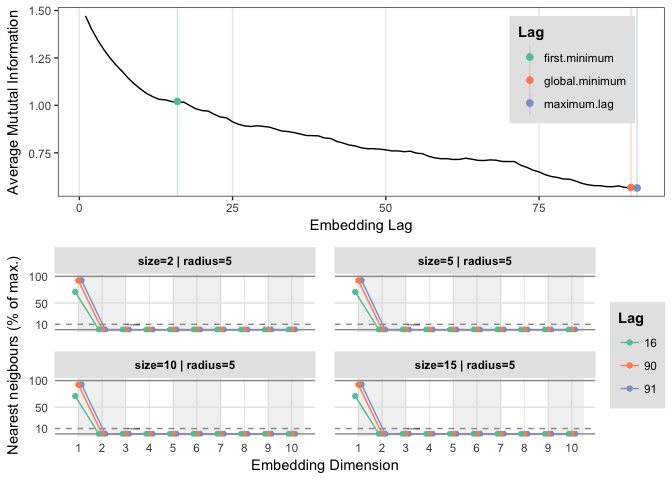
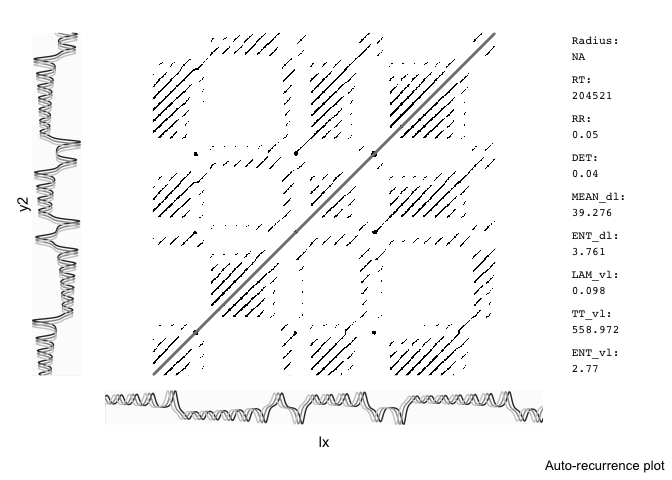

# **Phase Space Reconstruction and RQA** 

You can use `R` to run `RQA` analyses. These assignments assume you'll use `R`, but you can also find a `Matlab` toolbox for `RQA` here: [CRP toolbox](http://tocsy.pik-potsdam.de/CRPtoolbox/), there are `Python` libraries as well check [this page](http://www.recurrence-plot.tk/programmes.php) for an overview of software. 

You'll need the latest version of `casnet`:

```r
# Install casnet if necessary: https://github.com/FredHasselman/casnet
# !!Warning!! Very Beta...
# Auto config of Marwan's commandline rqa works on Windows, MacOS and probably Linux as well
library(devtools)
devtools::install_github("FredHasselman/casnet")
library(casnet)
```

Package `casnet` uses the [command line recurrence plot tools](http://tocsy.pik-potsdam.de/commandline-rp.php). The first time you run the command `crqa_cl()` the package will try to download the correct executables, look for messages in the console to find out if the script succeeded.

\BeginKnitrBlock{rmdnote}<div class="rmdnote">**R-packages for Phase Space Reconstruction**

Package `casnet` relies on packages `fractal` and `rgl` to reconstruct phase space. Package `rgl` is used for plotting and can cause problems on some windows machines. On windows You'll need to check if you have the [X Window System](http://www.x.org/wiki/) for interactive 3D plotting. This Linux desktop system comes installed in some way or form on most Mac and Windows systems. You can test if it is present by running `rgl::open3d()` in `R`, which will try to open an interactive plotting device.</div>\EndKnitrBlock{rmdnote}


Here is a great summary of the phase space reconstruction technique: https://youtu.be/6i57udsPKms


### Reconstruct the Lorenz attractor {.tabset .tabset-fade .tabset-pills}

Package `fractal` includes the 3 dimensions of the Lorenz system in the chaotic regime. Run this code `rgl::plot3d(lorenz,type="l")` with all three packages loaded to get an interactive 3D plot of this strange attractor.

We'll reconstruct the attractor based on just dimension `X` of the system using the data from package `fractal`, and functions from package `casnet`. Don't forget: *always look at the manual pages of a function* you are running.

\BeginKnitrBlock{rmdimportant}<div class="rmdimportant">Package `fractal` and package `nonlinearTseries` use functions with similar names, perhapp better to not load them together, or always use `fractal::` and `nonlinearTseries::` if you want to call the functions direclty.</div>\EndKnitrBlock{rmdimportant}


#### Questions {-}

* Use `lx <- lorenz[1:2048,1]` to reconstruct the phase space based on `lx`. 
    + Find an optimal embedding lag and dimension by calling `crqa_parameters()`.
    + Use `nnThres = .01`. This is the proportion of remaining nearest neighbours below which we consider the number of dimensions optimal. Because this time series was generated by a simulation of a system, we can use a much lower threshold. For real data, which is much noisier, you can use `0.1` or `0.2`.
    
This `crqa_parameters()` function will call several other functions (e.g. `fractal::timeLag()` with `method = "mutual"` and `nonlinearTseries::findAllNeighbours()` for the false nearest neighbourhood search). Look at the manual page, you can run the `crqa_parameters()` function with the defaults settings, it will show a diagnostic plot. Because we have to search over a range of parameters it can take a while to get the results...

* Based on the output:
    + Choose an embedding lag $\tau$ (in `casnet` functions this is the argument `emLag`). Remember, this is just an optimisation choice. Sometimes there is no first minimum, or no global minimum.
    + Find an appropriate embedding dimension by looking when the false nearest neighbours drop below 1\%. 
    
* Now you can use this information to reconstruct the phase space: 
    + Embed the time series using `ts_embed()` (you can also use `fractal::embedSeries()`).
    + Inspect the object that was returned
    + Use  `rgl::plot3d()` to plot the reconstructed space. Plot the reconstructed phase space. (You'll need to use `as.matrix()` on the object created by `fractal::embedSeries()`)

#### Answers {-}

* Use `lx <- lorenz[1:2048,1]` to reconstruct the phase space based on `lx`. 
    + Find an optimal embedding lag and dimension by calling `crqa_parameters()`.


```r
library(rgl)
library(fractal)
```

```
## Loading required package: splus2R
```

```
## Loading required package: ifultools
```

```r
library(casnet)

# The X data
lx <- lorenz[1:2048,1]

# Search for the parameters,
params <- crqa_parameters(lx)
```

<!-- -->

```r
# Assign the optimal parameters
emLag <- params$optimLag
emDim <- params$optimDim
```

* Now you can use this information to reconstruct the phase space


```r
# For X
lx_emb <- ts_embed(y=lx,emLag = emLag, emDim = emDim)

rgl::plot3d(lx_emb, type="l")

# For Y
ly <- lorenz[1:2048,2]

# Search for the parameters,
params <- crqa_parameters(ly)
```

<!-- -->

```r
# Assign the optimal parameters
emLag <- params$optimLag
emDim <- params$optimDim

# Embed the time series
ly_emb <- ts_embed(y=ly,emLag = emLag, emDim = emDim)
rgl::plot3d(ly_emb,type="l")

# For Z
lz <- lorenz[1:2048,3]

# Search for the parameters,
params <- crqa_parameters(lz)
```

<!-- -->

```r
# Assign the optimal parameters
emLag <- params$optimLag
emDim <- params$optimDim

# Embed the time series
lz_emb <- ts_embed(y=lz,emLag = emLag, emDim = emDim)
rgl::plot3d(lz_emb,type="l")
```


### Reconstruct the Predator-Prey model {.tabset .tabset-fade .tabset-pills}


#### Questions {-}

Use the same procedure as above to reconstruct the state space of the predator-prey system. (Look [at the solutions](https://darwin.pwo.ru.nl/skunkworks/courseware/1718_DCS/assignments/ASSIGNMENTS_P1A.html#221_foxes_and_rabbits_in_r) to get a `Foxes` or `Rabbit` series).

 * You should get a 2D state space, so 3D plotting might be a bit too much for this system.

#### Answers{-}


```r
library(plyr)
library(ggplot2)
# Get the time series
# Parameters
N  <- 1000
a  <- d <- 1
b  <- c <- 2 
R0 <- F0 <- 0.1
Ra  <- as.numeric(c(R0, rep(NA,N-1)))
Fx  <- as.numeric(c(F0, rep(NA,N-1)))

# Time constant
delta <- 0.01

# Numerical integration of the predator-prey system
l_ply(seq_along(Ra), function(t){
    Ra[[t+1]] <<- (a - b * Fx[t]) * Ra[t] * delta + Ra[t] 
    Fx[[t+1]] <<- (c * Ra[t] - d) * Fx[t] * delta + Fx[t] 
    })

# lets take Foxes and search
params <- crqa_parameters(Fx)
```

<!-- -->

```r
# Assign the optimal parameters
emLag <- params$optimLag
emDim <- params$optimDim

# Embed the time series
Fx_emb <- ts_embed(y=Fx,emLag = emLag, emDim = emDim)

# Now take Rabbits and search parameters
params <- crqa_parameters(Ra)
```

<!-- -->

```r
# Assign the optimal parameters
emLag <- params$optimLag
emDim <- params$optimDim

# Embed the time series
Ra_emb <- ts_embed(y=Ra,emLag = emLag, emDim = emDim)

# Plot
df.pp <- cbind.data.frame(Foxes = c(Fx, Fx_emb[,1], Ra_emb[,1]), Rabbits = c(Ra, Fx_emb[,2], Ra_emb[,2]), Type = c(rep("Original",N+1), rep("reconstructed Foxes",NROW(Fx_emb)), rep("reconstructed Rabbits",NROW(Ra_emb))))

ggplot(df.pp,aes(x=Foxes, y = Rabbits, group = Type)) +
  geom_path(aes(colour=Type), size=1) +
  theme_bw() +
  coord_equal()
```

<!-- -->


## **(auto-) Recurrence Quantification Analysis**

There are several packages which can perform (C)RQA analysis, we will not use [`crqa`](https://cran.r-project.org/web/packages/crqa/index.html), but the function in package `casnet`.

\BeginKnitrBlock{rmdimportant}<div class="rmdimportant"> The package `crqa()` was mainly designed to run categorical Cross-Recurrence Quantification Analysis (see [Coco & Dale (2014)](http://journal.frontiersin.org/Journal/10.3389/fpsyg.2014.00510/abstract) and for R code see appendices in [Coco & Dale (2013)](http://arxiv.org/abs/1310.0201)). The article is a good reference for RQA analysis.</div>\EndKnitrBlock{rmdimportant}


### RQA of the Lorenz attractor {.tabset .tabset-fade .tabset-pills}

Perform an RQA on the reconstructed state space of the Lorenz system. You'll need a radius (also called: threshold, or $\epsilon$) in order to decide which points are close together (recurrent). You have already seen `casnet` provides a function which will automatically select the best parameter settings for phase space reconstruction: `crqa_parameters()`. 


#### Questions {-}

* First get a radius that gives you a fixed recurrence rate use `crqa_radius()` look at the manual pages.

* Best way to ensure you are using the same parameters in each function is to create some lists with parameter settings (check the `crqa_cl()` manual to figure out what these parameters mean)


#### Answers{-}


```r
library(fractal)
library(casnet)

# Lorenz X
lx <- lorenz[1:2048,1]
emLag = 17
emDim = 3

(emRad <- crqa_radius(y1 = lx, emLag = emLag, emDim = emDim)$Radius)
```

```
## 
## Auto-recurrence: Setting diagonal to (1 + max. distance) for analyses
```

```
## lower and upper are both 0 (no band, just diagonal)
##  using: diag(mat) <- 38.5536...
```

```
## 
## Searching for a radius that will yield 0.05 for RR
```

```
## 
## Converged! Found an appropriate radius...
```

```
## [1] 3.629007
```

```r
# RQA analysis
(out <- crqa_cl(lx,emDim = emDim, emLag = emLag, emRad = emRad))
```

```
## 
## ~~~o~~o~~casnet~~o~~o~~~
## 
## Performing auto-RQA
## 
## ...using sequential processing...
## 
  |                                                                     
  |                                                               |   0%
  |                                                                     
  |o~oo~oo~oo~oo~oo~oo~oo~oo~oo~oo~oo~oo~oo~oo~oo~oo~oo~oo~oo~oo~o| 100%
## 
## Completed in:
##    user  system elapsed 
##   3.203   0.071   3.306 
## 
## ~~~o~~o~~casnet~~o~~o~~~
```

```
##                                 .id        RR      DET  DET.RR     LAM
## 1 window: 1 | start: 1 | stop: 2048 0.0499637 0.998963 19.9938 0.99918
##   LAM.DET L_max       L  L_entr         DIV V_max      TT  V_entr      T1
## 1 1.00022  2013 24.6951 3.76081 0.000496771    35 10.1375 2.75883 15.9085
##       T2 W_max  W_mean  W_entr W_prob       F_min emDim emLag    emRad
## 1 175.25  1533 164.849 4.67858     58 0.000652316     3    17 3.629007
##   DLmin VLmin  distNorm
## 1     2     2 EUCLIDEAN
```


We can plot the recurrence matrix...


```r
library(casnet)

# Unthresholded matrix (no radius applied)
RM <- recmat(y1 = lx, emDim = emDim, emLag = emLag)

# plot it
recmat_plot(RM,plotDimensions = TRUE)
```

<!-- --><!-- -->

```r
# Thresholded by the radius
RMth <- di2bi(RM,radius = emRad)

recmat_plot(RMth, plotDimensions = TRUE, plotMeasures = TRUE)
```

<!-- --><!-- -->


### RQA of circle-tracing data {.tabset .tabset-fade .tabset-pills}

We'll analyse a time series recorded from asubject who is tracing a circle using a computer mouse:   [circle tracing data](https://github.com/FredHasselman/The-Complex-Systems-Approach-Book/tree/master/assignments/assignment_data/RQA_circletrace).


#### Questions {-}

* Perform an RQA on one of the coordinates
* Study what happens to the RQA measures if you shuffle the temporal order.
* Package `fractal` contains a function `surrogate`. This will create so-called *constrained* realisations of the time series. You can look at the vignette in package `casnet` `cl_CRQA` ([also available in Github](https://github.com/FredHasselman/casnet/tree/master/inst/doc)) Look at the help pages of the function, or study the *Surrogates Manual* of the [TISEAN software](http://www.mpipks-dresden.mpg.de/~tisean/Tisean_3.0.1/index.html) and create two surrogate series, one based on `phase` and one on `aaft`.
     + Look at the RQA measures and think about which $H_0$ should probably be rejected.
     + If you want to be more certain, you'll have to create a test (more surrogates). The [TISEAN manual](http://www.mpipks-dresden.mpg.de/~tisean/Tisean_3.0.1/docs/surropaper/node5.html#SECTION00030000000000000000) provides all the info you need to construct such a test:
     
     > "For a minimal significance requirement of 95\% , we thus need at least 19 or 39 surrogate time series for one- and two-sided tests, respectively. The conditions for rank based tests with more samples can be easily worked out. Using more surrogates can increase the discrimination power."
  

# **Categorical and Cross-RQA (CRQA)** 


You'll probably need:


```r
library(rio)
library(fractal)
library(casnet)
```


### Assignment: CRQA and Diagonal Profile {.tabset .tabset-fade .tabset-pills}


* Create two sinewave variables for CRQA analysis and use the $x$ and $y$ coordinates of the circletracing data:


```r
y1 <- sin(1:900*2*pi/67)
y2 <- sin(.01*(1:900*2*pi/67)^2)

# Here are the circle trace data
xy <- import("https://raw.githubusercontent.com/FredHasselman/The-Complex-Systems-Approach-Book/master/assignments/assignment_data/RQA_circletrace/mouse_circle_xy.csv") 

y1 <- xy$x
y2 <- xy$y
```

* You have just created two sine(-like) waves. We’ll examine if and how they are coupled in a shared phase space. As a first step plot them.

* Find an embedding delay (using mutual information) and an embedding dimension (if you calculate an embedding dimension for each signal separately, as a rule of thumb use the highest embedding dimension you find in further analyses).

* We can now create a cross recurrence matrix. Fill in the values you decided on. You can choose a radius automatically, look in the `crqa` manual.

* Get the optimal parameters using a radius which will give us 2\%-5\% recurrent points.

* Run the CRQA and produce a plot of the recurrence matrix.

* Can you understand what is going on? 
  + For the simulated data: Explain the the lack of recurrent points at the beginning of the time series.
  + For the circle trace: How could one see these are not deterministic sine waves?

* Examine the synchronisation under the diagonal LOS. Look in the manual of `crqa` or  [Coco & Dale (2014)](http://journal.frontiersin.org/Journal/10.3389/fpsyg.2014.00510/abstract). 
  + To get the diagonal profile from a recurrence plot `RM`, use `band(RM, k1, k2, ...)`. Where `k1` is the upper diaginal and `k2` the lower diagonal.
  + Make a plot of the diagonal profile. How far is the peak in RR removed from 0 (Line of Synchronisation)? 


* Perform the same steps with a shuffled version (or use surrogate analysis!) of the data of time series $y1$. You can use the embedding parameters you found earlier. 

> NOTE: If you generate surrogate timeseries, make sure the RR is the same for all surrogates. Try to keep the RR in the same range by using.


### Categorical CRQA: Friends data {-}

* Package `crqa` contains two categorical trial series from the "Friends"study.
    + Lookup `RDts1` and `RDts2` in the help file. 
    + Also lookup the articles discussing the study to get an idea about these series [here](http://cognaction.org/rdmaterials/php.cv/pdfs/article/richardson_dale_2005.pdf) and [here](http://cognaction.org/rdmaterials/php.cv/pdfs/article/richardson_dale_kirkham.pdf))  

* In the paper accompanying the package by [Coco & Dale (2014)](http://journal.frontiersin.org/Journal/10.3389/fpsyg.2014.00510/abstract) demonstrate the analysis of these series. 
    + Recreate this analysis, e.g. Figure 10 in the article including the CRQA measures.

