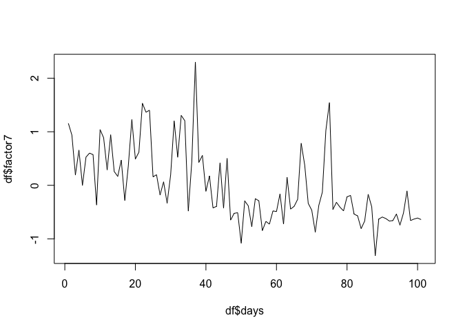
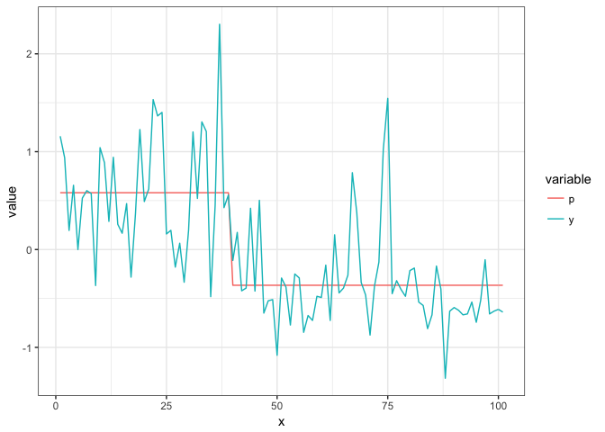
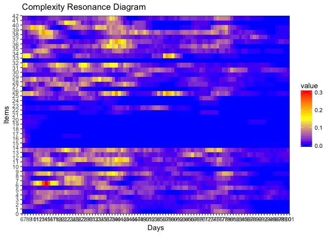
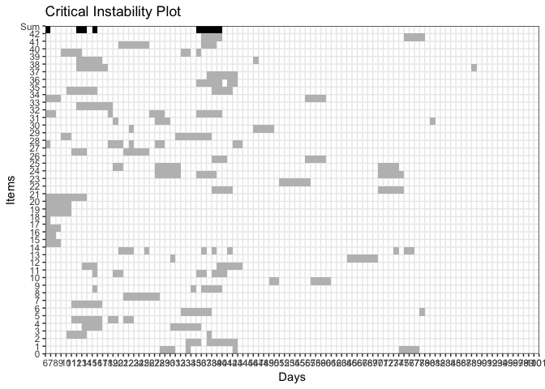
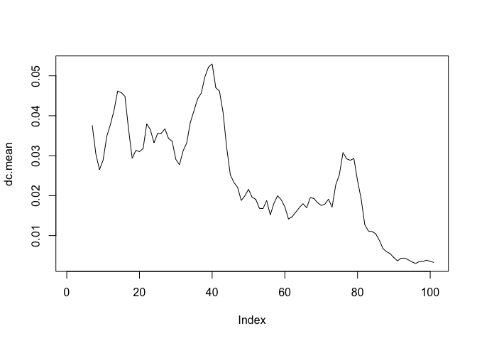
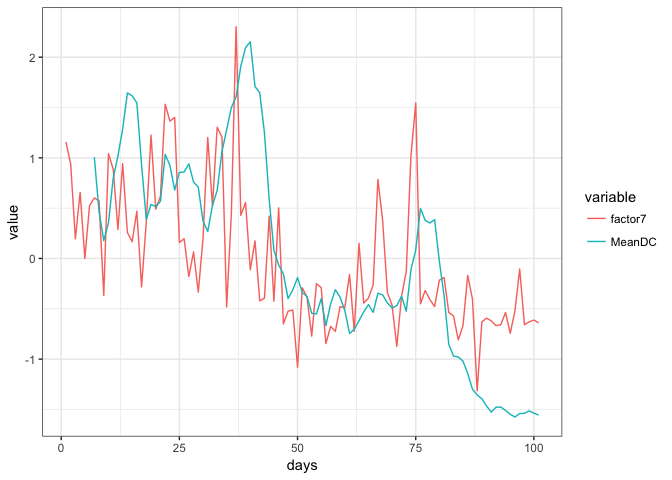

# **Quick Links** {-}

* [Main Assignments Page](https://darwin.pwo.ru.nl/skunkworks/courseware/1718_DCS/assignments/)
* [Assignments Part 1A: Introduction to the mathematics of change](https://darwin.pwo.ru.nl/skunkworks/courseware/1718_DCS/assignments/ASSIGNMENTS_P1A.html)
* [Assignments Part 1B: Fitting Parameters and Potential Functions](https://darwin.pwo.ru.nl/skunkworks/courseware/1718_DCS/assignments/ASSIGNMENTS_P1B.html)
* [Assignments Part 2: Time Series Analysis: Temporal Correlations and Fractal Scaling](https://darwin.pwo.ru.nl/skunkworks/courseware/1718_DCS/assignments/ASSIGNMENTS_P2.html)
* [Assignments Part 3: Quantifying Recurrences in State Space](https://darwin.pwo.ru.nl/skunkworks/courseware/1718_DCS/assignments/ASSIGNMENTS_P3.html)
  
</br>
</br>


# **Early Warning Signals and Complex Networks**


## **Early Warning Signals in a Clinical Case Study**

Dynamic assessment (e.g. ecological momentary assesment) is increasingly used in the mental health field. Process monitoring with dynamic assessment can empower patients and benefit self-insight (van Os et al., 2017). Additionally, ecological momentary assesment (EMA) time series can be analyzed and the results can be used to inform the treatment process. 
In this assignment, we will use complex systems theory and methodology to perform a quantitative case study for a real patient. 

### First Steps {.tabset .tabset-fade .tabset-pills}

You will analyze EMA data from a patient who received impatient psychotherapy for mood disorders. The patient answered questions from the therapy process questionnaire on a daily basis for the full 101 days of his treatment. 
The learning objectives of the assignments are as follows:
1) You can interpret plots of raw EMA time series, as well as complexity resonance diagrams and critical instability diagrams of EMA time series.
2) You can describe what possible change processes in complex systems could explain the quantitative results from the case study. 


#### Questions {-}

a) Open R and load the data 'clinical.case.study.csv' to a dataframe called df. 
b) Look at the data frame. Where is time in this data? In the rows or the columns?
c) Add a time variable called 'days' to the dataframe. 
d) Factor 7 yields the scores on 'Impairment by Symptoms and Problems' for this patient on each day. Plot the time series. What do you see?


#### Answers {-}

a) The data file is on [Github](https://github.com/FredHasselman/The-Complex-Systems-Approach-Book/blob/master/assignments/assignment_data/EarlyWarningSignals/clinical.case.study.csv)

```r
library(rio)
df <- import("https://raw.githubusercontent.com/FredHasselman/The-Complex-Systems-Approach-Book/master/assignments/assignment_data/EarlyWarningSignals/clinical.case.study.csv")
```

b) In the rows.

c) 

```r
df$days <- (1:nrow(df))
```
d) 

```r
plot(df$days, df$factor7, type='l')
```

<!-- -->


### Phase Transitions and Early-Warning Signals {.tabset .tabset-fade .tabset-pills}

Before we continue, read this short summary of what you (should) know about phase transitions and early-warning signals: 

\BeginKnitrBlock{rmdnote}<div class="rmdnote">Change from one attractor to another is called a phase transition. Phase transitions are preceded by a destabilization period in which the stability of the existing state decreases (as a consequence of increasing control parameters). During destabilization, the system loses its resilience to external influences leading to increased fluctuations and disorder in the systems behaviour (critical fluctuations) and an increased return time to the existing state after perturbation (critical slowing down). Destabilization ends abruptly when the system makes a phase transition towards a new stable state. Critical fluctuations and critical slowing down can therefore serve as early-warning signals (EWS) for phase transitions. </div>\EndKnitrBlock{rmdnote}

#### Questions {-}

Answer the following questions, please think and discuss with your neighbours before turning to the answers. You can use the literature and what you've learned in the lecture:

a) Can you think of possible phase transitions in psychopathology? Give examples. 
b)What is the role of destabilization in the treatment of psychopathology?
c) Look at the plot of factor 7 for our patient. Can you visualize a possible phase transition?
d) Do you expect to find early-warning signals in the data of our patient? And where?

#### Answers {-}

a) Onset of pathology (e.g. psychosis), relapse in addiction, suicide attempts, sudden gains and losses, etc.
b) Destabilization is most of the time a good thing in treatment: the goal of treatment is to change (destabilize) the existing state.
During destabilization, the patient is increasingly sensitive to external influences (including treatment). Destabilization can be a target period for intervention.
c) There is a sudden gain (abrupt and persisting decrease in symptoms) somewhere around day 40.
d) Before the sudden gain

### Phase transitions in symptom severity {.tabset .tabset-fade .tabset-pills}

In the last question, you might have hypothesized the occurrence of a phase transition in the impairment by symptoms and problems of our patient (sudden gain). Let's try a method to quantify level shifts, including sudden gains, in time series data.  

#### Questions {-}

a)	Analyze the time series of factor 7 using the function `ts_levels()` in casnet. Look at the manual pages to get an idea what is going. Use this code: `casnet::ts_levels(df$factor7, minLevelChange=1, minLevelDuration = 7, changeSensitivity = 0.01, maxLevels=30, method="anova")`.
b) Look at the `summary()` of the `tree` field in the output object.
c) Plot the results in the `pred` field of the output object (`x` is `time`, `y` is the original series, `p` is the predicted level of the original series.
d) Describe verbally the change trajectory in the symptom severity of our patient. 

#### Answers {-}

a) This method uses regression trees to quantify segments of the time series. This is OK for descriptive purposes. Ideally, we would classify a phase transition in a qualitative manner (remember, it is a qualitative shift) but the ts_levels function is very useful to identify discontinous shifts in time series data. 


```r
library(casnet)
library(ggplot2)
library(tidyr)
lvl <- ts_levels(df$factor7, minDataSplit = 12, minLevelDuration = 7, changeSensitivity = 0.05, maxLevels=30, method="anova") 
```

b) Look for `primary splits`


```r
summary(lvl$tree)
```

```
## Call:
## rpart::rpart(formula = y ~ x, data = dfs, method = method, control = list(minsplit = minDataSplit, 
##     minbucket = minLevelDuration, maxdepth = maxLevels, cp = changeSensitivity))
##   n= 101 
## 
##          CP nsplit rel error    xerror      xstd
## 1 0.4399209      0 1.0000000 1.0163256 0.1501655
## 2 0.0500000      1 0.5600791 0.6217326 0.1210092
## 
## Variable importance
##   x 
## 100 
## 
## Node number 1: 101 observations,    complexity param=0.4399209
##   mean=6.930683e-11, MSE=0.4817495 
##   left son=2 (62 obs) right son=3 (39 obs)
##   Primary splits:
##       x < 39.5 to the right, improve=0.4399209, (0 missing)
## 
## Node number 2: 62 observations
##   mean=-0.3651189, MSE=0.2190611 
## 
## Node number 3: 39 observations
##   mean=0.5804455, MSE=0.350508
```

c)

```r
# ggplot likes the long data format
lvl_long <- lvl$pred %>% 
  gather(key=variable, value=value, -x)

ggplot(lvl_long, aes(x=x, y=value, colour=variable)) + geom_line() + theme_bw()
```

<!-- -->

d) Flutucations, shift, fluctuations.

### Early Warning Signals {.tabset .tabset-fade .tabset-pills}

Now it is time to analyze the dynamic complexity of the ES time series and see if we can find early-warning signals. 

#### Questions {-}

a) Some questions in the data where answered on a scale from 0 to 100, others from 0 to 6. We must rescale all questions that are 0-100 to the scale 0-6 before we can analyze EWS. If you like, you can try to write a for loop for this. You can also look at the first answer.  
b) Analyze the dynamic complexity of the ES time series using the function dyn_comp(), ask for a plot.
c) The function returns a list, what is in the list?
d) Look at the complexity resonance diagram, do you see early-warning signals for the sudden gain?
e) Analyze the presence of critical instabilities using the function crit_in(), set doPlot=TRUE
f) Look at the critical instability diagram, do you see early-warning signals for the sudden gain?
g) Plot the time series of the average dynamic complexity of all items 
h) Plot the time series of factor 7 and the time series of the average dynamic complexity in one plot
i) You get a warning that there are NA values. Why are there NA's?

#### Answers {-}

a) rescale predictors to max=6

```r
for(j in (9:50)){
  if(max(df[,j])>6){
    df[,j] <- (df[,j]/100)*6
  }
}
```
b) 

```r
dc.case <- dyn_comp(df, win=7, col_first=9, col_last=50, scale_min=0, scale_max=6, doPlot = TRUE)
```
c) dataframe + plot object
d) 

```r
dc.case$plot.dc
```

<!-- -->
e) 

```r
ci.case <- crit_in(dc.case$df.comp, 7)
```
f) 

```r
ci.case$plot.ci
```

<!-- -->
g) 

```r
dc.mean <- rowMeans(as.matrix(dc.case$df.comp))
plot(dc.mean, type='l')
```

<!-- -->
h) 

```r
library(dplyr)
```

```
## 
## Attaching package: 'dplyr'
```

```
## The following objects are masked from 'package:stats':
## 
##     filter, lag
```

```
## The following objects are masked from 'package:base':
## 
##     intersect, setdiff, setequal, union
```

```r
library(ggplot2)

# Create a long dataset for ggplot
# Here we use the syntax from the `tidyverse` set of packages to create a 
df %>% 
  mutate(MeanDC=ts_standardise(dc.mean)) %>% 
  select(days,factor7,MeanDC) %>% 
  gather(key=variable,value=value,-days) %>%
  ggplot(aes(x=days, y=value, colour=variable)) + geom_line() + theme_bw()
```

```
## Warning: Removed 6 rows containing missing values (geom_path).
```

<!-- -->
i) Because dynamic complexity is analyzed over a backwards window. The first value is at day 7.


